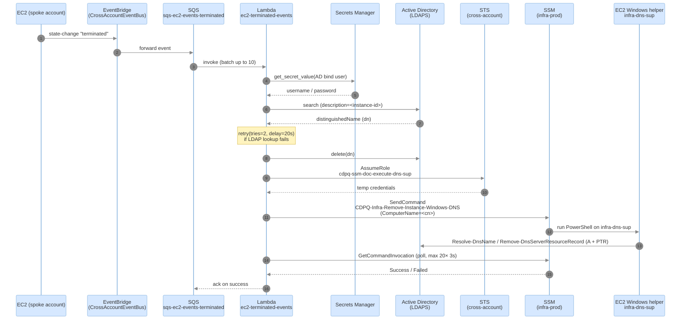
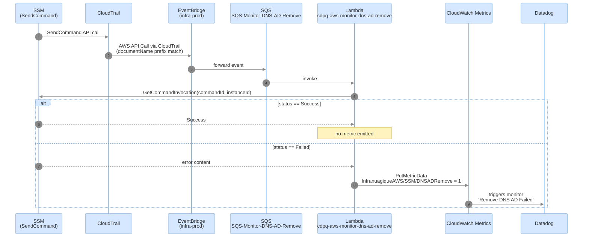
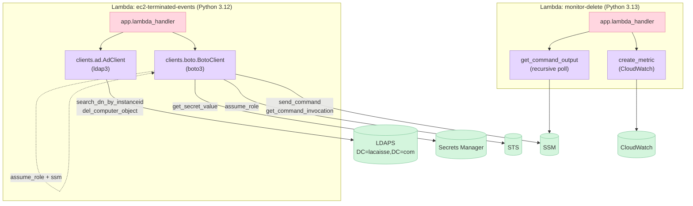
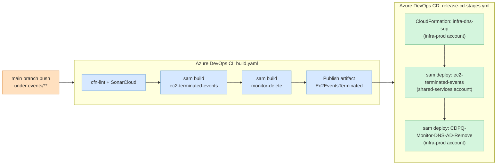

# aws-ec2-ad

Automated cleanup of Active Directory (AD) computer objects and Windows DNS records when an EC2 instance is terminated in AWS.

> Confluence reference: [Suppression automatique des machines de l'AD](https://cdpq.atlassian.net/wiki/spaces/EPPI/pages/1969553501/Suppression+automatique+des+machines+de+l+AD)

---

## Purpose

When an EC2 Windows instance joined to the corporate Active Directory is terminated, two stale artifacts remain behind:

1. The **computer object** in Active Directory (LDAP).
2. The **DNS A / PTR records** in the Windows DNS servers (the AD domain controllers).

This repository deploys the AWS infrastructure (EventBridge rules, SQS queues, Lambda functions, IAM roles, SSM document, and a helper EC2 instance) that detects the termination event and automatically removes both artifacts. A second, independent Lambda monitors the success/failure of the DNS removal SSM command and pushes a CloudWatch metric that drives a Datadog alert.

---

## Repository layout

| Path | Purpose |
| --- | --- |
| [events/ec2-terminated-events/template.yaml](events/ec2-terminated-events/template.yaml) | SAM stack (deployed in the **shared-services** account) — SQS, Lambda, EventBridge rule, IAM role, Datadog monitor. |
| [events/ec2-terminated-events/src/app.py](events/ec2-terminated-events/src/app.py) | Lambda entrypoint: parses the SQS message, looks up the AD object, deletes it, then triggers DNS cleanup via SSM. |
| [events/ec2-terminated-events/src/clients/ad.py](events/ec2-terminated-events/src/clients/ad.py) | LDAP client (`ldap3`) used to search and delete computer objects in AD. |
| [events/ec2-terminated-events/src/clients/boto.py](events/ec2-terminated-events/src/clients/boto.py) | AWS helpers: Secrets Manager, STS `assume_role`, SSM `send_command` + invocation polling. |
| [events/ec2-terminated-events/ec2-infra-dns-sup.yaml](events/ec2-terminated-events/ec2-infra-dns-sup.yaml) | CloudFormation stack (deployed in the **infra-prod** account) — provisions the Windows helper EC2, the cross-account IAM role, and the `CDPQ-Infra-Remove-Instance-Windows-DNS` SSM document. |
| [events/monitor-delete/template.yaml](events/monitor-delete/template.yaml) | SAM stack (deployed in the **infra-prod** account) — EventBridge rule on `ssm:SendCommand` + SQS + Lambda that monitors the DNS-removal command outcome and feeds a Datadog monitor. |
| [events/monitor-delete/src/app.py](events/monitor-delete/src/app.py) | Lambda entrypoint that polls `GetCommandInvocation` and emits the `InfranuagiqueAWS/SSM / DNSADRemove` CloudWatch metric on failure. |
| [devops/build.yaml](devops/build.yaml) | Azure DevOps CI pipeline (cfn-lint, SonarCloud, `sam build`, artifact publish). |
| [devops/release-cd-stages.yml](devops/release-cd-stages.yml) | Azure DevOps CD stages: deploys the three stacks across two AWS accounts. |
| [devops/release-nexus-terminated-events-cd.yml](devops/release-nexus-terminated-events-cd.yml) | Nexus v2 release pipeline that extends the CD template. |
| [devops/variables/stage-PR.yml](devops/variables/stage-PR.yml) | Per-environment variables (LDAP server, AD secret, account IDs, AWS credential connections). |

---

## High-level architecture

The solution spans two AWS accounts:

- **shared-services** — receives the termination event, runs the AD cleanup Lambda.
- **infra-prod** — hosts the Windows helper EC2 (joined to AD), executes the SSM document that removes DNS records, and runs the DNS-removal monitoring Lambda.

```mermaid
flowchart LR
    subgraph SourceAcct["Any spoke AWS account"]
        EC2[EC2 instance<br/>terminated]
    end

    subgraph Bus["Cross-account event bus"]
        CrossBus[(CDPQ-CrossAccountEventBus)]
    end

    subgraph Shared["AWS account: shared-services"]
        Rule1[EventBridge Rule<br/>state = terminated]
        Q1[(SQS<br/>sqs-ec2-events-terminated)]
        DLQ1[(DLQ)]
        Lambda1[Lambda<br/>ec2-terminated-events]
        SM[(Secrets Manager<br/>AD bind user)]
    end

    subgraph InfraProd["AWS account: infra-prod"]
        Role[IAM Role<br/>cdpq-ssm-doc-execute-dns-sup]
        DNSHelper[EC2 Windows helper<br/>infra-dns-sup]
        SSMDoc[(SSM Document<br/>CDPQ-Infra-Remove-Instance-Windows-DNS)]
        Rule2[EventBridge Rule<br/>ssm:SendCommand]
        Q2[(SQS<br/>SQS-Monitor-DNS-AD-Remove)]
        Lambda2[Lambda<br/>cdpq-aws-monitor-dns-ad-remove]
        CW[(CloudWatch metric<br/>InfranuagiqueAWS/SSM<br/>DNSADRemove)]
    end

    AD[(Active Directory<br/>lacaisse.com<br/>LDAPS 636)]
    DD[Datadog monitors]

    EC2 -- "EC2 Instance State-change" --> CrossBus
    CrossBus --> Rule1 --> Q1
    Q1 -- "messages" --> Lambda1
    Q1 -. failures .-> DLQ1
    Lambda1 -- "get_secret_value" --> SM
    Lambda1 -- "LDAP search + delete" --> AD
    Lambda1 -- "sts:AssumeRole" --> Role
    Lambda1 -- "ssm:SendCommand" --> SSMDoc
    SSMDoc -- "runs on" --> DNSHelper
    DNSHelper -- "PowerShell DNS cleanup" --> AD

    SSMDoc -- "CloudTrail event" --> Rule2 --> Q2 --> Lambda2
    Lambda2 -- "GetCommandInvocation" --> SSMDoc
    Lambda2 -- "PutMetricData on failure" --> CW
    CW --> DD
    Lambda1 -. errors .-> DD
    Lambda2 -. errors .-> DD

    classDef compute fill:#FFE0BF,stroke:#E6A86B,stroke-width:1px,color:#333
    classDef queue fill:#FFF4BF,stroke:#D4B43C,stroke-width:1px,color:#333
    classDef lambda fill:#FFD6E0,stroke:#E68AA0,stroke-width:1px,color:#333
    classDef event fill:#D6E8FF,stroke:#7FAEDB,stroke-width:1px,color:#333
    classDef storage fill:#D4F5DD,stroke:#7FC79B,stroke-width:1px,color:#333
    classDef identity fill:#E6D6FF,stroke:#A98AD8,stroke-width:1px,color:#333
    classDef monitor fill:#BFF0E8,stroke:#6FBFB0,stroke-width:1px,color:#333

    class EC2,DNSHelper compute
    class Q1,DLQ1,Q2 queue
    class Lambda1,Lambda2 lambda
    class CrossBus,Rule1,Rule2 event
    class SM,SSMDoc,AD storage
    class Role identity
    class CW,DD monitor
```



---

## End-to-end termination flow

Sequence of events when an EC2 instance is terminated.



---

## DNS-removal monitoring flow

`monitor-delete` watches every invocation of the SSM document and emits a CloudWatch metric only when the command fails. A Datadog monitor on that metric alerts the operations team.



---

## Component interactions



Key environment variables consumed by the `ec2-terminated-events` Lambda (set by [template.yaml](events/ec2-terminated-events/template.yaml)):

| Variable | Source | Purpose |
| --- | --- | --- |
| `LDAP_SERVER` | pipeline var `ldapServer` | LDAPS host (`lacaisse.com:636`). |
| `AD_NAME` | pipeline var `adName` | Base DN suffix (`DC=lacaisse,DC=com`). |
| `AD_USER_SECRET` | pipeline var `adUserSecret` | ARN of the Secrets Manager secret holding the bind user/password. |
| `INSTANCE_ID_DNS_SUP` | pipeline var `InstanceIdDnsSup` | EC2 ID of the Windows helper that runs the SSM document. |
| `CROSS_ACCOUNT_ROLE_ARN` | built from `InfraProdAccount` | Role assumed in infra-prod to call SSM. |

---

## CI / CD pipeline



Build steps (see [devops/build.yaml](devops/build.yaml)):

1. Lint every `events/**/*.yaml` with `cfn-lint` and publish results to SonarCloud + JUnit.
2. `sam build --use-container` for both SAM applications.
3. Copy build output, `samconfig.toml`, `template.yaml` and `ec2-infra-dns-sup.yaml` to the staging directory.
4. Publish artifact `Ec2EventsTerminated`.

Deploy steps (see [devops/release-cd-stages.yml](devops/release-cd-stages.yml)) — each uses a different AWS credential connection defined in [devops/variables/stage-PR.yml](devops/variables/stage-PR.yml):

| Step | Account | Stack | Tool |
| --- | --- | --- | --- |
| Create EC2 helper | `CDPQ-AWS-INFRA-PR` | `infra-dns-sup` | `CloudFormationCreateOrUpdateStack` |
| Cleanup Lambda | `CDPQ-AWS-shared-services-PR` | `ec2-terminated-events` | `sam deploy` |
| Monitoring Lambda | `CDPQ-AWS-INFRA-PR` | `CDPQ-Monitor-DNS-AD-Remove` | `sam deploy` |

The release is wrapped by the Nexus v2 template ([devops/release-nexus-terminated-events-cd.yml](devops/release-nexus-terminated-events-cd.yml)) which ties the deployment to a ServiceNow change request for production.

---

## Local development

Each SAM application can be built and invoked locally:

```powershell
# build
cd events/ec2-terminated-events
sam build --use-container

# invoke with the sample event
sam local invoke Function --event event.json
```

A representative SQS payload (`EC2 Instance State-change Notification` with `state=terminated`) is provided in [events/ec2-terminated-events/event.json](events/ec2-terminated-events/event.json).

Python dependencies for the cleanup Lambda are minimal — see [events/ec2-terminated-events/src/requirements.txt](events/ec2-terminated-events/src/requirements.txt):

- `ldap3` — LDAPS connection / search / delete.
- `retry` — decorator used to retry the LDAP lookup twice with a 20s delay.

---

## Observability & alerting

Three Datadog monitors are deployed alongside the Lambdas:

- **Errors in `ec2-terminated-events`** — `aws.lambda.errors` ≥ 1 over the last hour.
- **Errors in `cdpq-aws-monitor-dns-ad-remove`** — same metric on the monitoring Lambda.
- **Remove DNS AD Failed** — fires when `monitor-delete` emits `InfranuagiqueAWS/SSM/DNSADRemove`, indicating that the SSM PowerShell document failed for at least one instance. The monitor message points operators to the relevant CloudWatch log stream in `/aws/lambda/cdpq-aws-monitor-dns-ad-remove`.

Lambda logs are forwarded to Datadog through the standard CloudWatch subscription filter on the forwarder ARN stored in SSM (`/cdpq/service/datadog/forwarder/arn`).
