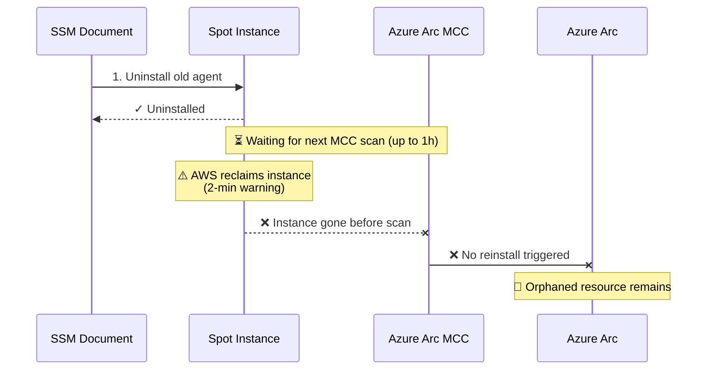
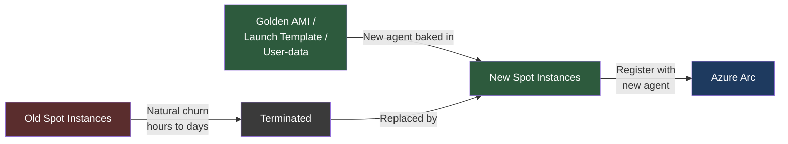
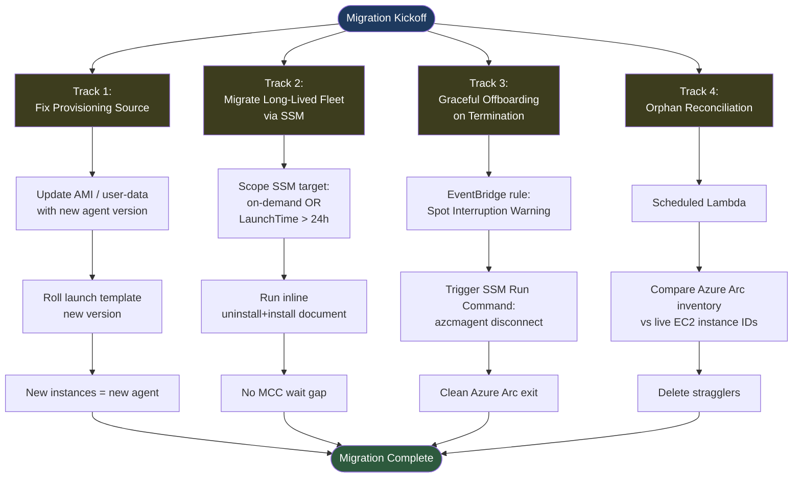
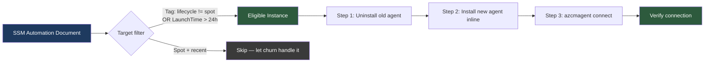
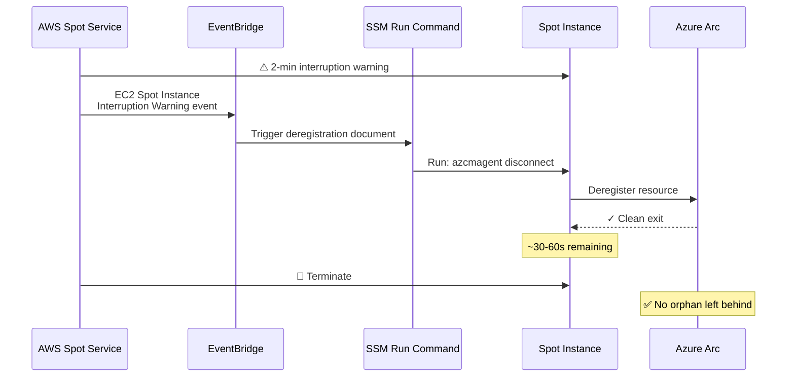
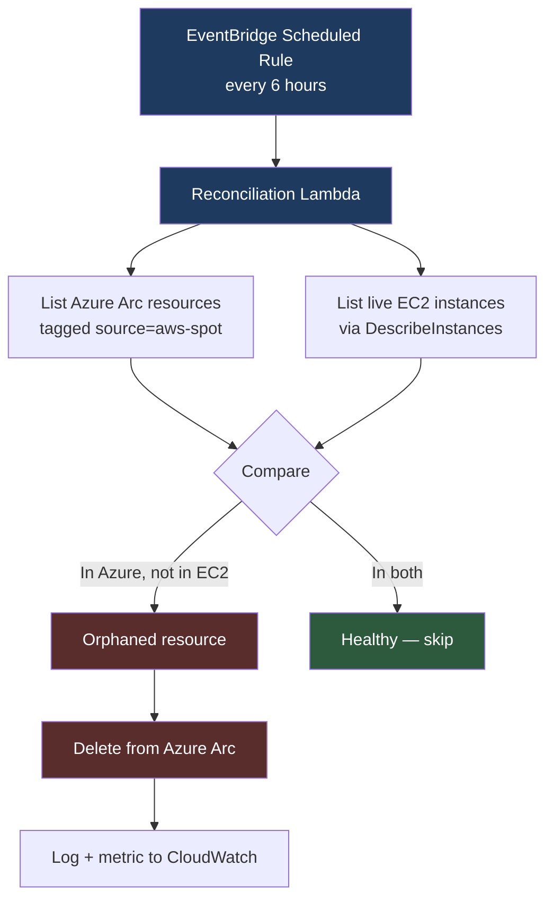
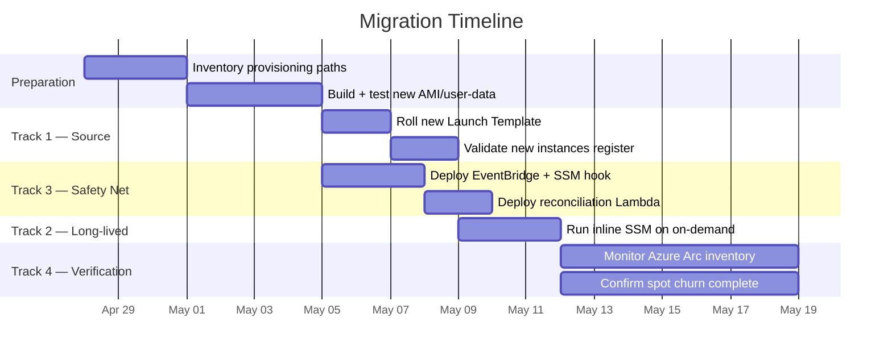
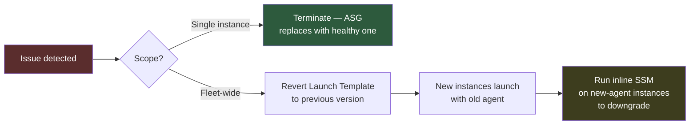

# Azure Arc Agent Migration on AWS Spot Instances

## Remediation Plan for Ephemeral Workloads

---

## 1. Problem Statement

The standard Azure Arc agent migration flow (uninstall → wait for MCC scan → reinstall) assumes long-lived instances. On AWS Spot instances, this assumption breaks down because:

- Spot instances can be reclaimed with only a **2-minute termination warning**
- The **Multi-Cloud Connector (MCC) scan runs on an interval** (typically hourly), creating a gap between uninstall and reinstall
- Spot fleets churn constantly — new instances spawn with the **old agent baked in** faster than migration can complete
- Terminated instances leave **orphaned Azure Arc resources** in Azure if not deregistered cleanly

### Why the Classic Flow Fails on Spot

---

## 2. Core Principle: Migrate the Source, Not the Instances

For ephemeral workloads, the mental shift is: **don't chase running instances — fix the provisioning path and let natural churn do the work.**

---

## 3. Remediation Strategy — Four Parallel Tracks

---

## 4. Track Details

### Track 1 — Fix the Provisioning Source *(highest priority)*

Stop the bleed first. Every new spot instance launched with the old AMI/user-data is a new problem.

**Actions:**
- Identify the provisioning path (Packer/EC2 Image Builder, Launch Template user-data, Karpenter NodePool, EMR bootstrap, AWS Batch compute environment, etc.)
- Bake the new Azure Arc agent version into the image, OR update the `user-data` installation script
- Publish a new Launch Template version and update ASG / Karpenter / Batch references
- Validate: launch one instance, confirm new agent connects to Azure Arc

### Track 2 — Migrate Long-Lived Instances via SSM

For on-demand and long-running instances only. **Skip MCC in the migration path entirely** — use an inline document that uninstalls and reinstalls back-to-back.

**Why inline:** removes the MCC scan-interval dependency and eliminates the vulnerability window where an instance could die between uninstall and reinstall.

### Track 3 — Graceful Offboarding on Spot Interruption

The most important hygiene piece. Without this, Azure Arc accumulates zombie resources indefinitely.

**Implementation:**
- EventBridge rule on event pattern: `aws.ec2` → `EC2 Spot Instance Interruption Warning`
- Target: SSM Run Command invoking `AWS-RunShellScript` (Linux) or `AWS-RunPowerShellScript` (Windows)
- Script: `azcmagent disconnect --force` with appropriate service principal credentials from Secrets Manager
- Keep the script lean — you have ~90 usable seconds after event propagation

### Track 4 — Orphan Reconciliation Safety Net

Even with Track 3, some instances will die without warning (hardware failure, network partition during the 2-min window). A periodic reconciler catches these.

---

## 5. Rollout Sequence

**Critical ordering note:** Deploy Track 3 (graceful offboarding) **before or alongside** Track 1. Otherwise, the natural churn from the new Launch Template will terminate old-agent instances without deregistering them, creating a flood of orphans.

---

## 6. Decision Matrix — Which Instances Get Which Treatment

| Instance Type | LaunchTime | Treatment | Rationale |
|---|---|---|---|
| On-demand | Any | Inline SSM (Track 2) | Stable enough for uninstall+install |
| Spot | > 24h | Inline SSM (Track 2) | Survived long enough; likely to survive migration |
| Spot | < 24h | Let churn handle it (Track 1) | Will be replaced soon anyway |
| Any | New (post-AMI roll) | Already migrated | Baked in at provisioning |

---

## 7. Pre-Flight Check

Before executing, confirm one thing that changes the whole plan:

> **Are spot instances discovered by MCC, or do they self-onboard via `azcmagent connect` in user-data?**

- **Self-onboard (user-data):** MCC scan interval is irrelevant. Migration = Track 1 only (update user-data). Tracks 3 and 4 still apply for hygiene.
- **MCC discovery:** Full four-track plan applies.

---

## 8. Success Criteria

- [ ] 100% of newly-launched spot instances run new agent version (measured daily)
- [ ] Zero on-demand instances on old agent version after Track 2 completion
- [ ] Azure Arc inventory count matches live EC2 count (±5% tolerance for in-flight terminations)
- [ ] Orphan reconciliation Lambda reports < 10 orphans per run after week 2
- [ ] No customer-visible monitoring/compliance gaps during migration window

---

## 9. Rollback Plan

If the new agent version causes issues:

The "migrate the source" approach makes rollback trivially fast — you just roll the Launch Template back and let churn reverse the migration.