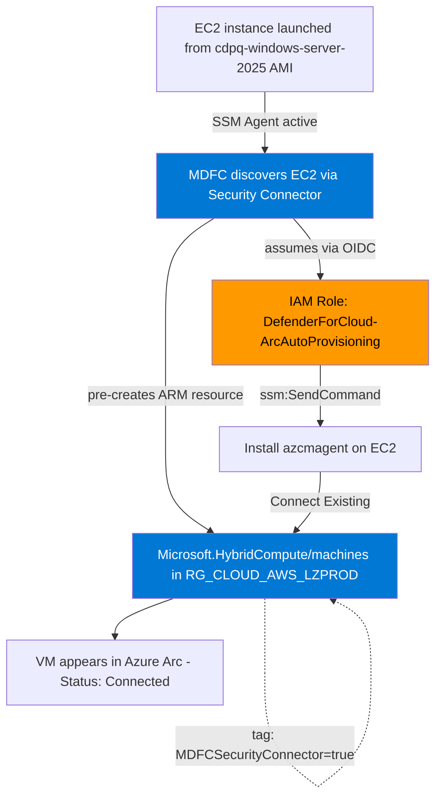
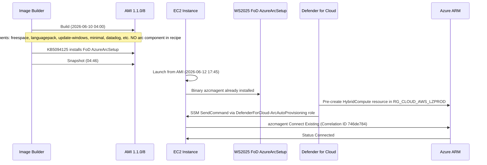
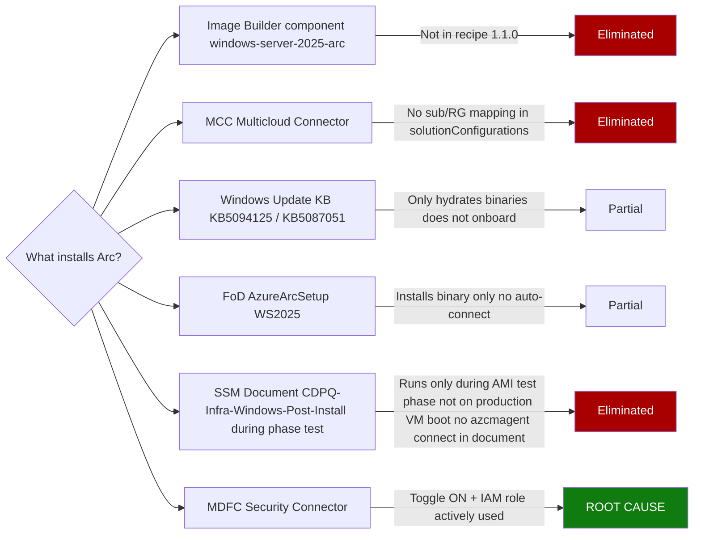
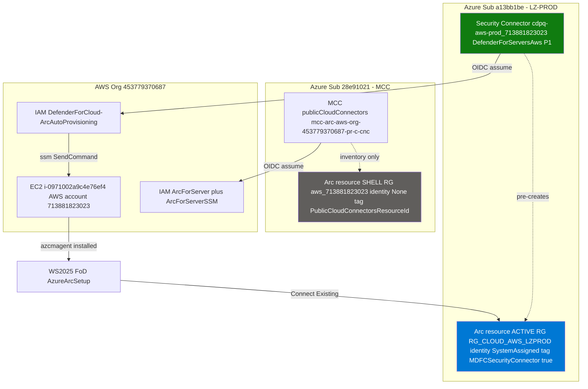

# Azure Arc Auto-Provisioning on AWS EC2 — Root Cause Analysis

## Summary

EC2 instances launched from the CDPQ Windows Server 2025 golden image were automatically appearing as Azure Arc-enabled servers in the wrong Azure subscription/resource group (`RG_CLOUD_AWS_LZPROD`), despite the `windows-server-2025-arc` Image Builder component having been removed from the recipe.

After investigation, the root cause was identified as **Microsoft Defender for Cloud (MDFC) Security Connectors** with the **Azure Arc agent auto-provisioning toggle enabled**, not the Image Builder pipeline.

---

## Environment Context

| Element | Value |
|---|---|
| AWS Account (org root) | `453779370687` |
| AWS Account (member, where VM lives) | `713881823023` |
| Azure Tenant | `0bdbe027-8f50-4ec3-843f-e27c41a63957` (CDPQ) |
| Target Azure Subscription | `a13bb1be-43cf-46bd-a732-b4df88e468c1` (LZ-PROD) |
| Target Resource Group | `RG_CLOUD_AWS_LZPROD` |
| Investigated VM | `i-0971002a9c4e76ef4` |
| AMI | `ami-00ffcef2b5d5a2e26` (`cdpq-windows-server-2025` 1.1.0/8) |
| OS | Windows Server 2025 (build 10.0.26100) |

---

## The Onboarding Chain



---

## Investigation Timeline



---

## Root Cause Layers (eliminated through investigation)



---

## Proof Commands

### 1. Confirm Arc agent is connected and identify target sub/RG

On the EC2 instance (PowerShell):

```powershell
& "$env:ProgramFiles\AzureConnectedMachineAgent\azcmagent.exe" show
```

Expected output (key fields):

```
Resource Group Name : RG_CLOUD_AWS_LZPROD
Subscription ID    : a13bb1be-43cf-46bd-a732-b4df88e468c1
Correlation ID     : 746de784-6763-44d9-bc6c-e54b6bd62944
Agent Status       : Connected
```

### 2. Confirm onboarding was "Connect Existing" (resource pre-created in Azure)

```powershell
Select-String -Path "C:\ProgramData\AzureConnectedMachineAgent\Log\himds.log" -Pattern "Connect Existing|Agent Command" | Select -First 10
```

Expected output:

```
Agent Command: existing
Connect Existing Cloud=AzureCloud Correlation ID=746de784-...
```

Proves the resource existed in Azure before the agent connected.

### 3. Verify Windows Server 2025 FoD AzureArcSetup is installed

```powershell
Get-WindowsPackage -Online | Where-Object {$_.PackageName -like "*AzureArcSetup*"} | Select PackageName, PackageState, InstallTime
```

Expected output:

```
PackageName  : Microsoft-Server-AzureArcSetup-FoD-Package~31bf3856ad364e35~amd64~~10.0.26100.32995
PackageState : Installed
InstallTime  : 6/10/2026 4:25:00 PM
```

### 4. Find ALL Arc resources for the same EC2 (reveals MDFC vs MCC duplication)

```bash
az graph query -q "resources | where type =~ 'microsoft.hybridcompute/machines' | where name == 'i-0971002a9c4e76ef4' | project name, resourceGroup, subscriptionId, identity, tags" -o json
```

Expected output (two resources):

```json
[
  {
    "resourceGroup": "aws_713881823023",
    "subscriptionId": "28e91021-...",
    "identity": {"type": "None"},
    "tags": {"PublicCloudConnectorsResourceId": "...mcc-arc-aws-org-..."}
  },
  {
    "resourceGroup": "rg_cloud_aws_lzprod",
    "subscriptionId": "a13bb1be-...",
    "identity": {"type": "SystemAssigned"},
    "tags": {"MDFCSecurityConnector": "true"}
  }
]
```

The tag `MDFCSecurityConnector: true` identifies the resource as created by MDFC.

### 5. List all MDFC Security Connectors with Arc auto-provisioning enabled

```bash
az rest --method GET --uri "https://management.azure.com/subscriptions/a13bb1be-43cf-46bd-a732-b4df88e468c1/providers/Microsoft.Security/securityConnectors?api-version=2023-10-01-preview" --query "value[?properties.offerings[?offeringType=='DefenderForServersAws' && arcAutoProvisioning.enabled==\`true\`]].{name:name, awsAccount:properties.hierarchyIdentifier}" -o table
```

Expected output:

```
Name                              AwsAccount
--------------------------------  ------------
cdpq-aws-prod_713881823023        713881823023
cdpq-aws-prod_833563725094        833563725094
cdpq-aws-prod_442429445932        442429445932
... (15+ connectors)
```

### 6. Inspect the offering details for the connector matching the VM's AWS account

```bash
az rest --method GET --uri "https://management.azure.com/subscriptions/a13bb1be-43cf-46bd-a732-b4df88e468c1/providers/Microsoft.Security/securityConnectors?api-version=2023-10-01-preview" --query "value[?properties.hierarchyIdentifier=='713881823023'].properties.offerings[?offeringType=='DefenderForServersAws']" -o json
```

Expected output:

```json
[{
  "arcAutoProvisioning": {
    "cloudRoleArn": "arn:aws:iam::713881823023:role/DefenderForCloud-ArcAutoProvisioning",
    "enabled": true
  },
  "defenderForServers": {
    "cloudRoleArn": "arn:aws:iam::713881823023:role/DefenderForCloud-DefenderForServers"
  },
  "offeringType": "DefenderForServersAws",
  "subPlan": "P1"
}]
```

### 7. Confirm the IAM role exists and is actively used on AWS side

AWS Console then IAM then Roles then search "defender":

| Role name | Trusted entities | Last activity |
|---|---|---|
| `DefenderForCloud-ArcAutoProvisioning` | OIDC IdP | active (hours/minutes) |
| `DefenderForCloud-DefenderForServers` | OIDC IdP | - |

Or via CLI:

```bash
aws iam get-role --role-name DefenderForCloud-ArcAutoProvisioning --query "Role.{Name:RoleName, LastUsed:RoleLastUsed.LastUsedDate, ARN:Arn}"
```

### 8. Verify the Azure caller on the resource creation

```bash
az monitor activity-log list --resource-id "/subscriptions/a13bb1be-43cf-46bd-a732-b4df88e468c1/resourceGroups/RG_CLOUD_AWS_LZPROD/providers/Microsoft.HybridCompute/machines/i-0971002a9c4e76ef4" --offset 30d --query "[?operationName.value=='Microsoft.HybridCompute/machines/write'].{time:eventTimestamp, caller:caller, appId:claims.appid}" -o table
```

Expected caller: `d2a590e7-6906-4a45-8f41-cecfdca9bca1` which is the Hybrid RP Application (Microsoft first-party SPN that the Hybrid Compute Resource Provider uses on behalf of upstream callers like MDFC).

Identify the SPN:

```bash
az ad sp show --id d2a590e7-6906-4a45-8f41-cecfdca9bca1 --query "displayName" -o tsv
```

Returns: `Hybrid RP Application`

### 9. Verify CDPQ-Infra-Windows-Post-Install is not the Arc trigger

a) Confirm it only runs during Image Builder test phase, not on production boot:

```bash
aws ssm list-command-invocations --instance-id i-0971002a9c4e76ef4 --region ca-central-1 --query "CommandInvocations[?contains(DocumentName, 'Post-Install')].[RequestedDateTime,DocumentName,Status]" --output table
```

Expected output for a production VM (launched from AMI, not a test instance): empty or no Post-Install entries.

b) Check the document content for any azcmagent connect call:

```bash
aws ssm get-document --name CDPQ-Infra-Windows-Post-Install --region ca-central-1 --query "Content" --output text | grep -iE "azcmagent|arc connect|HybridCompute"
```

Expected output: empty. The document does not invoke azcmagent connect.

c) Cross-check with Image Builder log (it ran during test phase of the AMI build, not on the production VM). CloudWatch log group `/aws/imagebuilder/windows-server-2025/1.1.0/8`, around 2026-06-10 05:16:

```
Stdout: aws ssm start-automation-execution --document-name CDPQ-Infra-Windows-Post-Install --parameters windowsversion=2025,instanceprofile=ibtest-w25-InstanceProfile,computername=w25t202606100116,InstanceId=i-0e248443e58080b14,environnement=PRD
```

Note the InstanceId `i-0e248443e58080b14` is the TEST instance, not the production VM. Confirms CDPQ-Infra-Windows-Post-Install runs against the Image Builder test instance, not against production VMs launched from the resulting AMI.

---

## Architecture: MDFC vs MCC



Key difference: Both MCC and MDFC create Arc resources, but MDFC's resource is the one the agent connects to (Connect Existing matches via AWS InstanceId). MCC's shell resource exists for inventory only.

---

## Fix

### Option A — Disable Arc auto-provisioning per connector (Azure Portal)

1. Navigate to: [Microsoft Defender for Cloud Environment settings](https://portal.azure.com/#view/Microsoft_Azure_Security/SecurityMenuBlade/~/EnvironmentSettings)
2. Expand the management group hierarchy then select an AWS connector (e.g., `cdpq-aws-prod_713881823023`)
3. Click Defender plans then Servers then Settings (or Edit configuration)
4. Toggle Azure Arc agent to Off
5. Save

The Azure Portal will prompt you to redownload and redeploy the CloudFormation template in AWS to remove the now-orphaned IAM role.

### Option B — Bulk disable across all connectors (CLI)

Test on one connector first.

```bash
SUB=a13bb1be-43cf-46bd-a732-b4df88e468c1

# Test on a single connector first
TEST_CONNECTOR=$(az rest --method GET \
  --uri "https://management.azure.com/subscriptions/${SUB}/providers/Microsoft.Security/securityConnectors?api-version=2023-10-01-preview" \
  --query "value[0].id" -o tsv)

az rest --method PATCH \
  --uri "https://management.azure.com${TEST_CONNECTOR}?api-version=2023-10-01-preview" \
  --body '{"properties":{"offerings":[{"offeringType":"DefenderForServersAws","arcAutoProvisioning":{"enabled":false}}]}}'

# Verify, then loop over all
for connector in $(az rest --method GET \
  --uri "https://management.azure.com/subscriptions/${SUB}/providers/Microsoft.Security/securityConnectors?api-version=2023-10-01-preview" \
  --query "value[].id" -o tsv); do
  echo "Disabling Arc auto-provisioning on: $connector"
  az rest --method PATCH \
    --uri "https://management.azure.com${connector}?api-version=2023-10-01-preview" \
    --body '{"properties":{"offerings":[{"offeringType":"DefenderForServersAws","arcAutoProvisioning":{"enabled":false}}]}}'
done
```

### Option C — Fix in IaC (recommended for permanent solution)

The Security Connectors are created by SPN `8edd93e1-2103-40b4-bd70-6e34e586362d` via your IaC pipeline. Locate the Terraform/Bicep module and set:

```hcl
# Terraform example
arc_auto_provisioning {
  enabled = false
}
```

Or in Bicep:

```bicep
arcAutoProvisioning: {
  enabled: false
}
```

Then redeploy. All new AWS accounts will be onboarded without Arc auto-provisioning.

### Option D — Disable Defender for Servers entirely

If you don't need Defender for Servers protection on EC2 at all:

```bash
for connector in $(az rest --method GET \
  --uri "https://management.azure.com/subscriptions/${SUB}/providers/Microsoft.Security/securityConnectors?api-version=2023-10-01-preview" \
  --query "value[].id" -o tsv); do
  az rest --method PATCH \
    --uri "https://management.azure.com${connector}?api-version=2023-10-01-preview" \
    --body '{"properties":{"offerings":[{"offeringType":"DefenderForServersAws","arcAutoProvisioning":{"enabled":false},"defenderForServers":{"enabled":false}}]}}'
done
```

This loses Defender for Servers value (vulnerability scans, threat detection, MDE auto-deployment).

### Cleanup of existing Arc resources (optional)

For VMs already onboarded that you want removed from Arc:

```powershell
# On each VM
& "$env:ProgramFiles\AzureConnectedMachineAgent\azcmagent.exe" disconnect --force-local-only
```

Then delete the ARM resources:

```bash
az resource delete --ids "/subscriptions/${SUB}/resourceGroups/RG_CLOUD_AWS_LZPROD/providers/Microsoft.HybridCompute/machines/<VM_NAME>"
```

---

## Verification After Fix

### 1. Confirm Arc auto-provisioning is disabled

```bash
az rest --method GET \
  --uri "https://management.azure.com/subscriptions/${SUB}/providers/Microsoft.Security/securityConnectors?api-version=2023-10-01-preview" \
  --query "value[].{name:name, arcEnabled:properties.offerings[?offeringType=='DefenderForServersAws'].arcAutoProvisioning.enabled|[0]}" \
  -o table
```

All `arcEnabled` should be `false`.

### 2. Verify IAM role is deleted in AWS (after CloudFormation re-deploy)

```bash
aws iam get-role --role-name DefenderForCloud-ArcAutoProvisioning
# Should return: NoSuchEntity
```

### 3. Launch a new EC2 from the golden AMI and confirm no Arc onboarding

After 1 hour (scan interval), check:

```bash
az graph query -q "resources | where type =~ 'microsoft.hybridcompute/machines' | where name == '<new_instance_id>'" -o json
# Should return empty
```

---

## What This Investigation Eliminated

| Suspected vector | Verdict | Evidence |
|---|---|---|
| Image Builder component `windows-server-2025-arc` | Not the cause | Component not in recipe `1.1.0` (verified via `aws imagebuilder get-image-recipe`) |
| `azcmagent.json` baked in AMI from parent | Not the cause | File not present on VM (`Get-ChildItem C:\ -Filter "azcmagent.json"`) |
| MCC `Microsoft.HybridConnectivity` connector | Not the active onboarding path | `solutionConfigurations.arcOnboarding.solutionSettings` has no sub/RG mapping; MCC resource is `identity: None` shell |
| Windows Update KB installing Arc directly | Partial. Only hydrates binaries | CBS.log shows `Hydration: Successful` for `AzureArcSetup.exe`, but no install action |
| FoD `Microsoft-Server-AzureArcSetup-FoD-Package` | Installs binary only, doesn't auto-connect | `Get-WindowsPackage` shows installed, but no auto-connect mechanism |
| SSM Document `CDPQ-Infra-Windows-Post-Install` | Not the cause | Executed only during Image Builder TEST phase (visible in CloudWatch log `/aws/imagebuilder/windows-server-2025/1.1.0/8` at 05:16); does not run on production VM boot; document content does not contain `azcmagent connect` |
| MDFC Security Connector with `arcAutoProvisioning.enabled=true` | ROOT CAUSE | Tag `MDFCSecurityConnector: true` on resource; IAM role `DefenderForCloud-ArcAutoProvisioning` actively used; `Connect Existing` in himds.log |

---

## Microsoft Documentation References

| Topic | Link |
|---|---|
| Connect AWS accounts to Microsoft Defender for Cloud (quickstart) | https://learn.microsoft.com/en-us/azure/defender-for-cloud/quickstart-onboard-aws?tabs=Defender-for-Servers |
| Update the CloudFormation template (when changing connector config) | https://learn.microsoft.com/en-us/azure/defender-for-cloud/quickstart-onboard-aws?tabs=Defender-for-Servers#update-the-cloudformation-template |
| Defender for Servers introduction and plans | https://learn.microsoft.com/en-us/azure/defender-for-cloud/defender-for-servers-introduction |
| Automate connector deployment (REST API) | https://learn.microsoft.com/en-us/azure/defender-for-cloud/plan-multicloud-security-automate-connector-deployment |
| Security Connectors REST API reference | https://learn.microsoft.com/en-us/rest/api/defenderforcloud/security-connectors |
| Azure Arc — Connect Windows Server machines via Azure Arc Setup (WS2022/2025 FoD) | https://learn.microsoft.com/en-us/azure/azure-arc/servers/onboard-windows-server |
| Azure Arc-enabled servers overview | https://learn.microsoft.com/en-us/azure/azure-arc/servers/overview |
| `azcmagent` CLI reference | https://learn.microsoft.com/en-us/azure/azure-arc/servers/azcmagent |
| Multicloud Connector (MCC) — separate system, not the cause here | https://learn.microsoft.com/en-us/azure/azure-arc/multicloud-connector/overview |

---

## Honest Notes on Investigation Methodology

- The tag `MDFCSecurityConnector: true` is the strongest indicator that MDFC owns the resource. The name of the tag itself maps to "Microsoft Defender For Cloud Security Connector." However, no Microsoft official doc was found explicitly stating "MDFC sets this exact tag value on auto-provisioned Arc resources." The conclusion is reinforced by:
  - The portal toggle "Azure Arc agent" being ON in the Security Connector configuration
  - The IAM role `DefenderForCloud-ArcAutoProvisioning` being actively used (last activity: hours ago)
  - The Activity Log caller being the Hybrid RP first-party SPN, consistent with MDFC's invocation pattern
- The Activity Log lookup for the original `correlationId` was empty (purged), so the direct caller of the initial `Microsoft.HybridCompute/machines/write` could not be retrieved for this specific VM. The chain is corroborated by configuration state rather than the original event.
- The SSM document `CDPQ-Infra-Windows-Post-Install` was initially considered as a possible Arc trigger because it appears in the Image Builder CloudWatch logs during the TEST phase. Investigation confirmed it executes only against the temporary test instance during the AMI build process (instance ID `i-0e248443e58080b14`, terminated after the build at 05:19) and not against production instances launched from the AMI. Its content was also verified to contain no `azcmagent connect` invocation.
- This document represents the conclusion as of investigation date. If you need formal vendor confirmation, open a Microsoft support case referencing the Security Connector ID and one onboarded VM's resource ID.

---

## Glossary

| Term | Meaning |
|---|---|
| MDFC | Microsoft Defender for Cloud |
| MCC | Multicloud Connector (`Microsoft.HybridConnectivity/publicCloudConnectors`) |
| FoD | Feature on Demand (Windows Server optional component) |
| OIDC | OpenID Connect (federated auth between Microsoft Entra ID and AWS IAM) |
| CSPM | Cloud Security Posture Management |
| Connect Existing | `azcmagent` mode where the ARM resource was pre-created in Azure before the agent runs |
| Hybrid RP | Microsoft first-party SPN (`d2a590e7-6906-4a45-8f41-cecfdca9bca1`) used by the `Microsoft.HybridCompute` resource provider |