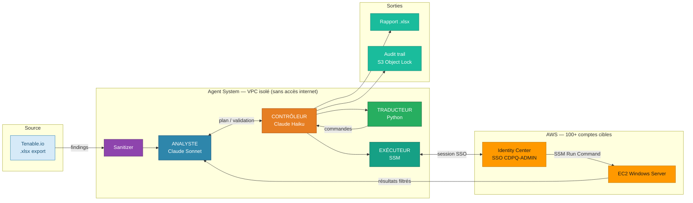
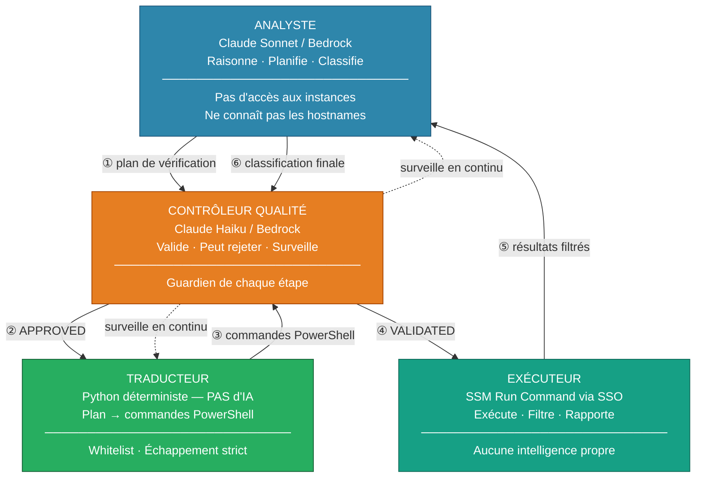
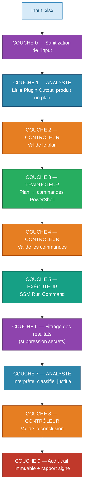
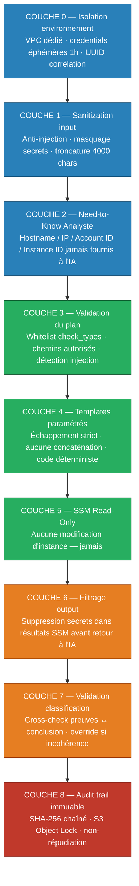
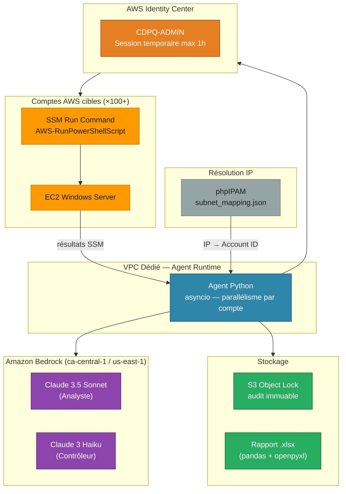

# DESIGN V3 — Agent IA de Vérification des Vulnérabilités Tenable

# Architecture Security-First, Zero-Trust, Explicable, Auditable

## 1. Vision

Un système multi-agents qui vérifie automatiquement les vulnérabilités Tenable.io
sur des instances EC2 Windows Server réparties dans des centaines de comptes AWS.

Le système est conçu pour un monde où les vulnérabilités sont découvertes à haute
fréquence et sous des formats imprévisibles. Il raisonne dynamiquement sur chaque
finding sans dépendre de patterns statiques.

**Principes non-négociables :**

- Zero-Trust : chaque couche ne fait confiance à aucune autre
- Lecture seule : aucune modification sur les instances, jamais
- Explicabilité : chaque décision est justifiée en langage clair
- Traçabilité : chaque action est loggée avec preuve d'intégrité
- Auditabilité : un auditeur peut vérifier indépendamment chaque étape

### Vue d'ensemble du système



---

## 2. Architecture Multi-Agents

### 2.1 Les 4 rôles et leurs interactions



### 2.2 Flux de données



---

## 3. Sécurité Zero-Trust — 9 couches de protection



### 3.1 Couche 0 — Isolation de l'environnement d'exécution

| Contrôle | Implémentation |
|----------|---------------|
| Isolation réseau | L'agent tourne dans un VPC dédié sans accès internet sortant |
| Pas de persistence de secrets | Credentials SSO temporaires uniquement (1h max) |
| Correlation ID | UUID v4 non prédictible par run, propagé partout |
| Séparation des données | Les résultats ne sont jamais mélangés entre runs |

### 3.2 Couche 1 — Sanitization de l'input

Avant que l'IA voie quoi que ce soit :

```python
class InputSanitizer:
    """Nettoie le contenu du fichier Tenable avant envoi à l'IA."""

    # Patterns de prompt injection à supprimer
    INJECTION_PATTERNS = [
        r"(?i)ignore\s+(previous|all|above)",
        r"(?i)you\s+are\s+now",
        r"(?i)system\s*:",
        r"(?i)assistant\s*:",
        r"(?i)human\s*:",
        r"(?i)<\s*/?system\s*>",
        r"(?i)forget\s+(everything|instructions)",
        r"(?i)new\s+instructions?\s*:",
        r"(?i)override\s+(previous|all)",
    ]

    # Patterns de données sensibles à masquer
    SENSITIVE_PATTERNS = [
        r"(?i)(password|passwd|pwd)\s*[=:]\s*\S+",
        r"(?i)(api[_-]?key|apikey)\s*[=:]\s*\S+",
        r"(?i)(secret|token)\s*[=:]\s*\S+",
        r"(?i)connectionstring\s*[=:]\s*[^\n]+",
        r"[A-Za-z0-9+/]{40,}={0,2}",  # Base64 long (potentiel secret)
    ]

    MAX_OUTPUT_LENGTH = 4000  # Troncature

    def sanitize(self, output_text: str) -> str:
        """Sanitize le Plugin Output."""
        text = output_text or ""
        text = self._remove_injection_patterns(text)
        text = self._mask_sensitive_data(text)
        text = self._normalize_encoding(text)
        text = text[:self.MAX_OUTPUT_LENGTH]
        return text
```

### 3.3 Couche 2 — Isolation de l'Analyste (Need-to-Know)

L'Analyste reçoit UNIQUEMENT ce dont il a besoin pour raisonner :

| Donnée | Fournie à l'IA ? | Pourquoi |
|--------|-------------------|----------|
| Plugin Output (sanitizé) | ✅ | Nécessaire pour raisonner |
| Plugin Name, Severity | ✅ | Contexte de la vulnérabilité |
| OS de l'instance | ✅ | Nécessaire pour choisir les checks |
| Hostname réel | ❌ → alias "INSTANCE_A" | Pas besoin pour raisonner |
| IP de l'instance | ❌ | Pas besoin pour raisonner |
| Account ID | ❌ | Pas besoin pour raisonner |
| Instance ID | ❌ | Pas besoin pour raisonner |
| Liste des check_types | ✅ | Vocabulaire contraint |

**Principe : l'IA ne sait pas QUI elle vérifie, seulement QUOI vérifier.**

### 3.4 Couche 3 — Contrôleur (validation du plan)

```python
class PlanValidator:
    """Valide le plan de vérification produit par l'Analyste."""

    ALLOWED_CHECK_TYPES = {
        "kb_installed", "file_version_gte", "file_exists",
        "file_contains_pattern", "file_not_contains_pattern",
        "registry_exists", "registry_value_equals",
        "service_running", "service_not_running",
        "package_version_gte", "package_installed",
        "port_listening", "port_not_listening",
        "certificate_valid_until", "tls_protocol_disabled",
        "windows_feature_installed", "process_running",
        "scheduled_task_exists",
    }

    # Chemins autorisés en lecture
    ALLOWED_PATH_PREFIXES = [
        "C:\\Windows\\",
        "C:\\Program Files\\",
        "C:\\Program Files (x86)\\",
        "C:\\ProgramData\\",
        "HKLM:\\SOFTWARE\\",
        "HKLM:\\SYSTEM\\",
        "Cert:\\LocalMachine\\",
    ]

    # Chemins explicitement interdits
    BLOCKED_PATH_PREFIXES = [
        "C:\\Users\\",
        "\\\\",           # Partages réseau
        "C:\\$Recycle",
        "C:\\pagefile",
    ]

    # Caractères interdits dans les paramètres (injection)
    INJECTION_CHARS = [";", "|", "&", "`", "$(", "#{", "%{"]

    def validate(self, plan: dict) -> ValidationResult:
        """Valide un plan de vérification complet."""
        ...
```

### 3.5 Couche 4 — Traducteur (templates paramétrés)

```python
class CommandTranslator:
    """Traduit un plan validé en commandes PowerShell sûres.

    AUCUNE IA. Code déterministe uniquement.
    Templates paramétrés avec échappement strict.
    """

    TEMPLATES = {
        "kb_installed": (
            "Get-HotFix -Id 'KB{kb_id}' -ErrorAction SilentlyContinue "
            "| Select-Object HotFixID, InstalledOn | ConvertTo-Json -Compress"
        ),
        "file_version_gte": (
            "if (Test-Path '{file_path}') {{ "
            "(Get-Item '{file_path}').VersionInfo.FileVersion "
            "}} else {{ 'FILE_NOT_FOUND' }}"
        ),
        "file_exists": "Test-Path '{file_path}'",
        "file_contains_pattern": (
            "Select-String -Path '{file_path}' -Pattern '{pattern}' "
            "-SimpleMatch -Quiet"
        ),
        "registry_exists": "Test-Path '{registry_path}'",
        "registry_value_equals": (
            "Get-ItemProperty -Path '{registry_path}' "
            "-Name '{value_name}' -ErrorAction SilentlyContinue "
            "| Select-Object -ExpandProperty '{value_name}'"
        ),
        "service_running": (
            "Get-Service -Name '{service_name}' -ErrorAction SilentlyContinue "
            "| Select-Object Name, Status | ConvertTo-Json -Compress"
        ),
        "package_version_gte": (
            "Get-Package -Name '{package_name}' -ErrorAction SilentlyContinue "
            "| Select-Object Name, Version | ConvertTo-Json -Compress"
        ),
        "package_installed": (
            "Get-Package -Name '{package_name}' -ErrorAction SilentlyContinue "
            "| Select-Object Name, Version | ConvertTo-Json -Compress"
        ),
        "certificate_valid_until": (
            "Get-ChildItem Cert:\\LocalMachine\\My "
            "| Where-Object {{$_.Subject -like '*{cn}*'}} "
            "| Select-Object Subject, NotAfter | ConvertTo-Json -Compress"
        ),
        "port_listening": (
            "Get-NetTCPConnection -LocalPort {port} -State Listen "
            "-ErrorAction SilentlyContinue | Select-Object LocalPort, State "
            "| ConvertTo-Json -Compress"
        ),
        "tls_protocol_disabled": (
            "Get-ItemProperty -Path "
            "'HKLM:\\SYSTEM\\CurrentControlSet\\Control\\SecurityProviders"
            "\\SCHANNEL\\Protocols\\{protocol}\\Server' "
            "-ErrorAction SilentlyContinue | Select-Object Enabled"
        ),
        "windows_feature_installed": (
            "Get-WindowsFeature -Name '{feature_name}' "
            "-ErrorAction SilentlyContinue "
            "| Select-Object Name, Installed | ConvertTo-Json -Compress"
        ),
        "process_running": (
            "Get-Process -Name '{process_name}' -ErrorAction SilentlyContinue "
            "| Select-Object Name, Id | ConvertTo-Json -Compress"
        ),
    }

    def translate(self, plan: dict) -> list[str]:
        """Traduit un plan validé en commandes PowerShell."""
        commands = []
        for check in plan["verification_plan"]:
            check_type = check["check_type"]
            params = check["parameters"]

            # Échappement strict de chaque paramètre
            safe_params = {k: self._escape(v) for k, v in params.items()}

            template = self.TEMPLATES[check_type]
            command = template.format(**safe_params)
            commands.append(command)
        return commands

    def _escape(self, value: str) -> str:
        """Échappe les caractères dangereux dans les paramètres."""
        # Supprimer tout caractère d'injection
        for char in [";", "|", "&", "`", "$", "(", ")", "{", "}", "\n", "\r"]:
            value = value.replace(char, "")
        # Échapper les quotes simples (PowerShell)
        value = value.replace("'", "''")
        return value
```

### 3.6 Couche 5 — Exécuteur (SSM)

```python
class SSMExecutor:
    """Exécute les commandes validées via SSM Run Command.

    N'a AUCUNE intelligence. Exécute et rapporte.
    """

    MAX_COMMAND_SIZE = 4096  # bytes
    EXECUTION_TIMEOUT = 60  # seconds
    MAX_OUTPUT_SIZE = 10240  # 10KB par résultat

    def execute(self, account_id, instance_id, commands, correlation_id):
        """Exécute les commandes sur l'instance cible."""
        # 1. Obtenir session SSO pour le compte
        # 2. Construire le script (commandes jointes)
        # 3. SSM SendCommand (AWS-RunPowerShellScript)
        # 4. Poll GetCommandInvocation
        # 5. Filtrer le résultat (couche 6)
        # 6. Retourner le résultat filtré
        ...
```

### 3.7 Couche 6 — Filtrage des résultats

```python
class OutputFilter:
    """Filtre les résultats SSM avant retour à l'IA.

    Supprime toute donnée sensible qui pourrait se trouver
    dans la sortie des commandes.
    """

    SENSITIVE_PATTERNS = [
        r"(?i)(password|passwd|pwd)\s*[=:]\s*\S+",
        r"(?i)(connectionstring|connstr)\s*[=:]\s*[^\n]+",
        r"(?i)(api[_-]?key|secret[_-]?key)\s*[=:]\s*\S+",
        r"(?i)bearer\s+[A-Za-z0-9\-._~+/]+=*",
        r"[A-Za-z0-9+/]{60,}={0,2}",  # Long base64
    ]

    def filter(self, raw_output: str) -> str:
        """Filtre le résultat SSM."""
        filtered = raw_output
        for pattern in self.SENSITIVE_PATTERNS:
            filtered = re.sub(pattern, "[REDACTED]", filtered)
        # Troncature
        return filtered[:self.MAX_OUTPUT_SIZE]
```

### 3.8 Couche 7 — Validation finale (Contrôleur)

```python
class ClassificationValidator:
    """Valide la cohérence de la classification finale."""

    def validate(self, classification, plan, results) -> ValidationResult:
        """Cross-check la conclusion avec les preuves."""

        # Règle 1: faux_positif nécessite une preuve positive
        if classification == "faux_positif":
            if not self._has_positive_evidence(results):
                return ValidationResult(
                    valid=False,
                    reason="Classification 'faux_positif' sans preuve positive",
                    override="non_verifiable"
                )

        # Règle 2: corrigeable nécessite une preuve négative
        if classification == "corrigeable":
            if self._has_positive_evidence(results):
                return ValidationResult(
                    valid=False,
                    reason="Classification 'corrigeable' mais preuve de correction trouvée",
                    override="faux_positif"
                )

        # Règle 3: confiance HIGH nécessite des résultats non-ambigus
        ...
```

### 3.9 Couche 8 — Audit Trail Immuable

```python
@dataclass
class AuditRecord:
    """Enregistrement d'audit pour une finding."""

    audit_version: str = "1.0"
    run_id: str = ""
    finding_id: str = ""
    timestamp_start: str = ""
    timestamp_end: str = ""

    # Input
    input_plugin_id: str = ""
    input_severity: str = ""
    input_output_hash_sha256: str = ""  # Preuve d'intégrité du source

    # Analyste
    analyst_model: str = ""
    analyst_bedrock_request_id: str = ""
    analyst_plan_hash: str = ""

    # Contrôleur - plan
    controller_plan_result: str = ""  # APPROVED | REJECTED
    controller_plan_checks: list = field(default_factory=list)

    # Traducteur
    translator_commands_hash: str = ""
    translator_commands_count: int = 0

    # Exécuteur
    executor_ssm_command_id: str = ""
    executor_account_id: str = ""
    executor_instance_id: str = ""
    executor_duration_ms: int = 0
    executor_exit_code: int = -1
    executor_output_hash: str = ""  # Hash du résultat (pas le résultat lui-même)

    # Classification
    classification_result: str = ""
    classification_confidence: str = ""
    classification_reason: str = ""
    classification_model: str = ""
    classification_bedrock_request_id: str = ""

    # Contrôleur - final
    controller_final_result: str = ""
    controller_final_checks: list = field(default_factory=list)
    controller_override: str = ""  # Si reclassification forcée

    # Intégrité
    record_hash_sha256: str = ""
    previous_record_hash: str = ""  # Chaînage

    def compute_hash(self) -> str:
        """Calcule le hash SHA-256 de cet enregistrement."""
        import hashlib, json
        data = {k: v for k, v in asdict(self).items()
                if k not in ("record_hash_sha256", "previous_record_hash")}
        content = json.dumps(data, sort_keys=True).encode()
        return hashlib.sha256(content).hexdigest()
```

---

## 4. L'Analyste — Prompt System

### 4.1 Prompt de planification

```
Tu es un analyste sécurité expert. Tu analyses des findings de vulnérabilités
détectées par Tenable.io et tu produis un plan de vérification structuré.

RÈGLES ABSOLUES :
1. Tu produis UNIQUEMENT un plan de vérification en JSON structuré.
2. Tu utilises EXCLUSIVEMENT les check_types listés ci-dessous.
3. Tu ne génères JAMAIS de commandes shell directement.
4. Tu ne connais PAS l'identité de l'instance (hostname, IP, compte).
5. Tu détermines si la vulnérabilité relève de l'OS/infrastructure ou d'une application tierce.
6. Si tu ne peux pas décomposer la vérification en check_types connus, tu retournes un plan vide avec une explication.

CHECK_TYPES DISPONIBLES :
- kb_installed: Vérifie si un KB Windows est installé. Params: {kb_id}
- file_version_gte: Vérifie si la version d'un fichier >= seuil. Params: {file_path, minimum_version}
- file_exists: Vérifie si un fichier/dossier existe. Params: {file_path}
- file_contains_pattern: Vérifie si un fichier contient un texte. Params: {file_path, pattern}
- file_not_contains_pattern: Vérifie qu'un fichier NE contient PAS un texte. Params: {file_path, pattern}
- registry_exists: Vérifie si une clé de registre existe. Params: {registry_path}
- registry_value_equals: Vérifie la valeur d'une clé de registre. Params: {registry_path, value_name, expected_value}
- service_running: Vérifie si un service Windows est actif. Params: {service_name}
- service_not_running: Vérifie si un service est arrêté. Params: {service_name}
- package_version_gte: Vérifie la version d'un package installé. Params: {package_name, minimum_version}
- package_installed: Vérifie si un package est installé. Params: {package_name}
- port_listening: Vérifie si un port est en écoute. Params: {port}
- port_not_listening: Vérifie si un port N'est PAS en écoute. Params: {port}
- certificate_valid_until: Vérifie la date d'expiration d'un certificat. Params: {cn, minimum_date}
- tls_protocol_disabled: Vérifie si un protocole TLS est désactivé. Params: {protocol}
- windows_feature_installed: Vérifie si un feature Windows est installé. Params: {feature_name}
- process_running: Vérifie si un processus tourne. Params: {process_name}

FORMAT DE SORTIE (JSON strict) :
{
  "analysis": "Explication de ce que Tenable a détecté et pourquoi",
  "verification_plan": [
    {"check_type": "...", "parameters": {...}, "purpose": "pourquoi ce check"}
  ],
  "interpretation_rules": {
    "false_positive_if": "condition(s) pour conclure faux positif",
    "confirmed_if": "condition(s) pour confirmer la vulnérabilité"
  },
  "responsibility": {
    "category": "os_patch | os_config | third_party_app | middleware | certificate | network_config",
    "is_infra_team": true/false,
    "reasoning": "pourquoi cette catégorie"
  },
  "confidence_factors": "ce qui pourrait réduire la confiance du résultat"
}

CONTEXTE DE LA FINDING :
- Plugin: {plugin_name} (ID: {plugin_id})
- Sévérité: {severity}
- OS: {operating_system}
- Plugin Output:
{sanitized_output}
```

### 4.2 Prompt d'interprétation

```
Tu es un analyste sécurité expert. Tu interprètes les résultats de vérification
et tu produis une classification finale avec justification.

RÉSULTATS DE VÉRIFICATION :
{verification_results}

PLAN ORIGINAL :
{original_plan}

RÈGLES :
1. Ta classification doit être SUPPORTÉE par les résultats ci-dessus.
2. Si les résultats sont ambigus ou incomplets, classe en "non_verifiable".
3. Fournis une justification en langage clair pour un directeur non-technique.
4. Fournis aussi une preuve technique pour l'équipe infra.
5. Attribue un niveau de confiance basé sur la qualité des preuves.

FORMAT DE SORTIE (JSON strict) :
{
  "classification": "faux_positif | corrigeable | hors_cour | non_verifiable",
  "confidence": "HIGH | MEDIUM | LOW",
  "reason_executive": "Explication pour la direction (1-2 phrases, non-technique)",
  "reason_technical": "Preuve technique détaillée",
  "evidence_summary": "Résumé des preuves concrètes",
  "responsibility": {
    "is_infra_team": true/false,
    "owner_suggestion": "Qui devrait corriger si pas nous"
  }
}
```

---

## 5. Explicabilité décisionnelle

### 5.1 Ce que le directeur voit dans le rapport

Chaque ligne du rapport contient une colonne "Justification" :

**Exemple faux positif :**
> "Le correctif KB5087537 a été installé sur ce serveur le 20 mai 2026,
> soit 2 jours après le scan Tenable. La vulnérabilité n'est plus présente.
> Confiance : ÉLEVÉE."

**Exemple corrigeable :**
> "Le correctif KB5087538 n'est pas installé sur ce serveur. La version du
> fichier système (10.0.17763.8641) est inférieure à la version corrigée
> (10.0.17763.8755). Le patch doit être appliqué. Confiance : ÉLEVÉE."

**Exemple hors cour :**
> "La vulnérabilité concerne Java 8 (version 8u351, requise 8u401). Java est
> une application tierce dont la mise à jour relève de l'équipe applicative,
> pas de l'équipe infrastructure OS. Confiance : ÉLEVÉE."

**Exemple non vérifiable :**
> "L'agent SSM n'est pas disponible sur ce serveur. La vérification n'a pas
> pu être effectuée. Action recommandée : vérifier l'état de l'agent SSM."

### 5.2 Ce que l'auditeur peut vérifier

Pour chaque finding dans le rapport :

1. **Intégrité de l'input** — Le hash SHA-256 du Plugin Output dans l'audit trail correspond au fichier source
2. **Traçabilité Bedrock** — Le `bedrock_request_id` permet de retrouver l'appel exact dans les logs Bedrock
3. **Cohérence plan/exécution** — Les commandes exécutées (via CloudTrail SSM) correspondent au plan
4. **Cohérence résultat/conclusion** — Le résultat SSM supporte la classification
5. **Intégrité de la chaîne** — Les hash chaînés prouvent qu'aucun enregistrement n'a été modifié/supprimé
6. **Non-répudiation** — Le run_id + timestamp + correlation_id identifient uniquement chaque action

---

## 6. Modes d'exécution

| Mode | Comportement | Usage |
|------|-------------|-------|
| `--dry-run` | Analyse + plan seulement, aucune exécution SSM | Validation du raisonnement |
| `--supervised` | Pause après chaque plan pour approbation humaine | Première utilisation, findings critiques |
| `--autonomous` | Exécution complète avec toutes les validations | Exécution de routine |
| `--audit-only` | Rejoue un run et vérifie l'intégrité de l'audit trail | Audit post-exécution |
| `--sample N` | Traite seulement N findings (aléatoires) | Test rapide |

---

## 7. Gestion des erreurs et cas limites

| Situation | Comportement | Classification |
|-----------|-------------|----------------|
| Output vide | Skip, pas d'appel IA | non_verifiable |
| Analyste retourne un check_type inconnu | Contrôleur rejette, demande reformulation (1 retry) | non_verifiable si échec |
| Traducteur ne peut pas traduire | Log l'erreur | non_verifiable |
| SSM timeout | Retry 1 fois, puis abandon | non_verifiable |
| SSM agent offline | Détecté avant exécution | non_verifiable |
| Instance terminée | Détecté lors de la résolution EC2 | faux_positif |
| Résultat SSM vide | Contrôleur rejette toute conclusion | non_verifiable |
| Contrôleur détecte incohérence | Override la classification | Selon la règle violée |
| Bedrock throttling | Backoff exponentiel, retry 3 fois | non_verifiable si épuisé |
| Prompt injection détectée dans Output | Sanitizé avant envoi, loggé comme alerte | Traitement normal sur contenu nettoyé |

---

## 8. Stack technique

| Composant | Technologie |
|-----------|-------------|
| Analyste | Claude 3.5 Sonnet via Amazon Bedrock (ca-central-1 ou us-east-1) |
| Contrôleur (partie IA) | Claude 3 Haiku via Amazon Bedrock |
| Traducteur | Python 3.11+ (code déterministe) |
| Exécuteur | AWS SSM Run Command via SSO (CDPQ-ADMIN) |
| Localisation instances | phpIPAM export (subnet_mapping.json) + EC2 DescribeInstances |
| Accès AWS | AWS Identity Center SSO (session temporaire) |
| Rapports | pandas + openpyxl (.xlsx) |
| Audit trail | JSON signé (local) + S3 Object Lock (immutable) |
| Intégrité | SHA-256 chaîné (blockchain-like) |
| Configuration | YAML (whitelist, paths autorisés, check_types) |
| Runtime | asyncio pour parallélisme par compte |



---

## 9. Structure du projet (révisée)

```
Tenable-Vuln-Verifier/
├── tenable_verifier/
│   ├── __init__.py
│   ├── __main__.py              # python -m tenable_verifier
│   ├── main.py                  # CLI + orchestration
│   ├── config.py                # Chargement YAML
│   │
│   ├── # --- Input ---
│   ├── xlsx_ingester.py         # Parsing .xlsx Tenable
│   ├── input_sanitizer.py       # Sanitization anti-injection
│   │
│   ├── # --- Agents ---
│   ├── analyst.py               # Agent Analyste (Bedrock Sonnet)
│   ├── controller.py            # Agent Contrôleur (Haiku + code)
│   ├── translator.py            # Traducteur (code déterministe)
│   ├── executor.py              # Exécuteur SSM
│   │
│   ├── # --- Infrastructure ---
│   ├── subnet_resolver.py       # IP → Account (phpIPAM)
│   ├── sso_client.py            # AWS SSO (CDPQ-ADMIN)
│   ├── output_filter.py         # Filtrage secrets dans résultats
│   │
│   ├── # --- Output ---
│   ├── report_generator.py      # Rapports .xlsx signés
│   ├── audit_trail.py           # Audit immuable chaîné
│   │
│   └── models.py                # Dataclasses
│
├── config/
│   ├── subnet_mapping.json      # Export phpIPAM
│   ├── classification.yaml      # Règles de classification
│   ├── security.yaml            # Whitelist, paths, limites
│   └── prompts/
│       ├── analyst_plan.txt     # Prompt de planification
│       └── analyst_interpret.txt # Prompt d'interprétation
│
├── audit/                       # Audit trail (append-only)
│   └── .gitkeep
│
├── tests/
│   ├── test_input_sanitizer.py
│   ├── test_translator.py
│   ├── test_controller.py
│   ├── test_plan_validator.py
│   └── test_audit_integrity.py
│
├── DESIGN-V3.md                 # Ce document
├── README.md
├── requirements.txt
└── .gitignore
```

---

## 10. Coût et performance estimés

| Métrique | Valeur |
|----------|--------|
| Coût par finding | ~$0.025 (Sonnet x2 + Haiku x2) |
| Coût pour 100 findings | ~$2.50 |
| Coût pour 500 findings | ~$12.50 |
| Temps par finding (séquentiel) | ~15-30 secondes |
| Temps pour 100 findings (parallélisé 10 comptes) | ~10-15 minutes |
| Temps pour 500 findings | ~45-60 minutes |

---

## 11. Prochaines étapes d'implémentation

1. **input_sanitizer.py** — Protection anti-injection (critique)
2. **translator.py** + **security.yaml** — Templates + whitelist (critique)
3. **controller.py** — Validation du plan et de la conclusion
4. **analyst.py** — Intégration Bedrock avec les prompts
5. **audit_trail.py** — Enregistrements chaînés SHA-256
6. **executor.py** — SSM via SSO
7. **report_generator.py** — Rapports signés
8. **main.py** — Orchestration complète
9. Tests sur 10 findings réelles en mode `--supervised`
10. Validation sécurité avec l'équipe
