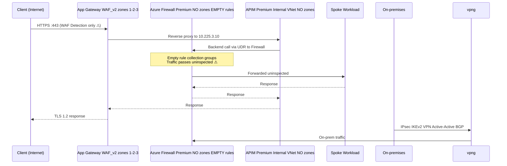
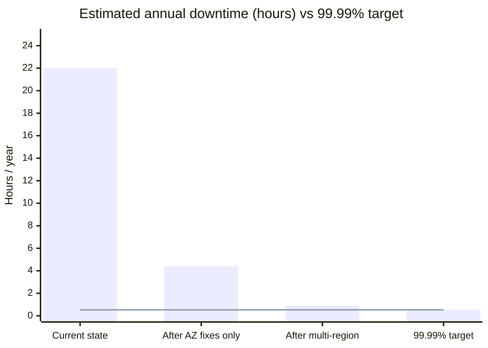
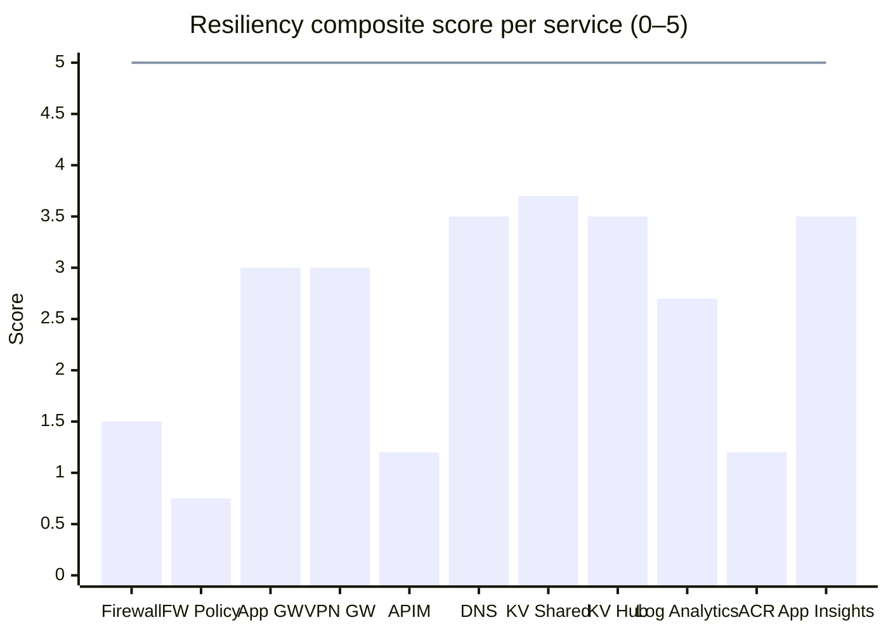
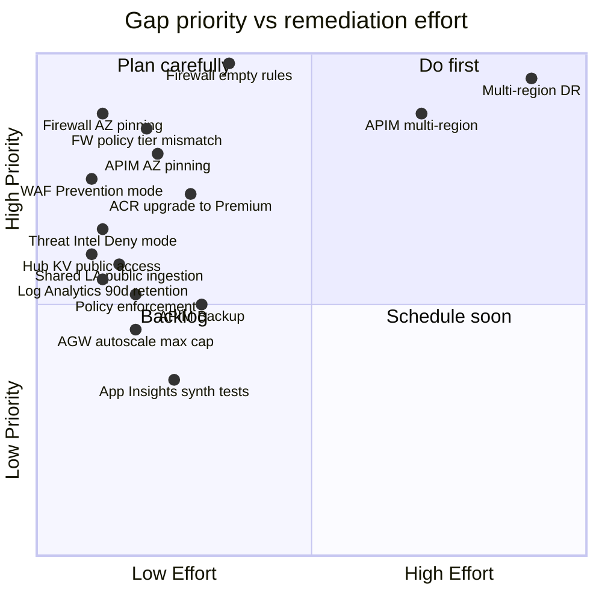
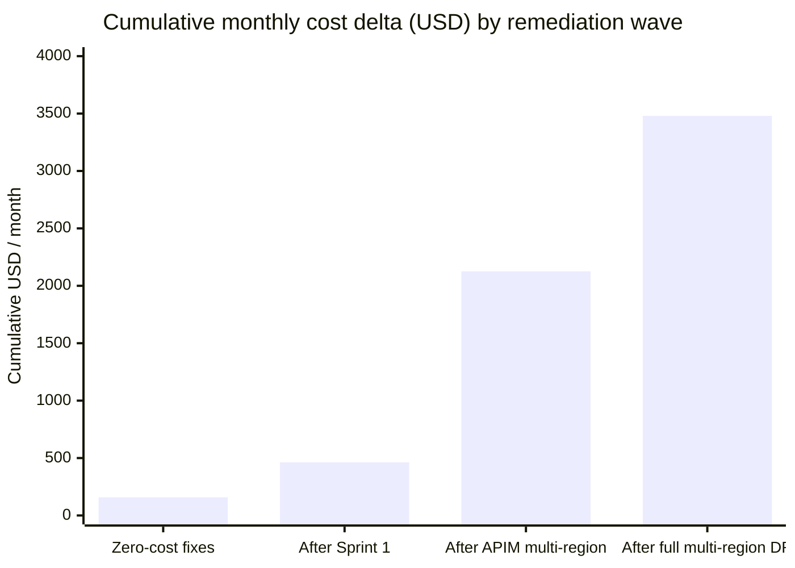
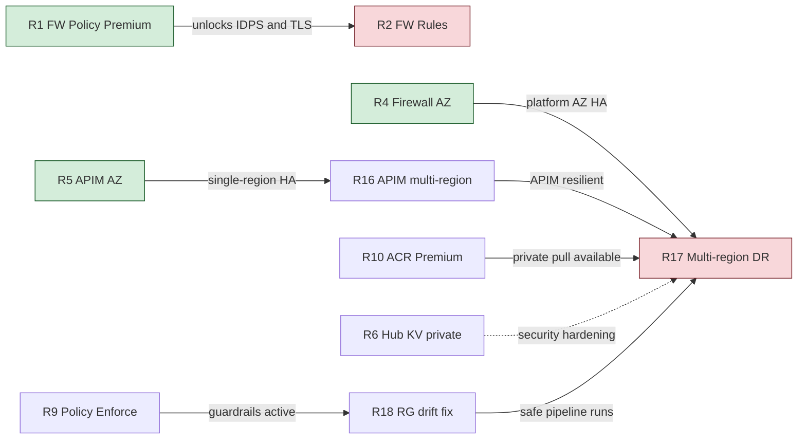
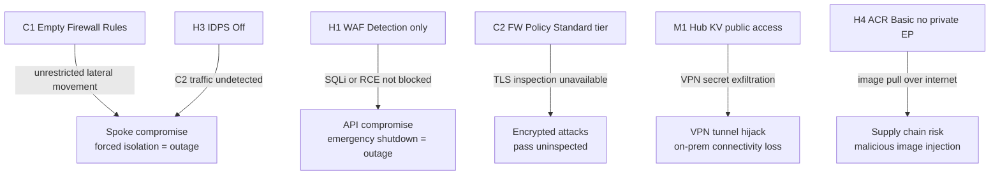

# Resiliency Assessment — `cdpq-pr` (CDPQ Production)

**Assessment date:** 2026-04-24
**Assessed by:** Azure Cloud Architecture — Resiliency Engineering
**Environment:** `cdpq-pr` — CDPQ Production, Azure Landing Zone (Hub-and-Spoke)
**Region:** Canada Central *(single region — no secondary deployed)*
**Target composite SLA:** 99.99% (~52.6 minutes downtime / year)
**Source of truth:** Bicep code in this repository (`fichiers-bicep/`)

> **Scope:** This assessment covers every service provisioned by the Bicep code in this repository.
> No workload-tier configs were provided; findings for workload-hosted services are flagged **[ASSUMED]**.
> Platform findings are derived directly from the Bicep source — no assumptions were made where the code is explicit.

---

## 1. Full service inventory

```mermaid
graph TB
    subgraph MG["Management Group Hierarchy"]
        mg_root["mg-cdpq (root)"]
        mg_net["mg-cdpq-platforms-networking"]
        mg_infra["mg-cdpq-platforms-infrastructure"]
        mg_root --> mg_net & mg_infra
    end

    subgraph HUB["Hub Subscription — cdp-alz-hub-pr · Canada Central"]
        subgraph hub_main["Main RG"]
            vnet["Hub vNet 10.225.0.0/16\n9 subnets"]
            afw["Azure Firewall Premium\nNO zones ⚠\nEmpty rule set ⚠"]
            vpng["VPN Gateway VpnGw2AZ Gen2\nActive-Active BGP ✓\nZone-redundant PIPs ✓"]
            rt["Route Tables x4\nUDR to Firewall"]
            lgw["Local Network Gateway\nOn-prem 64.124.68.129"]
            vcn["VPN Connection\nIPsec IKEv2 AES256"]
            pip_fw["PIP Firewall\nzones 1-2-3 ✓"]
            pip_vpn1["PIP VPN 01\nzones 1-2-3 ✓"]
            pip_vpn2["PIP VPN 02\nzones 1-2-3 ✓"]
        end
        subgraph hub_gw["Gateway RG"]
            agw["App Gateway WAF_v2\nzones 1-2-3 ✓\nautoscale 1-2\nDetection mode ⚠"]
            wafpol["WAF Policy OWASP 3.2\nDetection not Prevention ⚠"]
            pip_agw["PIP AGW\nNo zones ⚠"]
            nsg_agw["NSG AGW subnet"]
            mi_agw["Managed Identity AGW"]
        end
        subgraph hub_dns["DNS RG"]
            dnspr["DNS Resolver\ndual inbound+outbound"]
            dfr["DNS Forwarding Ruleset"]
            pdz["Private DNS Zones x13\ncognitive / openai / kv\napim / cdpq.cloud / etc."]
        end
        subgraph hub_sh["Shared Hub RG"]
            kv_hub["Key Vault Hub\nPublic access NOT disabled ⚠\nPurge protect ✓ RBAC ✓"]
            law_hub["Log Analytics\n30d retention ⚠"]
        end
        subgraph hub_icpl["ICPL RG"]
            pep["Private Endpoint\nsqlmi-ic-dm-dev-eastus-003"]
            arec["DNS A Records SQL MI"]
        end
    end

    subgraph SHSVC["Shared Services Subscription — cdp-alz-shsvc-pr · Canada Central"]
        subgraph sh_main["Main Shared RG"]
            kv_sh["Key Vault Shared\nPublic disabled ✓\nPurge protect ✓ RBAC ✓"]
            law_sh["Log Analytics\n30d retention ⚠\nPublic ingestion Enabled ⚠"]
            mi_sh["Managed Identity APIM"]
        end
        subgraph sh_ext["Ext Shared RG"]
            apim["APIM Premium\nInternal VNet ✓\nNO zones ⚠\nSystem+User MI ✓\nDiagnostics ✓"]
            vnet_sh["Shared vNet 10.224.0.0/16\nPeered to Hub ✓"]
            nsg_apim["NSG APIM\nManagement rules ✓"]
            rt_sh["Route Table\nAPIM to Firewall UDR ✓"]
            acr["ACR Basic ⚠\nNo zones / No geo-rep\nNo private endpoint"]
            appi["App Insights\nIngestion disabled ✓\nLA-backed ✓"]
            dvc["Dev Center\ndev/test/prod envs"]
            pip_apim["PIP APIM\nNo zones ⚠"]
            ag["Action Group\nAPIM alerts ✓"]
        end
    end

    mg_net -.->|scopes| HUB
    mg_infra -.->|scopes| SHSVC
    vnet <-->|VNet Peering| vnet_sh
    agw -->|HTTPS reverse proxy| apim
    afw -->|Policy + UDRs| vnet
    dnspr -->|Forwarding ruleset| dfr
```

---

## 2. Traffic flow

---

## 3. SLA composite analysis

| Component | Microsoft SLA | AZ deployed | Zones in Bicep |
|---|:---:|:---:|:---:|
| VPN Gateway VpnGw2AZ | 99.95% | Zone-redundant SKU | Via SKU name |
| Application Gateway WAF_v2 | 99.95% | `availabilityZones: [1,2,3]` | ✓ Explicit |
| Azure Firewall Premium | 99.95% | No `zones` in module | ⚠ Missing |
| APIM Premium | 99.95% | No `zones` in module | ⚠ Missing |
| ACR Basic | 99.9% | No zone redundancy | N/A |
| Key Vault (both) | 99.99% | Built-in | N/A |
| Log Analytics | 99.9% | Built-in | N/A |
| DNS Resolver | 99.99% | Built-in | N/A |
| App Insights | 99.9% | Built-in | N/A |

**Estimated composite SLA (critical path: AGW → APIM → Firewall → Workload):**

$$SLA_{composite} = 0.9995 \times 0.9995 \times 0.9995 \times 0.999 \approx \mathbf{99.75\%}$$

Approximately **22 hours of potential downtime per year** — ~25× over the 99.99% budget.

---

## 4. Resiliency scoring per service

Scores are 0–5 per dimension. 5 = fully implemented best practice.

### 4.1 Azure Firewall Premium

| Dimension | Score | Evidence from Bicep |
|---|:---:|---|
| Availability Zones | **0** | No `zones` parameter in `azFirewall` module. PIPs are zone-redundant but the resource itself is not. |
| Multi-region failover | **0** | Single Canada Central instance. No secondary region or failover. |
| Backup & DR | **2** | Firewall Policy is in Bicep — re-deployable. No automated backup. |
| Auto-scaling & elasticity | **3** | Premium SKU auto-scales. No manual sizing required. |
| Health probes & circuit breakers | **2** | Diagnostics to Log Analytics ✓. No custom health alerts. |
| Retry & transient fault handling | **2** | Platform handles transient issues within a datacenter. Single AZ = no zone failover. |
| **Composite** | **1.5 / 5** | Critical: no zones, empty rule set, IDPS off. |

### 4.2 Azure Firewall Policy (security posture)

| Dimension | Score | Evidence from Bicep |
|---|:---:|---|
| Rule collection coverage | **0** | `ruleCollectionGroups: []` — policy is empty. All traffic through the firewall is uninspected. |
| IDPS | **0** | `intrusionDetection.mode: 'Off'` |
| Threat Intel | **2** | `threatIntelMode: 'Alert'` — alerting but not denying. |
| Tier alignment | **1** | Firewall is Premium; Policy is Standard. Premium IDPS and TLS inspection unavailable. |
| **Composite** | **0.75 / 5** | Critical security and resiliency gap. |

### 4.3 Application Gateway WAF_v2

| Dimension | Score | Evidence from Bicep |
|---|:---:|---|
| Availability Zones | **5** | `availabilityZones: [1, 2, 3]` ✓ |
| Multi-region failover | **0** | Single instance; no Traffic Manager or Front Door in scope. |
| Backup & DR | **3** | Fully re-deployable from Bicep. No state to back up. |
| Auto-scaling & elasticity | **3** | `autoscaleMinCapacity: 1, autoscaleMaxCapacity: 2`. Max capped at 2 — insufficient for burst. |
| Health probes & circuit breakers | **4** | Health probe configured (`/status-0123456789abcdef`, 30s interval, 3 thresholds) ✓. WAF in Detection mode only — attacks logged, not blocked. |
| Retry & transient fault handling | **3** | Standard AGW retry behaviour. Backend timeout 20s. |
| **Composite** | **3.0 / 5** | Good AZ coverage; WAF mode and autoscale cap are the main gaps. |

### 4.4 VPN Gateway VpnGw2AZ

| Dimension | Score | Evidence from Bicep |
|---|:---:|---|
| Availability Zones | **5** | `VpnGw2AZ` SKU = zone-redundant ✓. All PIPs zone-redundant ✓. |
| Multi-region failover | **1** | Active-Active BGP (`clusterMode: 'activeActiveBgp'`) within single region ✓. No cross-region redundancy. |
| Backup & DR | **4** | Fully re-deployable from Bicep. On-prem side managed by CDPQ. |
| Auto-scaling & elasticity | **3** | Gateway SKU handles scaling automatically. |
| Health probes & circuit breakers | **2** | No custom BGP monitoring or route failover alerting. |
| Retry & transient fault handling | **3** | IKEv2 with custom IPsec policy (AES256/SHA256, SA lifetime 27000s). |
| **Composite** | **3.0 / 5** | Best-configured service in the estate. Main gap: no cross-region redundancy. |

### 4.5 APIM Premium (Internal VNet)

| Dimension | Score | Evidence from Bicep |
|---|:---:|---|
| Availability Zones | **0** | No `zones` parameter in `apimAVMService` module despite Premium SKU. |
| Multi-region failover | **0** | No `additionalLocations` — single region only. |
| Backup & DR | **1** | No APIM Backup policy in Bicep. API definitions re-deployable; subscriptions/named values at risk. |
| Auto-scaling & elasticity | **1** | Single unit deployed. No auto-scaling configuration. |
| Health probes & circuit breakers | **3** | App Insights + Action Group + Log Analytics diagnostics ✓. No circuit breaker policies in scope. |
| Retry & transient fault handling | **2** | Platform-level retry only; no explicit retry policies in Bicep. |
| **Composite** | **1.2 / 5** | Premium SKU without AZ or multi-region = false sense of security. |

### 4.6 Private DNS Resolver

| Dimension | Score | Evidence from Bicep |
|---|:---:|---|
| Availability Zones | **4** | Service is zone-redundant by design. Dual inbound + dual outbound endpoints ✓. |
| Multi-region failover | **0** | Single region. |
| Backup & DR | **5** | Fully stateless; re-deployable from Bicep. 13 private DNS zones defined. |
| Auto-scaling & elasticity | **5** | Fully managed, serverless. |
| Health probes & circuit breakers | **3** | DNS resolution failure visible in queries; no explicit alerting in Bicep. |
| Retry & transient fault handling | **4** | DNS client retry is built-in. |
| **Composite** | **3.5 / 5** | Well-configured. Only gap is no secondary region. |

### 4.7 Key Vault — Shared (`kv-alz-shsvc-pr`)

| Dimension | Score | Evidence from Bicep |
|---|:---:|---|
| Availability Zones | **5** | Built-in zone redundancy for Key Vault. |
| Multi-region failover | **2** | Azure passively replicates KV data to Canada East. No active geo-replication. |
| Backup & DR | **3** | `enablePurgeProtection: true` ✓. RBAC ✓. `publicNetworkAccess: 'Disabled'` ✓. No automated secret backup. |
| Auto-scaling & elasticity | **5** | Fully managed. |
| Health probes & circuit breakers | **3** | No custom availability alert in Bicep. |
| Retry & transient fault handling | **4** | SDK-level retry built in. |
| **Composite** | **3.7 / 5** | Well-hardened. No secret backup policy is the remaining gap. |

### 4.8 Key Vault — Hub (`kv-alz-hub-pr`)

| Dimension | Score | Evidence from Bicep |
|---|:---:|---|
| Availability Zones | **5** | Built-in zone redundancy. |
| Multi-region failover | **2** | Passive replication to Canada East. |
| Backup & DR | **2** | `enablePurgeProtection: true` ✓. RBAC ✓. **`publicNetworkAccess` not disabled** — network surface exposed. Stores VPN shared secret. |
| Auto-scaling & elasticity | **5** | Fully managed. |
| Health probes & circuit breakers | **3** | No custom alert. |
| Retry & transient fault handling | **4** | SDK-level retry. |
| **Composite** | **3.5 / 5** | Public access gap on a vault holding connectivity credentials is a security-resiliency concern. |

### 4.9 Log Analytics Workspaces (Hub + Shared)

| Dimension | Score | Evidence from Bicep |
|---|:---:|---|
| Availability Zones | **4** | Built-in for Log Analytics workspace. |
| Multi-region failover | **0** | Single workspace per subscription; no DR workspace. |
| Backup & DR | **1** | `dataRetention: 30` — only 30 days. Shared workspace has `publicNetworkAccessForIngestion: 'Enabled'`. |
| Auto-scaling & elasticity | **5** | PerGB2018 = fully elastic. |
| Health probes & circuit breakers | **2** | No workspace health alert in Bicep. |
| Retry & transient fault handling | **4** | Agent and HTTP retry built-in. |
| **Composite** | **2.7 / 5** | Retention insufficient for forensics; Shared workspace exposes ingestion over public internet. |

### 4.10 ACR (Basic SKU)

| Dimension | Score | Evidence from Bicep |
|---|:---:|---|
| Availability Zones | **0** | Basic SKU has no zone redundancy. |
| Multi-region failover | **0** | No geo-replication. Basic SKU does not support it. |
| Backup & DR | **1** | Images can be re-pushed; no automated backup policy. |
| Auto-scaling & elasticity | **3** | Managed service; scales within SKU limits. |
| Health probes & circuit breakers | **1** | No pull failure alerting in Bicep. Registry outage = workload scale-out failure. |
| Retry & transient fault handling | **2** | Docker client retry built-in. |
| **Composite** | **1.2 / 5** | Basic SKU is not suitable for production: no private endpoint, no zone redundancy, no geo-replication. |

### 4.11 Application Insights

| Dimension | Score | Evidence from Bicep |
|---|:---:|---|
| Availability Zones | **4** | Workspace-based App Insights inherits LA zone redundancy. |
| Multi-region failover | **1** | Single workspace; no secondary. |
| Backup & DR | **4** | Data in Log Analytics. `publicNetworkAccessForIngestion: 'Disabled'` ✓. |
| Auto-scaling & elasticity | **5** | Fully managed. |
| Health probes & circuit breakers | **3** | No synthetic availability tests in Bicep. |
| Retry & transient fault handling | **4** | SDK handles transient faults. |
| **Composite** | **3.5 / 5** | Well-configured. No synthetic monitoring tests is the gap. |

### Score summary

---

## 5. Prioritised gap list

### CRITICAL

| ID | Gap | Evidence | Business impact |
|---|---|---|---|
| **C1** | **Azure Firewall has empty rule collection groups** | `ruleCollectionGroups: []` in both `FwPolicyHubFw` modules | All east-west and egress traffic passes through the firewall **completely uninspected**. Network segmentation provides zero protection. Security and compliance posture is entirely undermined. |
| **C2** | **Firewall Policy is Standard tier; Firewall is Premium** | `azureSkuTier: 'Premium'` + `tier: 'Standard'` in policy | Premium-only capabilities — IDPS, TLS inspection, URL filtering — are silently unavailable. The Premium licence cost is paid with no security benefit. |
| **C3** | **Azure Firewall not pinned to Availability Zones** | No `zones` parameter in `azFirewall` module | A single AZ failure takes down all hub egress and east-west traffic. Every spoke workload loses connectivity simultaneously with no automated recovery. |
| **C4** | **APIM Premium deployed without AZ pinning** | No `zones` parameter in `apimAVMService` module | APIM is the sole API entry point. A single AZ failure removes all API access with no failover, despite Premium SKU licensing that supports AZ. |

### HIGH

| ID | Gap | Evidence | Business impact |
|---|---|---|---|
| **H1** | **WAF in Detection mode, not Prevention** | `mode: 'Detection'` in `avmAppGatewayWAFPolicy` | Attacks are logged but not blocked. The WAF provides no active protection against OWASP Top 10 threats in production. |
| **H2** | **Threat Intel mode is Alert, not Deny** | `threatIntelMode: 'Alert'` on Firewall | Known malicious IPs and domains are logged but allowed through. |
| **H3** | **IDPS is Off** | `intrusionDetection.mode: 'Off'` on Firewall Policy | No network-level intrusion detection or prevention of any kind. |
| **H4** | **ACR Basic SKU in production** | `acrSku: 'Basic'` in `rg-shsvc-ext-components.bicep` | Basic ACR has no private endpoint support (image pulls go over public internet), no zone redundancy, and no geo-replication. Registry outage causes all workload scale-out and deployment failures. |
| **H5** | **No multi-region architecture** | Single `parLocation: 'canadacentral'` across all modules | Any Canada Central regional impairment eliminates 100% of platform availability. Annual downtime budget can be consumed in a single regional event. |

### MEDIUM

| ID | Gap | Evidence | Business impact |
|---|---|---|---|
| **M1** | **Hub Key Vault — `publicNetworkAccess` not disabled** | No `publicNetworkAccess: 'Disabled'` in `rg-hub-shsvc-components.bicep` | Hub KV stores VPN shared secret (`azure-to-riopelle-shared-secret`). Exposed network surface for connectivity credentials, inconsistent with Shared KV hardening. |
| **M2** | **Log Analytics retention: 30 days (both workspaces)** | `dataRetention: 30` in both workspace modules | PCI/SOC2 require 90–365 days. A security incident detected late may have no forensic data available for investigation. |
| **M3** | **Shared Log Analytics — `publicNetworkAccessForIngestion: 'Enabled'`** | Explicitly set in `rg-shsvc-components.bicep` | Diagnostic logs from APIM and services ingested over public internet. Inconsistent with private networking posture established elsewhere. |
| **M4** | **AGW autoscale max capped at 2 instances** | `autoscaleMaxCapacity: 2` in `avmAppGateway` | Under significant traffic load, the gateway cannot scale beyond 2 units. A traffic spike requiring 3+ capacity units causes dropped connections. |
| **M5** | **No APIM Backup policy** | Absent from Bicep | APIM subscriptions, named values, and operational configuration are not captured in code. A re-deploy restores API definitions but loses production state. |
| **M6** | **Policy guardrails in DoNotEnforce** | `enforcementMode: 'DoNotEnforce'` for all assignments | `allowOnlyCanada` and `cdpqServiceBlacklist` are audit-only. Non-compliant resources can be deployed without impediment. |

### LOW

| ID | Gap | Evidence | Business impact |
|---|---|---|---|
| **L1** | **AGW Public IP has no explicit zone assignment** | No `availabilityZones` in `publicIpAddress` module in `rg-hub-gateway-components.bicep` (unlike Firewall and VPN PIPs which explicitly set zones 1-2-3) | Standard SKU PIPs without explicit zone assignment are non-zonal (regional). The AGW resource itself has AZ coverage; its PIP should match. |
| **L2** | **APIM Public IP has no zone assignment** | No `availabilityZones` in `apimPublicIP` module | Internal-VNet APIM uses the public IP for control-plane only; lower operational risk but should be consistent. |
| **L3** | **No Application Insights availability tests** | Absent from Bicep | No synthetic monitoring. API availability issues are discovered reactively (by users) rather than proactively. |
| **L4** | **RG naming drift (Hub + Shared)** | `docs/gap-report-hub-cdpq-pr-2026-02-24.md` | Next pipeline run risks creating duplicate parallel resource stacks and disrupting traffic flows. |

---

## 6. Remediation roadmap

```mermaid
flowchart TD
    subgraph IMMEDIATE["Immediate — zero or near-zero cost · deploy via existing pipeline"]
        R1["R1 · Upgrade FW Policy to Premium tier\nEnable IDPS in Alert mode\nSet threatIntelMode to Deny"]
        R2["R2 · Populate Firewall rule collection groups\nApplication + Network rules for known traffic"]
        R3["R3 · Set WAF mode to Prevention\nin avmAppGatewayWAFPolicy"]
        R4["R4 · Pin Azure Firewall to zones 1-2-3\nAdd zones param to azFirewall module"]
        R5["R5 · Pin APIM to zones 1-2-3\nAdd zones param to apimAVMService"]
        R6["R6 · Disable Hub KV public network access\npublicNetworkAccess Disabled + private endpoint"]
        R7["R7 · Increase LA retention 30d to 90d\nboth workspace modules"]
        R8["R8 · Disable Shared LA public ingestion\npublicNetworkAccessForIngestion Disabled"]
        R9["R9 · Enable Policy enforcement\nDoNotEnforce to Enabled after validation"]
    end

    subgraph SPRINT1["Sprint 1 — low-medium effort · billable changes"]
        R10["R10 · Upgrade ACR to Premium\nEnable private endpoint + zone redundancy"]
        R11["R11 · Add zone assignment to AGW and APIM PIPs\navailabilityZones 1-2-3"]
        R12["R12 · Raise AGW autoscale max to 5\nautoscaleMaxCapacity 5"]
        R13["R13 · Configure APIM Backup\nAutomated export to Storage Account"]
        R14["R14 · Add App Insights availability tests\nSynthetic probes for APIM health"]
        R15["R15 · Add Azure Monitor alerts\nFirewall health · APIM capacity · AGW 5xx"]
    end

    subgraph SPRINT2["Sprint 2 — strategic · high effort"]
        R16["R16 · Add APIM secondary region\nadditionalLocations Canada East"]
        R17["R17 · Multi-region platform DR\nCanada East passive Hub + Shared\nFront Door Standard for global routing"]
        R18["R18 · Resolve RG naming drift\nalign Bicep to deployed layout"]
    end

    IMMEDIATE --> SPRINT1 --> SPRINT2

    style IMMEDIATE fill:#d4edda,stroke:#155724
    style SPRINT1   fill:#cce5ff,stroke:#004085
    style SPRINT2   fill:#f8d7da,stroke:#721c24
```

### Detailed remediation table

| # | Recommendation | Priority | Effort | Zero cost? | Monthly delta (USD) | Cumulative |
|---|---|:---:|:---:|:---:|:---:|:---:|
| R1 | Upgrade FW Policy to Premium; set `threatIntelMode: 'Deny'`; enable IDPS Alert | CRITICAL | Low | ✅ | **$0** | $0 |
| R2 | Populate Firewall rule collection groups (application + network rules) | CRITICAL | Med | ✅ | **$0** | $0 |
| R3 | Set WAF `mode: 'Prevention'` in `avmAppGatewayWAFPolicy` | HIGH | Low | ✅ | **$0** | $0 |
| R4 | Add `zones: ['1','2','3']` to `azFirewall` module | CRITICAL | Low | ✅ | **$0** | $0 |
| R5 | Add `zones: ['1','2','3']` to `apimAVMService` module | CRITICAL | Low | ✅ | **$0** | $0 |
| R6 | Add `publicNetworkAccess: 'Disabled'` + private endpoint to Hub KV | MEDIUM | Low | Partial | **+$8** | $8 |
| R7 | Change `dataRetention: 30` → `90` in both Log Analytics modules | MEDIUM | Low | ❌ | **+$100–200** | ~$158 |
| R8 | Set `publicNetworkAccessForIngestion: 'Disabled'` on Shared LA workspace | MEDIUM | Low | ✅ | **$0** | ~$158 |
| R9 | Transition policy assignments from `DoNotEnforce` to `Enabled` post-validation | MEDIUM | Low | ✅ | **$0** | ~$158 |
| R10 | Upgrade ACR from Basic → Premium; add private endpoint + zone redundancy | HIGH | Low | ❌ | **+$167–200** | ~$342 |
| R11 | Add `availabilityZones: [1,2,3]` to AGW PIP and APIM PIP modules | LOW | Low | ✅ | **$0** | ~$342 |
| R12 | Raise AGW `autoscaleMaxCapacity` from 2 to 5 | MEDIUM | Low | ❌ on-demand | **+$0–150** | ~$417 |
| R13 | Configure APIM Backup to Storage Account (daily schedule) | MEDIUM | Low | ❌ | **+$5–20** | ~$432 |
| R14 | Add App Insights availability tests for APIM health endpoint | LOW | Low | ❌ | **+$1–10** | ~$440 |
| R15 | Add Azure Monitor metric alerts (Firewall, APIM, AGW, ACR) | LOW | Low | ❌ | **+$10–30** | ~$462 |
| R16 | Add APIM `additionalLocations: ['canadaeast']` — multi-region Premium | HIGH | Med | ❌ | **+$1,664–3,328** | ~$2,126 |
| R17 | Multi-region platform DR: secondary Hub + Shared in Canada East + Front Door Std | HIGH | High | ❌ | **+$800–2,000** | ~$3,480 |
| R18 | Resolve RG naming drift before next pipeline run | LOW | Med | ✅ | **$0** | ~$3,480 |

> Cost references: Azure public pricing, Canada Central / Canada East, April 2026.
> R1–R5, R8, R9, R11 are **zero-cost Bicep parameter changes** — implement immediately via the existing pipeline.

---

## 7. Cost impact by wave

---

## 8. Remediation dependency map

---

## 9. Security-resiliency cross-concerns

The following gaps are simultaneously security vulnerabilities and resiliency risks — an exploit can directly trigger or extend an outage:

---

## 10. Executive summary

The `cdpq-pr` production environment is built on a well-structured Azure Landing Zone with several genuine strengths: the VPN Gateway uses a zone-redundant, active-active BGP SKU; the Application Gateway has been correctly pinned across all three Availability Zones with health probes and autoscale; and APIM runs on the Premium SKU with full diagnostics wired to Log Analytics. However, the assessment of the actual Bicep source reveals four critical gaps that simultaneously undermine the 99.99% availability target and the security posture. Most seriously, the Azure Firewall — through which all east-west and egress traffic flows — has an **empty rule set**, meaning every byte of traffic is forwarded uninspected; compounding this, the Firewall Policy is configured at the wrong tier, silently disabling the intrusion detection and TLS inspection capabilities that the Premium licence has already been paid for. The Firewall and APIM are also both missing Availability Zone pinning, leaving the two most critical connectivity components vulnerable to a single-datacenter failure despite their premium SKUs being capable of zone redundancy. The estimated annual downtime under the current configuration is approximately **22 hours** — roughly 25 times the 99.99% target. The most important finding of this assessment is that the highest-priority fixes — upgrading the Firewall Policy tier, populating firewall rules, pinning the Firewall and APIM to all three zones, and switching the WAF to Prevention mode — are all **zero-cost Bicep configuration changes** that can be deployed through the existing pipeline today, delivering the largest resilience and security improvement at no additional Azure spend.
