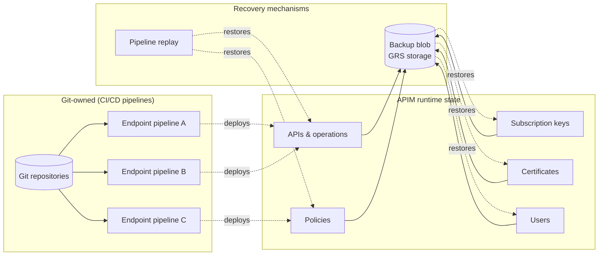
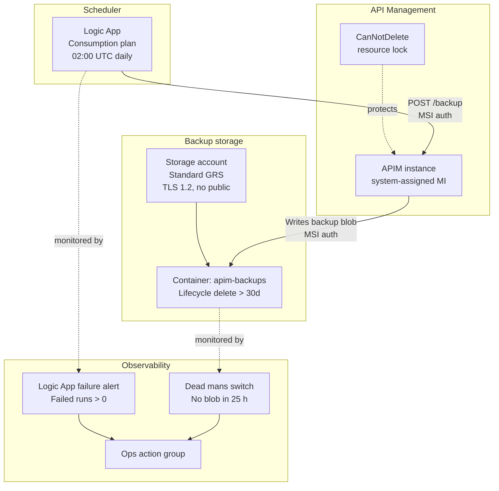
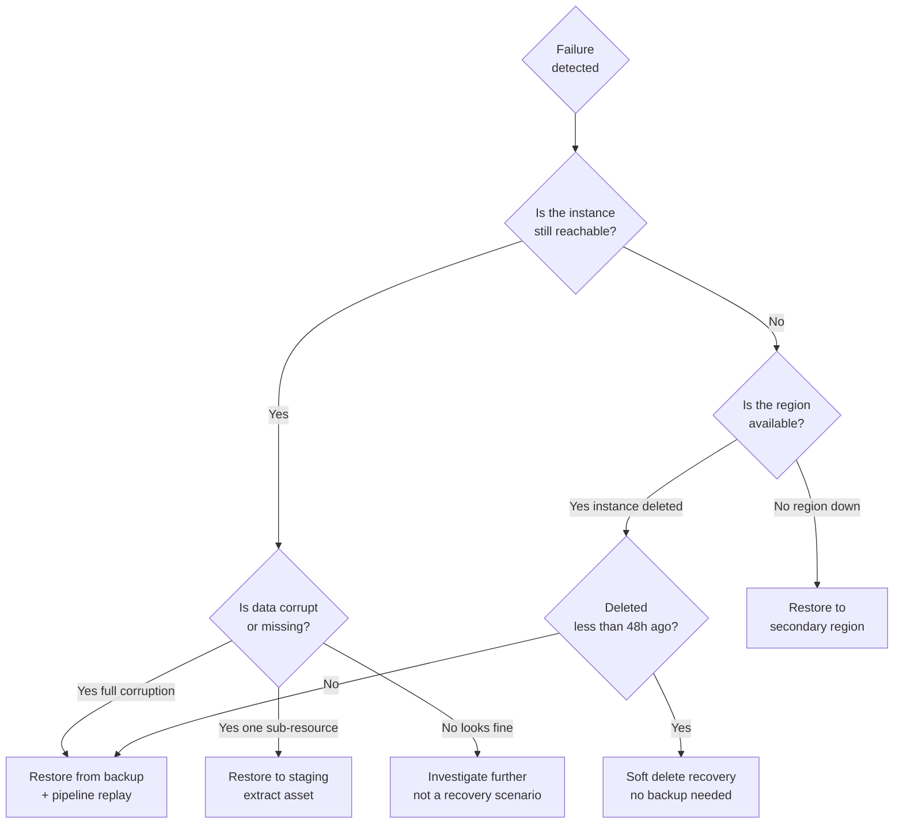
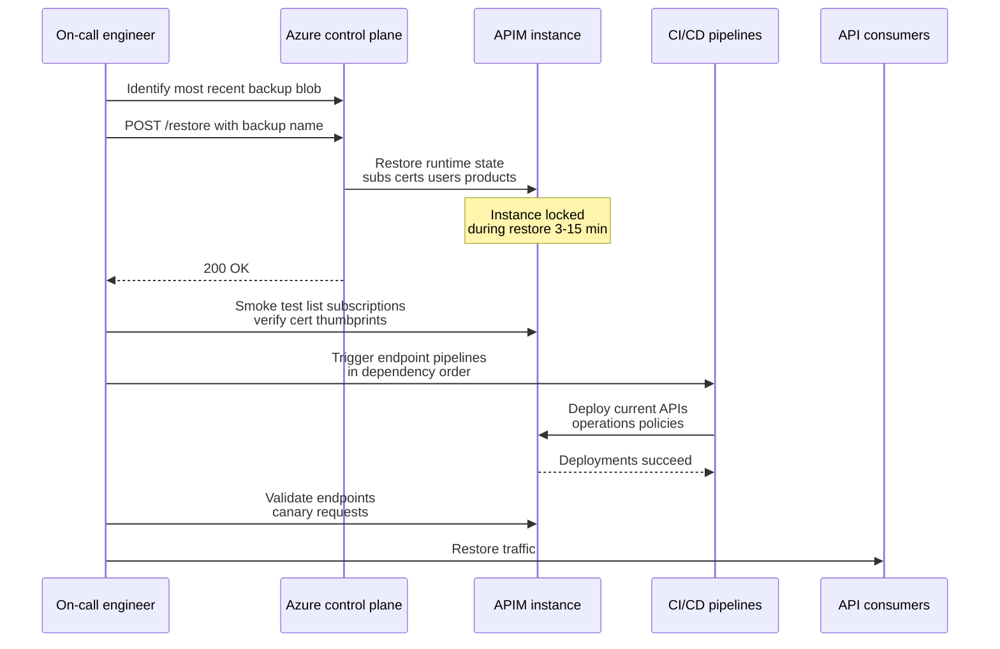

# APIM Resiliency Remediation Plan

**Classification:** Internal — Azure Architecture
**Status:** Draft
**Last updated:** 2026-04-24
**Owner:** Azure Cloud Architecture

---

## Executive Summary

An audit of the deployed Azure API Management instance identified one remaining resiliency gap. Named values are already Key Vault–backed — that exposure is closed. API definitions, operations, and policies are deployed through dedicated CI/CD pipelines and are redeployable from source control. However, no backup schedule exists for runtime-only state — subscription keys, certificates, users, and product configuration exist only in APIM's internal database with no point-in-time snapshot.

Recovery from a destructive event therefore requires two complementary mechanisms: a restore from backup to recover runtime-only state, followed by replay of the CI/CD pipelines to bring endpoint definitions current. Neither mechanism alone is sufficient.

APIM soft delete provides a 48-hour recovery window for accidental instance deletion, which meaningfully reduces one class of risk. It does not cover data corruption, sub-resource deletion, or scenarios where the instance is purged or unavailable without being deleted.

This plan delivers a native Azure backup solution that is credential-free, geo-redundant, and fully automatable via Bicep, and defines the recovery runbook that sequences backup restore with CI/CD pipeline replay.

---

## Scope of Risk

| Asset | Source of truth | At risk today? | Blast radius if lost |
|---|---|---|---|
| API definitions | CI/CD pipelines (Git) | No | None — replay pipelines |
| API policies | CI/CD pipelines (Git) | No | None — replay pipelines |
| Operations & schemas | CI/CD pipelines (OpenAPI in Git) | No | None — replay pipelines |
| Subscription keys | APIM instance only | **Yes** | High — all consumers re-keyed |
| Named values | Azure Key Vault | No | None — restore reconnects KV |
| Certificates | APIM instance only | **Yes** | Medium — re-upload required |
| Users | APIM instance only | **Yes** | Low |
| Products & groups | Partially CI/CD, partially runtime | Partial | Medium — manual reconciliation |

The critical exposure is subscription keys. These are generated by APIM at creation time and distributed to consumers. There is no mechanism to recover them outside of the soft delete window or a backup; every affected consumer must be contacted, issued a new key, and their integrations updated.

---

## State Ownership Model

The architecture has two distinct stores of truth. Endpoint configuration — APIs, operations, policies — lives in Git and is deployed by CI/CD pipelines. Runtime state — subscription keys, certificates, users — lives only inside APIM and is created through administrative or consumer actions that bypass the pipelines. Recovery from a loss event must address both.



The backup captures everything at the moment it runs, including endpoints deployed by CI/CD pipelines. But because endpoint pipelines are the authoritative source, the recovery pattern prefers pipeline replay for those assets — it produces the current state rather than the state as of 02:00 UTC yesterday.

---

## Gap — No backup schedule

### Existing protection: soft delete

APIM soft delete is active by default. When an instance is deleted, it enters a 48-hour retention window during which the full instance state — including subscription keys, named values, certificates, users, and products — can be recovered via the management plane with no data loss. After 48 hours, or if someone explicitly purges the instance, deletion is permanent.

Soft delete coverage versus remaining exposure:

| Failure scenario | Soft delete covers it? | Backup covers it? |
|---|---|---|
| Accidental `az apim delete` — detected within 48 h | Yes | Yes |
| Accidental deletion — detected after 48 h | No | Yes |
| Instance explicitly purged by an engineer | No | Yes |
| Data corruption inside the live instance | No | Yes |
| Individual subscription key deleted (not the instance) | No | Yes |
| Certificate deleted or expired | No | Yes |
| Primary region outage — instance unavailable, not deleted | No | Yes — restore to secondary |
| Malicious actor with Contributor access purges the instance | No | Yes — if backup storage is isolated |

### Why backup is still justified given soft delete

Soft delete covers exactly one scenario: accidental deletion of the entire instance, noticed within 48 hours. Outside that narrow band it does nothing. The scenarios that carry the most operational impact are the ones it cannot touch.

**Data corruption of the live instance.** A bad policy deployment, a named value overwritten by a runaway script, or a product configuration mangled by an erroneous IaC run leaves the instance fully running — soft delete is never triggered. Without a backup there is no point-in-time reference to restore from.

**Deletion noticed after 48 hours.** If the instance is deleted on a Friday evening and no alert fires until Monday morning, the soft delete window has closed. Weekend incidents are among the most likely times for this to happen.

**Explicit purge.** Any principal holding Contributor on the APIM resource can call the purge API. Soft delete provides zero protection against a deliberate purge.

**Sub-resource deletion without instance deletion.** If a specific subscription key is deleted via `DELETE .../subscriptions/{key-id}`, that key is gone. Soft delete operates at the instance level and is never triggered.

**Region unavailability.** If the primary region becomes unavailable, the instance is unreachable but has not been deleted. A backup written to a GRS storage account enables restore into a secondary region.

**The cost-benefit position.** Soft delete is the right first line of defence for accidental deletion. The backup adds ~$0.55/month and 5.5 hours of engineering effort to cover the full remaining failure surface. For a production API platform with external consumers, the cost of any one of those scenarios materialising exceeds the implementation cost by orders of magnitude.

---

## Target Solution Architecture



The architecture is credential-free end-to-end. The Logic App authenticates to the APIM management plane via its own system-assigned managed identity. APIM authenticates to the storage account via its managed identity. No SAS keys, no connection strings, and no secrets exist anywhere in the pipeline.

---

## Remediation

### Phase 0 — Soft delete hardening

Before deploying the backup pipeline, harden the soft delete protection so it is a reliable last line rather than an easily bypassed one. Two steps:

First, apply a `CanNotDelete` resource lock to the APIM instance. This prevents any principal — including those with Contributor or Owner — from deleting the instance without first explicitly removing the lock, which is an audited action:

```bicep
resource apimDeleteLock 'Microsoft.Authorization/locks@2020-05-01' = {
  name: '${apimName}-delete-lock'
  scope: apim
  properties: {
    level: 'CanNotDelete'
    notes: 'Prevent accidental deletion. Remove lock explicitly before decommission.'
  }
}
```

Second, restrict who holds `Microsoft.ApiManagement/service/delete` permission. Audit your current role assignments and confirm that only your platform engineering team has Contributor or Owner on the APIM resource. Application teams and CI/CD service principals should hold `API Management Service Contributor` at most, which does not include instance deletion.

**CI/CD name-conflict trap:** If your pipeline ever does a full teardown and redeploy of the APIM instance with the same name, the old instance enters soft-deleted state. A subsequent `az apim create` with the same name in the same region will fail — the name is still reserved. You must either restore the soft-deleted instance or explicitly purge it before recreating:

```bash
az rest --method delete \
  --url "https://management.azure.com/subscriptions/{sub}/providers/Microsoft.ApiManagement/deletedservices/{apim-name}?api-version=2023-03-01-preview"
```

Document this in your pipeline runbook so whoever runs a future teardown is forewarned.

### Phase 1 — Identity & RBAC

Enable system-assigned managed identity on the APIM instance. Create two role assignments:

- `Storage Blob Data Contributor` (role ID `ba92f5b4-2d11-453d-a403-e96b0029c9fe`) scoped to the backup storage account, assigned to the APIM managed identity principal. This grants the data-plane write access needed for the backup API to write blobs. Do not use `Storage Account Contributor` — that is a management-plane role and exceeds least privilege.
- `Contributor` scoped to the APIM resource only, assigned to the Logic App managed identity. This grants the scheduler permission to call the APIM management-plane backup endpoint.

Scope the storage role at the **storage account level**, not the container level. The APIM backup API enumerates containers before writing; container-scoped assignment causes a silent `403` at that step.

Allow 2–5 minutes for RBAC propagation before triggering the first backup run.

### Phase 2 — Storage account

Provision a dedicated storage account with the following settings:

- SKU: `Standard_GRS` — geo-redundant, survives primary-region failure
- `minimumTlsVersion: TLS1_2`
- `allowBlobPublicAccess: false`
- `supportsHttpsTrafficOnly: true`
- Container: `apim-backups`, `publicAccess: None`

Apply a blob lifecycle management policy to delete blobs with the prefix `apim-backup-` after 30 days. Without this, backups accumulate indefinitely. Adjust the retention window to match your compliance requirements.

Do not reuse an existing general-purpose storage account. The backup container must be isolated to limit the blast radius of any misconfigured access policy.

### Phase 3 — Logic App scheduler

Deploy a Logic App (Consumption plan) with a single recurrence trigger and a single HTTP action:

- Trigger: `Recurrence`, frequency `Day`, interval `1`, time `02:00 UTC`
- Action: `HTTP POST` to `https://management.azure.com/subscriptions/{sub}/resourceGroups/{rg}/providers/Microsoft.ApiManagement/service/{apim}/backup?api-version=2023-03-01-preview`
- Authentication: `ManagedServiceIdentity`, audience `https://management.azure.com/`
- Body:

```json
{
  "storageAccount": "<backup-storage-account-name>",
  "accessType": "SystemAssignedManagedIdentity",
  "containerName": "apim-backups",
  "backupName": "<concat('apim-backup-', formatDateTime(utcNow(), 'yyyy-MM-dd-HH'))>"
}
```

The `accessType: SystemAssignedManagedIdentity` field is required. Omitting it causes the API to fall back to expecting a SAS key, which will fail since none is provided.

The backup operation returns `202 Accepted` immediately and runs asynchronously. The blob appears in the container within 3–15 minutes depending on instance size. During backup, the APIM management plane queues configuration changes — gateway traffic is unaffected.

**Coordination with CI/CD pipelines:** Endpoint pipelines that run during the backup window will have their management-plane calls queued until the backup completes. For pipelines that deploy frequently (hourly or more often), either schedule the backup outside all pipeline windows, or accept the 3–15 minute deploy delay on any pipeline that happens to overlap. Pipelines should not be scheduled to run at 02:00 UTC.

### Phase 4 — Alerting

Deploy two independent alert rules:

- Logic App failure alert: Azure Monitor alert on the Logic App resource, condition `Failed runs > 0` in a 1-hour window, severity 2. Fires to your ops action group. Catches scheduler failures immediately.
- Dead man's switch: Azure Monitor alert (or Log Analytics scheduled query) that fires if no blob with the prefix `apim-backup-` has been written to the container in the last 25 hours. This catches silent failures where the Logic App succeeds but the blob is never written — for example, a storage RBAC misconfiguration that surfaces only at write time. The 25-hour window gives one hour of tolerance over the 24-hour backup cadence.

### Validation steps

1. Trigger the Logic App manually immediately after deployment.
2. Confirm the run status is `Succeeded` in the Logic App run history.
3. Confirm a blob named `apim-backup-YYYY-MM-DD-HH` appears in the container within 15 minutes.
4. Confirm the blob size is non-zero — a zero-byte blob indicates a silent write failure.
5. Confirm both alert rules fire correctly by temporarily disabling the Logic App and waiting 25 hours, or by running the dead man's switch query manually against a date range with no backups.

---

## Recovery Runbook

### Failure classification

The recovery path depends on what was lost. Classify the incident first, then follow the matching path.



### Recovery sequence

The following sequence applies to any failure requiring backup restore. The key insight is that pipeline replay runs *after* the restore, not in place of it, because the backup owns runtime state the pipelines do not manage.



### Pre-requisites for recovery

Before a recovery event occurs, the following must be documented and tested:

1. **Pipeline inventory** — a current list of every CI/CD pipeline that deploys to APIM, including which APIs, products, or policies each pipeline owns. Without this, step 3 of the sequence becomes a discovery exercise during an incident.
2. **Pipeline dependency order** — some pipelines depend on others (for example, a pipeline deploying a product must run after the pipelines deploying the APIs the product includes). Document the order.
3. **Manual trigger procedure** — each pipeline must have a documented manual trigger procedure that does not depend on Git pushes or scheduled triggers. If the only way to run a pipeline is to push a commit, your recovery is coupled to your source control.
4. **Pipeline idempotency confirmation** — verify in staging that each pipeline can safely run against an APIM instance where the APIs already exist (from the restore). Pipelines that fail on "resource already exists" are a recovery blocker.

### Post-recovery validation

After both restore and pipeline replay complete:

- Confirm the number of APIs, operations, and subscriptions matches pre-incident inventory.
- Run a smoke test against a known endpoint using a known subscription key — a `200` response confirms the full stack is live.
- Verify Key Vault-backed named values are resolving (call an endpoint that uses one).
- Confirm Azure Monitor is receiving gateway logs again.

### Quarterly DR test

The recovery runbook is untested until it has been run end-to-end in a non-production environment. Schedule a quarterly DR test that:

- Provisions a fresh APIM instance in a dedicated staging resource group.
- Restores the most recent production backup into it.
- Triggers every endpoint pipeline against the restored instance.
- Validates endpoint availability and subscription key integrity.
- Times each step and records deviations from the runbook.

Treat any runbook step that failed or took longer than documented as a finding requiring remediation before the next quarterly test.

---

## Implementation timeline

| Day | Activity | Owner | Effort |
|---|---|---|---|
| Day 1 AM | Deploy resource lock, audit Contributor assignments, document CI/CD purge runbook | Architect | 1 h |
| Day 1 AM | Enable APIM managed identity, deploy storage account, configure RBAC | Platform engineer | 2 h |
| Day 1 PM | Deploy Logic App, trigger first manual backup, validate blob | Platform engineer | 1.5 h |
| Day 2 AM | Deploy alert rules, validate dead man's switch | Platform engineer | 1 h |
| Day 2 PM | Document pipeline inventory, dependency order, manual trigger procedures | Architect + pipeline owners | 2–4 h |
| Day 3 | Validate pipeline idempotency against restored staging instance | Platform engineer | 2 h |
| Q+3 months | First quarterly DR restore test to staging environment | Platform engineer | 2 h |

Total engineering effort: approximately 11.5–13.5 hours across 3 days. The increase over the initial estimate reflects the pipeline inventory and idempotency validation work, which is a prerequisite for the backup to be actually useful during recovery.

---

## Cost impact

| Component | SKU / plan | Estimated monthly cost |
|---|---|---|
| Storage account (Standard GRS) | ~5 GB backup data | $0.25–1.00 / month |
| Storage account (operations) | ~30 PUT + ~30 LIST / month | < $0.01 / month |
| Logic App | Consumption — 1 run/day | < $0.10 / month |
| Azure Monitor alert rules | 2 rules | ~$0.20 / month |
| Resource lock | — | $0.00 |
| **Total** | | **~$0.55–1.30 / month** |

This is net-new spend. There is no cost impact to the existing APIM instance, and no premium SKU upgrade is required. The backup API is available on all APIM tiers including Developer.

---

## Risks & mitigations

| Risk | Likelihood | Impact | Mitigation |
|---|---|---|---|
| RBAC propagation delay causes first backup to fail | Medium | Low — retry resolves | Manual validation gate before marking Phase 1 complete |
| Backup runs during a planned deployment, queuing management-plane changes | Low | Low — queue drains post-backup | Schedule backup at confirmed off-peak window (02:00 UTC); pipelines should not schedule at 02:00 UTC |
| Soft-deleted instance purged before backup is in place | Low | High | Deploy resource lock in Phase 0 before any other step |
| CI/CD teardown + same-name redeploy fails due to soft-delete name reservation | Medium | Medium — pipeline blocked | Document purge command in pipeline runbook; always check for soft-deleted instances before recreating |
| Backup blob written but restore untested — corruption discovered only during incident | Medium | High | Enforce quarterly DR restore test; treat an untested backup as no backup |
| Pipeline replay after restore fails due to "resource already exists" errors | Medium | High — recovery stalls mid-sequence | Validate pipeline idempotency against restored staging instance before relying on runbook |
| Pipeline inventory stale at time of incident — unknown pipelines own unknown endpoints | Medium | High — incomplete recovery | Quarterly pipeline inventory review tied to DR test; fail DR test if inventory is incomplete |
| Backup window between snapshots loses recent endpoint changes | High | Low — pipeline replay brings them current | Recovery runbook explicitly replays pipelines after restore |
| Quarterly DR test disrupts staging environment | Low | Low | Use a dedicated DR resource group, not shared staging |

---

## Excluded from scope

The following items were identified during assessment but are out of scope for this remediation:

- Self-hosted gateway tokens — ephemeral, not included in APIM backup. A separate runbook for token regeneration is recommended.
- API consumer notification process for emergency key reissuance — this is a communication and process concern, not an infrastructure one.
- APIM multi-region deployment — this remediation improves recovery time but does not eliminate single-region exposure. A separate resiliency initiative is recommended if the target SLA requires active-active regional redundancy.
- Soft delete purge policy enforcement — Azure Policy can be used to deny `Microsoft.ApiManagement/deletedservices/delete` at the subscription level, preventing purge entirely. This is a governance control, not a remediation item, and should be evaluated separately against your decommission process requirements.
- CI/CD pipeline refactoring for improved idempotency — if pipeline idempotency validation (Day 3) identifies pipelines that cannot safely run against a restored instance, remediating those pipelines is a separate engineering effort owned by the pipeline teams, not by this plan.

---

## References

- [Azure API Management backup and restore](https://learn.microsoft.com/en-us/azure/api-management/api-management-howto-disaster-recovery-backup-restore)
- [Azure API Management soft delete](https://learn.microsoft.com/en-us/azure/api-management/soft-delete)
- [Azure Storage redundancy](https://learn.microsoft.com/en-us/azure/storage/common/storage-redundancy)
- [Azure built-in roles — Storage](https://learn.microsoft.com/en-us/azure/role-based-access-control/built-in-roles/storage)
- [Logic Apps managed identity authentication](https://learn.microsoft.com/en-us/azure/logic-apps/create-managed-service-identity)
- [Azure resource locks](https://learn.microsoft.com/en-us/azure/azure-resource-manager/management/lock-resources)
