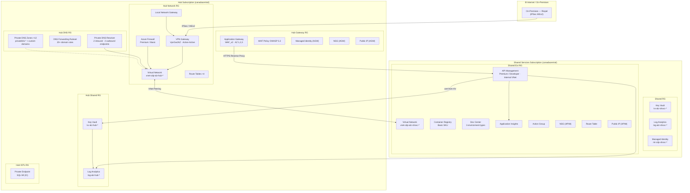
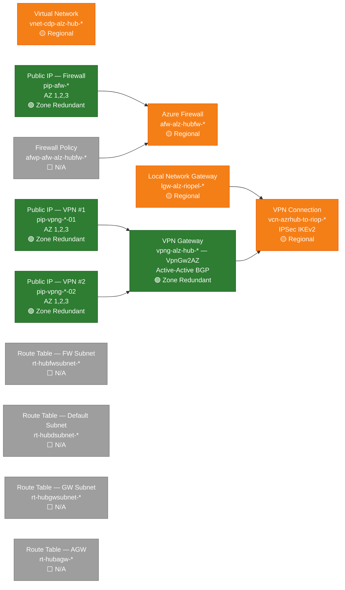
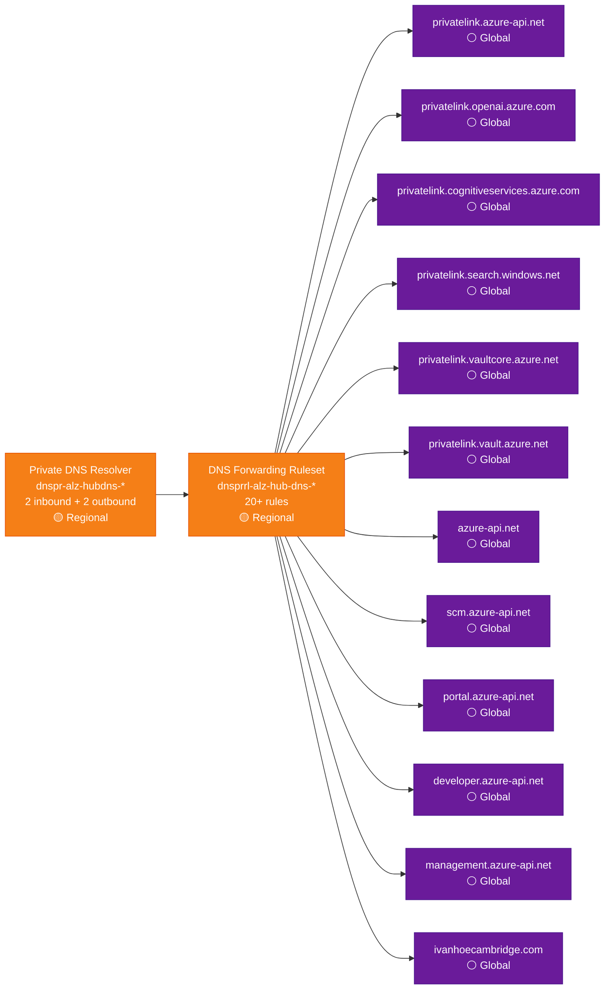
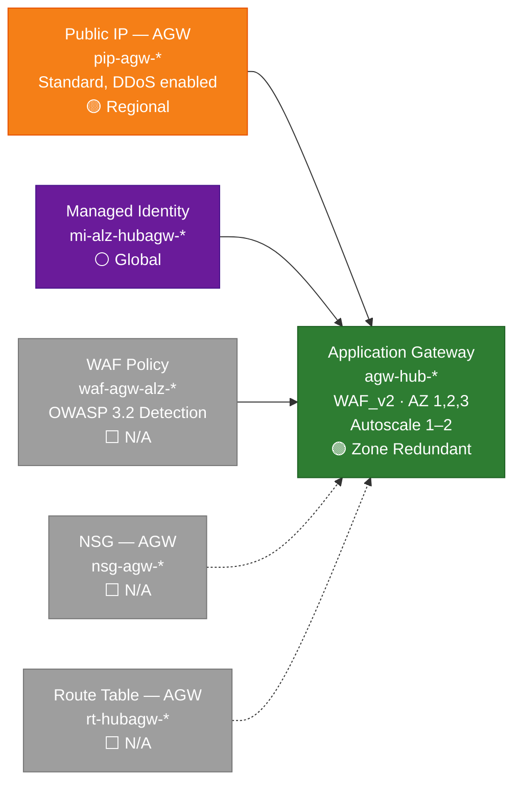
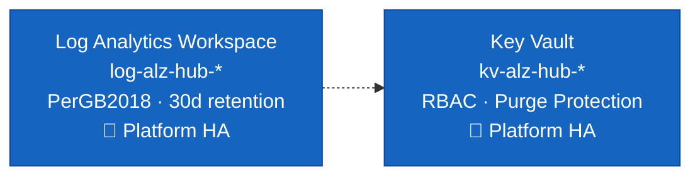
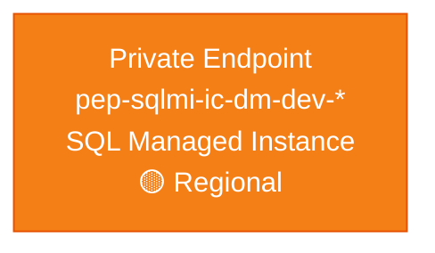
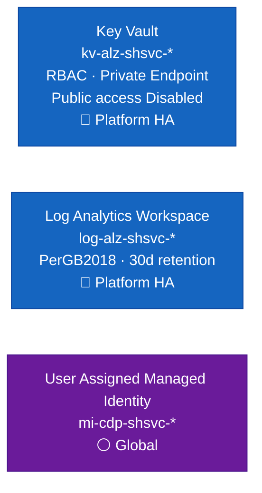
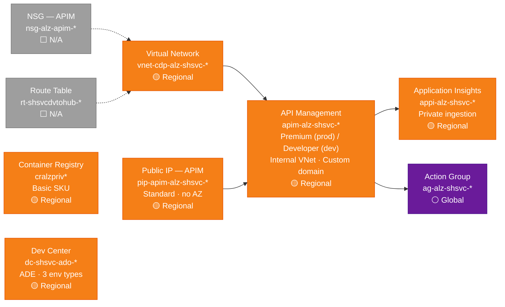
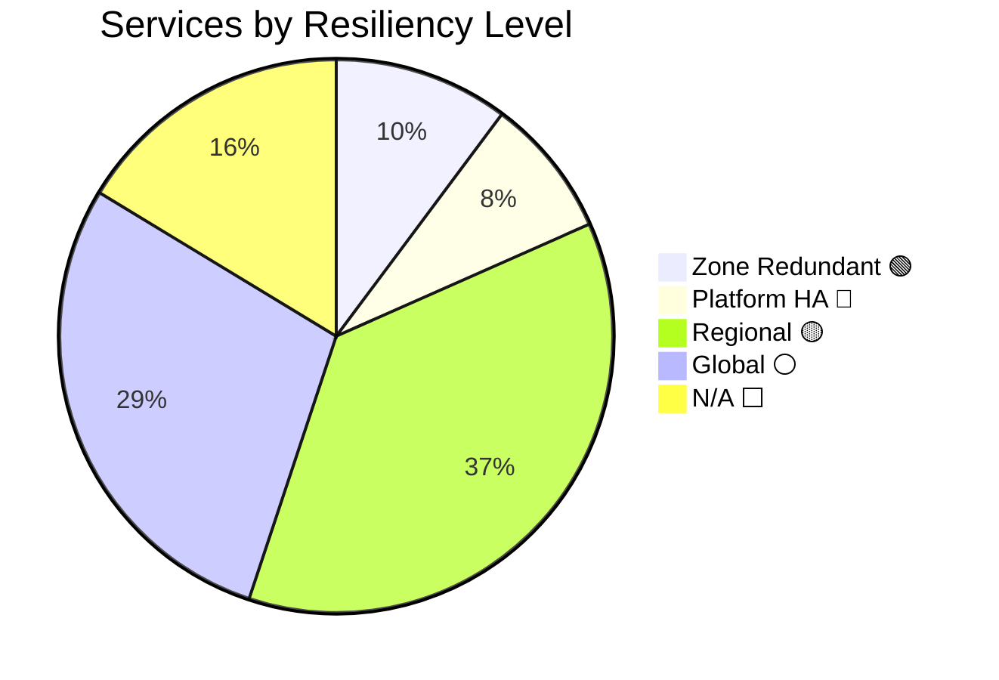
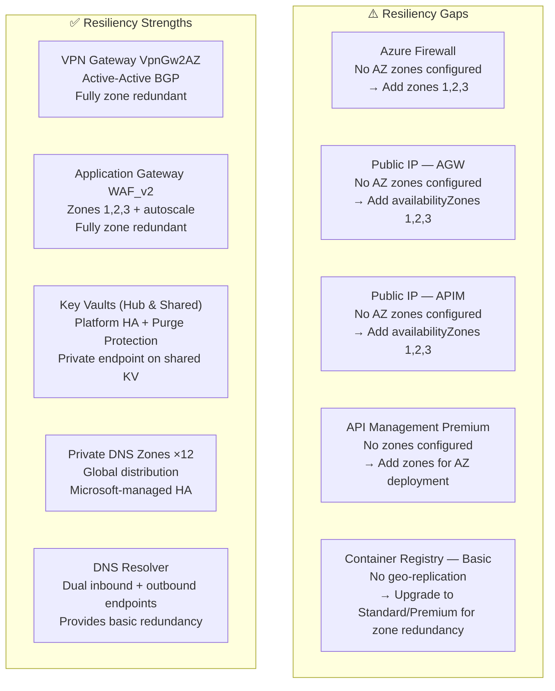

# Azure Services Resiliency Inventory

> Generated from Bicep sources — last updated: 2026-04-24
> Scope: Hub Landing Zone + Shared Services Landing Zone (Canada Central)

---

## Resiliency Levels — Legend

| Level | Definition |
|---|---|
| 🟢 **Zone Redundant** | Deployed explicitly across Availability Zones 1, 2, 3 — survives a single-AZ failure |
| 🔵 **Platform HA** | Microsoft manages redundancy internally (zone-redundant by default in Canada Central) |
| 🟡 **Regional** | Deployed in a single region without AZ configuration — survives node/rack failures but not AZ-level outages |
| ⚪ **Global** | Globally distributed by Microsoft — inherently resilient |
| ⬜ **N/A** | Non-stateful policy/config resource |

---

## Architecture Overview

---

## Hub Infrastructure Services

### Network & Security (Hub RG)

### DNS (Hub DNS RG)

### Application Gateway (Hub Gateway RG)

### Shared Services (Hub Shared RG)

### ICPL (Hub ICPL RG)

---

## Shared Services Infrastructure

### Shared Base (Shared RG)

### Shared Ext (Shared Ext RG)

---

## Full Resiliency Summary

---

## Complete Service Inventory

| # | Service | Resource Name Pattern | SKU / Tier | Resiliency Level | Notes |
|---|---|---|---|---|---|
| 1 | Virtual Network (Hub) | `vnet-cdp-alz-hub-*` | Standard | 🟡 Regional | Hub VNet, no AZ config |
| 2 | Azure Firewall | `afw-alz-hubfw-*` | Premium / Basic | 🟡 Regional | No `zones` configured |
| 3 | Firewall Policy | `afwp-afw-alz-hubfw-*` | Standard / Basic | ⬜ N/A | Config resource |
| 4 | VPN Gateway | `vpng-alz-hub-*` | **VpnGw2AZ** | 🟢 Zone Redundant | Active-Active BGP, Gen2 |
| 5 | Public IP — Firewall | `pip-afw-*` | Standard | 🟢 Zone Redundant | Zones 1, 2, 3 |
| 6 | Public IP — VPN #1 | `pip-vpng-*-01` | Standard | 🟢 Zone Redundant | Zones 1, 2, 3 |
| 7 | Public IP — VPN #2 | `pip-vpng-*-02` | Standard | 🟢 Zone Redundant | Zones 1, 2, 3 |
| 8 | Local Network Gateway | `lgw-alz-riopel-*` | — | 🟡 Regional | On-prem gateway reference |
| 9 | VPN Connection | `vcn-azrhub-to-riop-*` | IPSec / IKEv2 | 🟡 Regional | Inherits VPN GW HA |
| 10 | Route Table — FW Subnet | `rt-hubfwsubnet-*` | — | ⬜ N/A | Non-stateful config |
| 11 | Route Table — Default Subnet | `rt-hubdsubnet-*` | — | ⬜ N/A | Non-stateful config |
| 12 | Route Table — GW Subnet | `rt-hubgwsubnet-*` | — | ⬜ N/A | Non-stateful config |
| 13 | Route Table — AGW | `rt-hubagw-*` | — | ⬜ N/A | Non-stateful config |
| 14 | Private DNS Resolver | `dnspr-alz-hubdns-*` | — | 🟡 Regional | 2 inbound + 2 outbound endpoints |
| 15 | DNS Forwarding Ruleset | `dnsprrl-alz-hub-dns-*` | — | 🟡 Regional | 20+ forwarding rules |
| 16 | Private DNS Zone — azure-api.net | `azure-api.net` | Global | ⚪ Global | Hub VNet linked |
| 17 | Private DNS Zone — scm.azure-api.net | `scm.azure-api.net` | Global | ⚪ Global | |
| 18 | Private DNS Zone — portal.azure-api.net | `portal.azure-api.net` | Global | ⚪ Global | |
| 19 | Private DNS Zone — developer.azure-api.net | `developer.azure-api.net` | Global | ⚪ Global | |
| 20 | Private DNS Zone — management.azure-api.net | `management.azure-api.net` | Global | ⚪ Global | |
| 21 | Private DNS Zone — privatelink.azure-api.net | `privatelink.azure-api.net` | Global | ⚪ Global | |
| 22 | Private DNS Zone — openai | `privatelink.openai.azure.com` | Global | ⚪ Global | |
| 23 | Private DNS Zone — cognitive services | `privatelink.cognitiveservices.azure.com` | Global | ⚪ Global | |
| 24 | Private DNS Zone — search | `privatelink.search.windows.net` | Global | ⚪ Global | |
| 25 | Private DNS Zone — vault.azure.net | `privatelink.vault.azure.net` | Global | ⚪ Global | |
| 26 | Private DNS Zone — vaultcore | `privatelink.vaultcore.azure.net` | Global | ⚪ Global | |
| 27 | Private DNS Zone — ivanhoecambridge.com | `ivanhoecambridge.com` | Global | ⚪ Global | |
| 28 | Application Gateway | `agw-hub-*` | WAF_v2 | 🟢 Zone Redundant | AZ 1,2,3 · autoscale 1–2 |
| 29 | WAF Policy | `waf-agw-alz-*` | OWASP 3.2 | ⬜ N/A | Config resource |
| 30 | Public IP — AGW | `pip-agw-*` | Standard | 🟡 Regional | DDoS enabled, no zones |
| 31 | Managed Identity — AGW | `mi-alz-hubagw-*` | User Assigned | ⚪ Global | Platform-managed |
| 32 | NSG — AGW | `nsg-agw-*` | — | ⬜ N/A | Non-stateful config |
| 33 | Key Vault (Hub) | `kv-alz-hub-*` | Standard | 🔵 Platform HA | RBAC · Purge Protection |
| 34 | Log Analytics Workspace (Hub) | `log-alz-hub-*` | PerGB2018 | 🔵 Platform HA | Microsoft-managed AZ |
| 35 | Private Endpoint — SQL MI | `pep-sqlmi-ic-dm-dev-*` | — | 🟡 Regional | ICPL cross-subscription |
| 36 | Key Vault (Shared Services) | `kv-alz-shsvc-*` | Standard | 🔵 Platform HA | Private endpoint · public disabled |
| 37 | Log Analytics Workspace (Shared) | `log-alz-shsvc-*` | PerGB2018 | 🔵 Platform HA | Microsoft-managed AZ |
| 38 | Managed Identity (Shared) | `mi-cdp-shsvc-*` | User Assigned | ⚪ Global | Used by APIM + DevCenter |
| 39 | Virtual Network (Shared Services) | `vnet-cdp-alz-shsvc-*` | Standard | 🟡 Regional | Peered to Hub VNet |
| 40 | NSG — APIM | `nsg-alz-apim-*` | — | ⬜ N/A | Non-stateful config |
| 41 | Route Table (Shared) | `rt-shsvcdvtohub-*` | — | ⬜ N/A | Non-stateful config |
| 42 | Public IP — APIM | `apim-alz-shsvc-*-public-ip` | Standard | 🟡 Regional | No zones configured |
| 43 | API Management | `apim-alz-shsvc-*` | Premium / Developer | 🟡 Regional | Internal VNet · custom domain from KV |
| 44 | Container Registry | `cralzpriv*` | Basic | 🟡 Regional | No geo-replication |
| 45 | Dev Center | `dc-shsvc-ado-*` | — | 🟡 Regional | ADE, 3 env types (dev/test/prod) |
| 46 | Application Insights | `appi-alz-shsvc-*` | Web | 🟡 Regional | Private ingestion/query |
| 47 | Action Group | `ag-alz-shsvc-*` | Global | ⚪ Global | APIM alert notifications |

---

## Resiliency Gaps & Recommendations

| Priority | Service | Gap | Recommended Action |
|---|---|---|---|
| High | Azure Firewall | No AZ zones → single-AZ failure risk | Add `zones: [1, 2, 3]` to `azFirewall` module |
| High | API Management Premium | No AZ zones → single-AZ failure risk | Add `zones: [1, 2, 3]` to `apimAVMService` module |
| Medium | Public IP — AGW | No AZ zones | Add `availabilityZones: [1, 2, 3]` to `publicIpAddress` module |
| Medium | Public IP — APIM | No AZ zones | Add `availabilityZones: [1, 2, 3]` to `apimPublicIP` module |
| Low | Container Registry Basic | No zone redundancy, no geo-replication | Upgrade to Standard or Premium SKU |
