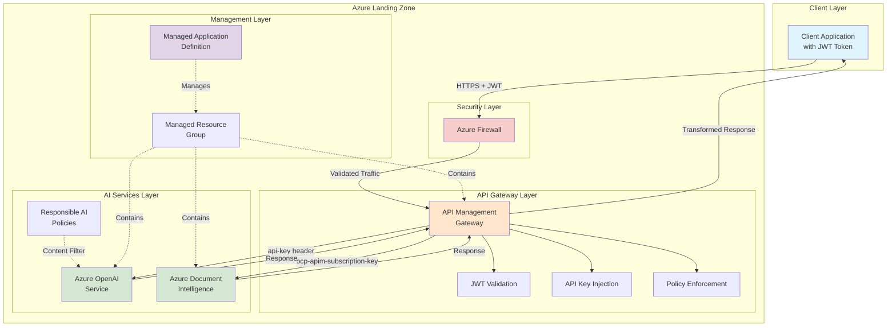
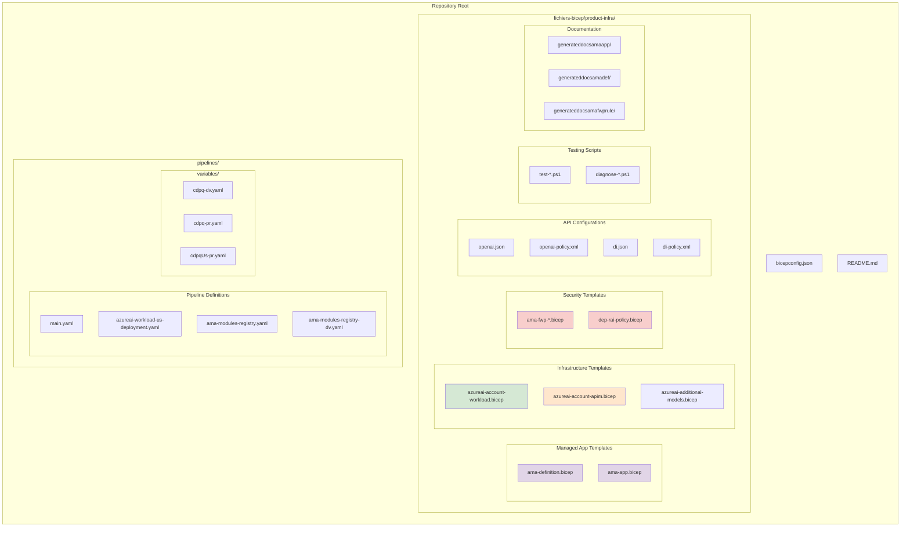
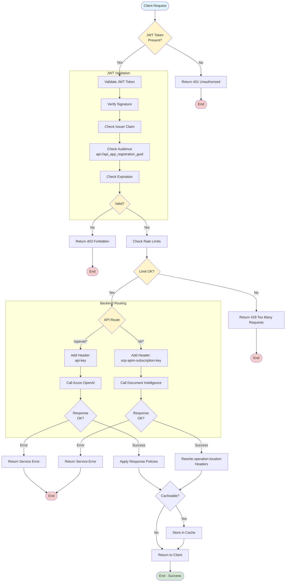
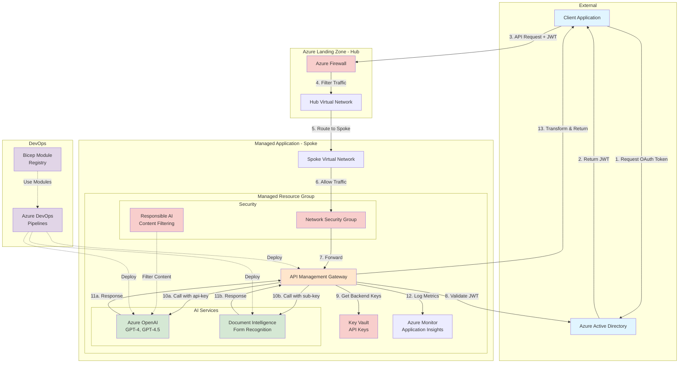
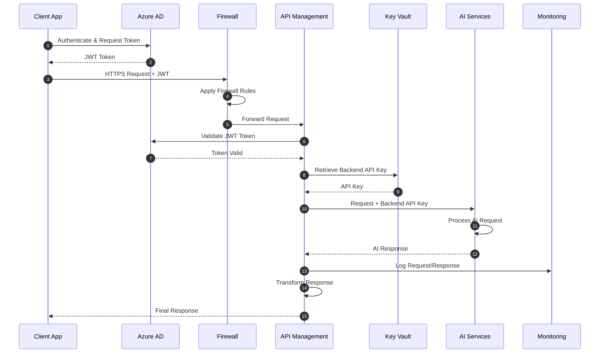

# ALZ AMA AzureAI

This repository contains a production-ready Azure Managed Application (AMA) that deploys and manages Azure AI services within the Azure Landing Zones (ALZ) framework. The solution provides a secure, enterprise-grade platform integrating **Azure OpenAI** and **Azure Document Intelligence** services behind an API Management gateway with comprehensive security controls.

## Architecture Overview

The solution deploys a Managed Application that provides:

- **Azure OpenAI** - AI completions and chat capabilities
- **Azure Document Intelligence** - Document analysis and form recognition (formerly Form Recognizer)
- **Azure API Management (APIM)** - Unified API gateway with security policies
- **Azure Firewall** - Network-level security controls
- **Responsible AI Policies** - Content filtering and protected material code detection

### High-Level Architecture



### Feature Highlights

- **Unified API Gateway**: Single entry point for multiple Azure AI services
- **Enterprise Security**: JWT validation, API key abstraction, and Azure Firewall integration
- **Managed Application Model**: Customer isolation and streamlined deployment
- **Multi-Environment Support**: Dev, PR (production), and US region configurations
- **Infrastructure as Code**: Comprehensive Bicep templates following Azure best practices
- **CI/CD Pipelines**: Automated validation, testing, and deployment

## Who is this for?

- Cloud architects and engineers deploying AI workloads on Azure
- Teams adopting Azure Landing Zones and requiring secure AI services
- Organizations needing a managed, enterprise-grade AI platform
- Anyone implementing AI services with strict security and compliance requirements

## Repository Structure



**Key Directories**:
- 📁 **fichiers-bicep/product-infra/** - Infrastructure as Code templates
- 📁 **pipelines/** - CI/CD pipeline definitions
- 📁 **pipelines/variables/** - Environment-specific configurations

## Core Components

### 1. Managed Application

```mermaid
stateDiagram-v2
    [*] --> Definition: Create AMA Definition

    state \"Service Catalog\" as Catalog {
        Definition --> Published: Publish to Catalog
        Published --> Available: Mark Available
    }

    state \"Customer Deployment\" as Customer {
        Available --> Requested: Customer Requests
        Requested --> Provisioning: Start Provisioning

        state Provisioning {
            [*] --> CreateMRG: Create Managed RG
            CreateMRG --> DeployResources: Deploy Resources
            DeployResources --> ConfigureAPIM: Configure APIM
            ConfigureAPIM --> DeployAI: Deploy AI Services
            DeployAI --> ApplySecurity: Apply Security
            ApplySecurity --> [*]
        }

        Provisioning --> Running: Deployment Complete
    }

    state \"Operations\" as Ops {
        Running --> Monitoring: Monitor Health
        Monitoring --> Running: Healthy
        Monitoring --> Updating: Update Required
        Updating --> Running: Update Complete
        Running --> Scaling: Scale Required
        Scaling --> Running: Scale Complete
    }

    Running --> Deleting: Customer Deletes
    Deleting --> [*]: Cleanup Complete

    note right of Definition
        Defines app structure,\n        UI definition,\n        authorization
    end note

    note right of Provisioning
        Deployed to customer's\n        subscription in isolated\n        managed resource group
    end note

    note right of Ops
        Publisher manages updates,\n        customer monitors usage
    end note
```

The solution is packaged as an **Azure Managed Application**, providing:
- **Customer Isolation**: Each deployment is isolated in the customer's subscription
- **Managed Resource Group**: Resources are deployed to a managed resource group
- **Simplified Management**: Centralized control and updates through the managed app model

**Key Files**:
- `azureai-account-ama-definition.bicep` - Defines the managed application catalog item
- `azureai-account-ama-app.bicep` - Deploys instances of the managed application

### 2. Azure AI Services

```mermaid
flowchart LR
    subgraph \"Model Catalog\"\n        GPT4[GPT-4]\n        GPT45[GPT-4.5]\n        GPT5[GPT-5]\n        Custom[Custom Models]\n    end\n    \n    subgraph \"Deployment Templates\"\n        BaseTemplate[azureai-account-workload.bicep]\n        AddModels[azureai-additional-models.bicep]\n        SingleModel[azureai-single-model-add.bicep]\n    end\n    \n    subgraph \"Azure OpenAI Service\"\n        OpenAIBase[Base OpenAI Account]\n        \n        subgraph \"Deployed Models\"\n            Model1[GPT-4 Deployment]\n            Model2[GPT-4.5 Deployment]\n            Model3[Custom Deployment]\n        end\n        \n        subgraph \"Endpoints\"\n            ChatAPI[\"/openai/deployments/{id}/chat/completions\"]\n            CompAPI[\"/openai/deployments/{id}/completions\"]\n        end\n    end\n    \n    subgraph \"Document Intelligence\"\n        DIBase[DI Account]\n        \n        subgraph \"Analyzers\"\n            Prebuilt[Prebuilt Models]\n            CustomForms[Custom Forms]\n        end\n        \n        subgraph \"Endpoints\"\n            AnalyzeAPI[\"/di/documentModels/{model}:analyze\"]\n            ResultAPI[\"/di/analyzeResults/{id}\"]\n        end\n    end\n    \n    subgraph \"API Management\"\n        APIM[APIM Gateway]\n        OpenAIProduct[OpenAI API Product]\n        DIProduct[DI API Product]\n    end\n    \n    GPT4 --> BaseTemplate\n    GPT45 --> AddModels\n    GPT5 --> SingleModel\n    Custom --> SingleModel\n    \n    BaseTemplate --> OpenAIBase\n    AddModels --> Model1\n    AddModels --> Model2\n    SingleModel --> Model3\n    \n    OpenAIBase --> Model1\n    OpenAIBase --> Model2\n    OpenAIBase --> Model3\n    \n    Model1 --> ChatAPI\n    Model2 --> ChatAPI\n    Model3 --> CompAPI\n    \n    Prebuilt --> AnalyzeAPI\n    CustomForms --> AnalyzeAPI\n    AnalyzeAPI --> ResultAPI\n    \n    ChatAPI --> APIM\n    CompAPI --> APIM\n    AnalyzeAPI --> APIM\n    ResultAPI --> APIM\n    \n    APIM --> OpenAIProduct\n    APIM --> DIProduct\n    \n    style OpenAIBase fill:#d5e8d4\n    style DIBase fill:#d5e8d4\n    style APIM fill:#ffe6cc\n    style BaseTemplate fill:#e1d5e7\n    style AddModels fill:#e1d5e7\n    style SingleModel fill:#e1d5e7\n```

**Azure OpenAI**:
- Provides chat completions and AI model capabilities
- Configured with custom models (GPT-4, GPT-4.5, etc.)
- Accessible via APIM at `/openai/*` endpoints

**Azure Document Intelligence**:
- Document analysis and form recognition
- Custom form analyzers and prebuilt models
- Accessible via APIM at `/di/*` endpoints

**Key Files**:
- `azureai-account-workload.bicep` - Main deployment using Azure Verified Modules (AVM)
- `azureai-additional-models.bicep` - Additional model deployments
- `azureai-single-model-add.bicep` - Single model addition template

### 3. API Management Gateway

```mermaid
graph TB
    subgraph \"APIM Configuration\"\n        APIM[API Management Instance]\n        \n        subgraph \"API Definitions\"\n            OpenAIAPI[\"OpenAI API<br/>(openai.json)\"]\n            DIAPI[\"Document Intelligence API<br/>(di.json)\"]\n        end\n        \n        subgraph \"Policies\"\n            GlobalPolicy[Global Policies]\n            \n            subgraph \"OpenAI Policies\"\n                OAIInbound[\"Inbound<br/>• JWT Validation<br/>• Add api-key header\"]\n                OAIOutbound[\"Outbound<br/>• Response caching<br/>• Header cleanup\"]\n            end\n            \n            subgraph \"DI Policies\"\n                DIInbound[\"Inbound<br/>• JWT Validation<br/>• Add subscription-key\"]\n                DIOutbound[\"Outbound<br/>• Rewrite operation-location<br/>• Response caching\"]\n            end\n        end\n        \n        subgraph \"Products\"\n            OpenAIProduct[OpenAI Product]\n            DIProduct[DI Product]\n        end\n        \n        subgraph \"Backend Configuration\"\n            OpenAIBackend[\"OpenAI Backend<br/>https://{account}.openai.azure.com\"]\n            DIBackend[\"DI Backend<br/>https://{region}.api.cognitive.microsoft.com\"]\n        end\n        \n        subgraph \"Named Values\"\n            OpenAIKey[\"OpenAI API Key<br/>(from Key Vault)\"]\n            DIKey[\"DI Subscription Key<br/>(from Key Vault)\"]\n            AADConfig[\"AAD OpenID Config URL\"]\n            Audience[\"JWT Audience Claim\"]\n        end\n    end\n    \n    subgraph \"Request Flow\"\n        ClientReq([Client Request]) --> RouteCheck{Route}\n        RouteCheck -->|/openai/*| OpenAIAPI\n        RouteCheck -->|/di/*| DIAPI\n        \n        OpenAIAPI --> OAIInbound\n        OAIInbound --> OpenAIKey\n        OpenAIKey --> OpenAIBackend\n        OpenAIBackend --> OAIOutbound\n        OAIOutbound --> ClientResp\n        \n        DIAPI --> DIInbound\n        DIInbound --> DIKey\n        DIKey --> DIBackend\n        DIBackend --> DIOutbound\n        DIOutbound --> ClientResp([Response])\n    end\n    \n    GlobalPolicy -.->|Apply to all| OAIInbound\n    GlobalPolicy -.->|Apply to all| DIInbound\n    AADConfig -.->|Used by| OAIInbound\n    AADConfig -.->|Used by| DIInbound\n    Audience -.->|Validate| OAIInbound\n    Audience -.->|Validate| DIInbound\n    \n    OpenAIProduct -.->|Contains| OpenAIAPI\n    DIProduct -.->|Contains| DIAPI\n    \n    style APIM fill:#ffe6cc\n    style OpenAIBackend fill:#d5e8d4\n    style DIBackend fill:#d5e8d4\n    style OpenAIKey fill:#f8cecc\n    style DIKey fill:#f8cecc\n    style AADConfig fill:#f8cecc\n    style ClientReq fill:#e1f5ff\n    style ClientResp fill:#e1f5ff\n```

Acts as a unified, secure gateway for all AI services with:
- **Route Consolidation**: Single endpoint for multiple backend services
- **Authentication**: JWT (OAuth 2.0) validation for all requests
- **API Key Management**: Backend API keys injected automatically by APIM
- **Policy Enforcement**: Rate limiting, caching, and transformation policies
- **Response Rewriting**: Header transformation for seamless client integration

**API Definitions**:
- `openai.json` + `openai-policy.xml` - OpenAI API specification and policies
- `di.json` + `di-policy.xml` - Document Intelligence API specification and policies

### 4. Security Layer

```mermaid
flowchart LR
    subgraph "Network Security"
        Internet([Internet]) --> FW[Azure Firewall]
        FW --> FWRules{Firewall<br/>Rules}
        FWRules -->|Allow| VNET[Virtual Network]
        FWRules -->|Block| Drop[Drop Traffic]
    end

    subgraph "API Security"
        VNET --> APIM[API Management]
        APIM --> OAuth[OAuth 2.0 / JWT]
        OAuth --> KeyMgmt[API Key Management]
        KeyMgmt --> PolicyEnf[Policy Enforcement]
    end

    subgraph "Content Security"
        PolicyEnf --> RAI[Responsible AI]
        RAI --> ContentFilter[Content Filtering]
        ContentFilter --> HateDetect[Hate Speech]
        ContentFilter --> SexualDetect[Sexual Content]
        ContentFilter --> ViolenceDetect[Violence]
        ContentFilter --> SelfHarmDetect[Self-Harm]
        RAI --> ProtectedMat[Protected Material]
        ProtectedMat --> CodeDetect[Code Detection]
    end

    subgraph "AI Services"
        HateDetect --> AIService[Azure AI Services]
        SexualDetect --> AIService
        ViolenceDetect --> AIService
        SelfHarmDetect --> AIService
        CodeDetect --> AIService
    end

    Drop -.-> Log[Audit Logs]
    AIService --> Response([Response])

    style FW fill:#f8cecc
    style OAuth fill:#ffe6cc
    style RAI fill:#f8cecc
    style ContentFilter fill:#fff4cc
    style AIService fill:#d5e8d4
```

**Firewall Configuration**:
- Network-level traffic filtering
- Rule collections for inbound/outbound traffic
- Integration with Azure Landing Zone hub network

**Responsible AI Policies**:
- Content filtering (hate, sexual, violence, self-harm)
- Protected material detection for code and text
- Configurable severity thresholds

**Key Files**:
- `azureai-account-ama-fwp-add-ruleCollections.bicep` - Firewall rule collections
- `azureai-account-fwp-rulesCollection.bicep` - Individual rule definitions
- `dep-rai-policy.bicep` - Responsible AI policy deployment

## API Gateway Data Flow

### Request Flow



### Request Flow Steps

1. **Client Authentication**
   - Client sends request with JWT token (OAuth 2.0)
   - Token includes audience claim: `api://api_app_registration_guid`

2. **API Management Processing**
   - Validates JWT token against OpenID Connect configuration
   - Checks token issuer and audience claims
   - Enforces rate limits and policies

3. **Backend Authentication**
   - APIM adds appropriate backend authentication:
     - **OpenAI**: `api-key` header
     - **Document Intelligence**: `ocp-apim-subscription-key` header
   - Client never needs to know backend API keys

4. **Service Processing**
   - Azure OpenAI or Document Intelligence processes the request
   - Returns response to APIM

5. **Response Transformation**
   - Document Intelligence: APIM rewrites `operation-location` headers to route through gateway
   - Returns response to client

### Authentication Flow

```mermaid
sequenceDiagram
    participant Client
    participant AAD as Azure AD
    participant APIM as API Management
    participant KV as Key Vault
    participant OpenAI as Azure OpenAI
    participant DI as Document Intelligence

    Note over Client,AAD: Step 1: Client Authentication
    Client->>AAD: Request OAuth 2.0 Token
    AAD-->>Client: JWT Token (Bearer)

    Note over Client,APIM: Step 2: API Request
    Client->>APIM: HTTPS Request<br/>Authorization: Bearer <JWT>

    Note over APIM: Step 3: Token Validation
    APIM->>APIM: Validate JWT Signature
    APIM->>APIM: Check Issuer Claim
    APIM->>APIM: Check Audience Claim
    APIM->>APIM: Verify Token Expiration

    Note over APIM,KV: Step 4: Backend Authentication
    APIM->>KV: Retrieve Backend API Keys
    KV-->>APIM: API Keys

    alt OpenAI Request
        APIM->>OpenAI: Forward Request<br/>Header: api-key
        OpenAI-->>APIM: AI Response
    else Document Intelligence Request
        APIM->>DI: Forward Request<br/>Header: ocp-apim-subscription-key
        DI-->>APIM: Analysis Response
    end

    Note over APIM: Step 5: Response Transformation
    APIM->>APIM: Rewrite Headers (DI only)
    APIM->>APIM: Apply Response Policies

    APIM-->>Client: Transformed Response

    style APIM fill:#ffe6cc
    style KV fill:#f8cecc
    style OpenAI fill:#d5e8d4
    style DI fill:#d5e8d4
```

## Infrastructure as Code (Bicep)

The `fichiers-bicep/product-infra/` directory contains comprehensive Bicep templates following Azure best practices:

### Deployment Templates

- **Main Workload**: `azureai-account-workload.bicep` uses Azure Verified Modules (AVM) for standardized deployments
- **API Management**: `azureai-account-apim*.bicep` configures APIM instances for EU2 and other regions
- **Managed Application**: Templates for both the app definition and deployment instances
- **Firewall Policies**: Modular templates for network security rules
- **Model Management**: Templates for adding, updating, and managing AI models

### Parameter Files

- `*.bicepparam` - Bicep parameter files for type-safe configuration
- `*.parameters.json` - ARM-style parameter files for backward compatibility
- Environment-specific parameters in pipeline variables

### Testing Scripts

PowerShell scripts for validation and testing:
- `test-azureai-account-ama-deployment.ps1` - Main deployment validation
- `test-correct-azure-openai.ps1` - OpenAI service connectivity test
- `test-gpt5-mini-fixed.ps1` - Specific model deployment test
- `diagnose-azure-openai-error.ps1` - Troubleshooting helper

## CI/CD Pipelines

The `pipelines/` directory contains Azure DevOps YAML pipelines for automated deployment:

### Pipeline Files

- **`main.yaml`** - Primary deployment pipeline orchestrating full infrastructure deployment
- **`azureai-workload-us-deployment.yaml`** - US region-specific deployment pipeline
- **`ama-modules-registry.yaml`** - Production Bicep module registry publishing
- **`ama-modules-registry-dv.yaml`** - Development Bicep module registry

### Environment Variables

```mermaid
graph LR
    subgraph \"Development Track\"\n        DevDV[\"Development<br/>cdpq-dv.yaml\"] --> DevCT[\"Dev CT<br/>cdpqdev-ct.yaml\"]\n        DevCT --> DevIntDV[\"Dev Integration<br/>cdpqdev-dv.yaml\"]\n        DevIntDV --> DevIntPR[\"Dev Prod<br/>cdpqdev-pr.yaml\"]\n    end\n    \n    subgraph \"Production Track\"\n        DevIntPR --> ProdDV[\"Prod Staging<br/>cdpq-dv.yaml\"]\n        ProdDV --> ProdPR[\"Production<br/>cdpq-pr.yaml\"]\n    end\n    \n    subgraph \"Geographic Regions\"\n        ProdPR --> EUProd[\"EU Production<br/>cdpq-pr.yaml\"]\n        ProdPR --> USProd[\"US Production<br/>cdpqUs-pr.yaml\"]\n    end\n    \n    style DevDV fill:#e1f5ff\n    style DevCT fill:#e1f5ff\n    style DevIntDV fill:#fff4cc\n    style DevIntPR fill:#fff4cc\n    style ProdDV fill:#ffe6cc\n    style ProdPR fill:#d5e8d4\n    style EUProd fill:#d5e8d4\n    style USProd fill:#d5e8d4\n```

Environment-specific configurations in `pipelines/variables/`:

| File | Environment | Purpose |
|------|-------------|---------|
| `cdpq-dv.yaml` | Development | Development environment settings |
| `cdpq-pr.yaml` | Production | Production environment settings |
| `cdpqdev-dv.yaml` | Dev Integration | Development integration settings |
| `cdpqdev-pr.yaml` | Dev Production | Development production settings |
| `cdpqUs-pr.yaml` | US Production | US region production settings |

### Pipeline Capabilities

```mermaid
flowchart TD
    Start([Pipeline Trigger]) --> Checkout[Checkout Code]
    Checkout --> Validate

    subgraph "Validation Stage"
        Validate[Bicep Validation] --> Lint[Bicep Linting]
        Lint --> Security[Security Scan]
        Security --> ValidateGate{Validation<br/>Passed?}
    end

    ValidateGate -->|No| FailValidate[Report Errors]
    FailValidate --> End1([End - Failed])

    ValidateGate -->|Yes| EnvSelect{Environment}

    subgraph "Environment Selection"
        EnvSelect -->|Dev| DevVars[Load cdpq-dv.yaml]
        EnvSelect -->|Prod| ProdVars[Load cdpq-pr.yaml]
        EnvSelect -->|US Prod| USVars[Load cdpqUs-pr.yaml]
    end

    DevVars --> Build
    ProdVars --> Build
    USVars --> Build

    subgraph "Build Stage"
        Build[Build Bicep Templates] --> Params[Process Parameters]
        Params --> Artifacts[Create Artifacts]
    end

    Artifacts --> DeployType{Deployment<br/>Type}

    subgraph "Deployment Stage"
        DeployType -->|Managed App| DeployAMA[Deploy AMA Definition]
        DeployType -->|Workload| DeployWork[Deploy Workload]
        DeployType -->|Modules| DeployMod[Publish to Registry]

        DeployAMA --> TestDeploy
        DeployWork --> TestDeploy
        DeployMod --> TestDeploy

        TestDeploy[Run Test Scripts] --> TestGate{Tests<br/>Passed?}
    end

    TestGate -->|No| FailDeploy[Rollback & Report]
    FailDeploy --> End2([End - Failed])

    TestGate -->|Yes| Notify[Send Notifications]
    Notify --> End3([End - Success])

    style Start fill:#e1f5ff
    style End1 fill:#f8cecc
    style End2 fill:#f8cecc
    style End3 fill:#d5e8d4
    style ValidateGate fill:#fff4cc
    style TestGate fill:#fff4cc
    style EnvSelect fill:#fff4cc
    style DeployType fill:#fff4cc
```

**Pipeline Features**:
- ✅ **Bicep Validation**: Linting and syntax checking
- ✅ **Security Scanning**: Infrastructure security analysis
- ✅ **Automated Testing**: Deployment validation scripts
- ✅ **Multi-Region**: Support for different Azure regions
- ✅ **Environment Promotion**: Dev → PR (Production) workflow
- ✅ **Module Registry**: Publishing reusable Bicep modules

## Security Implementation

### Defense-in-Depth Security Architecture

```mermaid
graph TB
    subgraph \"Layer 1: Network Security\"\n        Internet([Internet]) --> FW[Azure Firewall]\n        FW --> NSG[Network Security Groups]\n        NSG --> VNET[Virtual Network]\n    end\n    \n    subgraph \"Layer 2: Identity & Access\"\n        VNET --> APIM[API Management]\n        APIM --> AAD[Azure AD Authentication]\n        AAD --> JWT[JWT Token Validation]\n        JWT --> RBAC[Role-Based Access Control]\n    end\n    \n    subgraph \"Layer 3: API Security\"\n        RBAC --> RateLimit[Rate Limiting]\n        RateLimit --> Throttle[Throttling Policies]\n        Throttle --> KeyMgmt[API Key Management]\n        KeyMgmt --> KV[Key Vault]\n    end\n    \n    subgraph \"Layer 4: Content Security\"\n        KV --> RAI[Responsible AI]\n        RAI --> ContentPolicy{Content Type}\n        ContentPolicy -->|Text| TextFilter[Text Filtering]\n        ContentPolicy -->|Code| CodeFilter[Code Filtering]\n        \n        TextFilter --> HateCheck[Hate Speech Detection]\n        TextFilter --> SexualCheck[Sexual Content Detection]\n        TextFilter --> ViolenceCheck[Violence Detection]\n        TextFilter --> SelfHarmCheck[Self-Harm Detection]\n        \n        CodeFilter --> ProtectedCode[Protected Code Detection]\n        \n        HateCheck --> Severity\n        SexualCheck --> Severity\n        ViolenceCheck --> Severity\n        SelfHarmCheck --> Severity\n        ProtectedCode --> Severity\n        \n        Severity{Severity<br/>Check}\n    end\n    \n    subgraph \"Layer 5: Service Security\"\n        Severity -->|Pass| AIService[Azure AI Services]\n        AIService --> PE[Private Endpoints]\n        PE --> Encryption[Encryption at Rest]\n        Encryption --> Response\n    end\n    \n    subgraph \"Layer 6: Monitoring & Audit\"\n        Response([Response]) --> Logs[Azure Monitor Logs]\n        Logs --> Metrics[Metrics & Alerts]\n        Metrics --> Sentinel[Azure Sentinel]\n    end\n    \n    Severity -->|Block| Block[Block Request]\n    Block --> AuditLog[Audit Log]\n    AuditLog --> Alert[Security Alert]\n    \n    style FW fill:#f8cecc\n    style NSG fill:#f8cecc\n    style AAD fill:#ffe6cc\n    style JWT fill:#ffe6cc\n    style KV fill:#f8cecc\n    style RAI fill:#f8cecc\n    style Block fill:#f8cecc\n    style Alert fill:#f8cecc\n    style AIService fill:#d5e8d4\n    style Response fill:#d5e8d4\n```

### API Security

Both OpenAI and Document Intelligence APIs implement defense-in-depth security:

1. **OAuth 2.0 / JWT Validation**
   - OpenID Connect configuration URL validation
   - Audience claim validation (`api://api_app_registration_guid`)
   - Issuer validation against Azure AD
   - Token signature verification

2. **API Key Abstraction**
   - Backend API keys managed by APIM
   - Keys never exposed to clients
   - Automatic rotation support through Azure Key Vault

3. **Network Security**
   - Azure Firewall rules for traffic filtering
   - Private endpoints for AI services (optional)
   - VNet integration with Landing Zone hub

4. **Content Filtering**
   - Responsible AI policies at the service level
   - Protected material detection for code
   - Configurable severity thresholds

### Responsible AI Policies

Configured in `dep-rai-policy.bicep`:
- **Content Categories**: Hate, sexual, violence, self-harm
- **Protected Material**: Code detection and filtering
- **Customizable**: Severity levels (low, medium, high)
- **Enforcement**: Applied at the Azure OpenAI service level

## Getting Started

### Prerequisites

- Azure subscription with appropriate permissions
- Azure DevOps project for CI/CD
- Azure AD app registration for API authentication
- Azure CLI and Bicep CLI installed locally

### Local Deployment

```mermaid
flowchart TD
    Start([Start Deployment]) --> Clone[Clone Repository]
    Clone --> Review[Review Parameters]

    subgraph "Configuration"
        Review --> UpdateParams["Update *.bicepparam Files"]
        UpdateParams --> SetAAD[Configure Azure AD App]
        SetAAD --> SetNames[Set Resource Names]
    end

    SetNames --> DeployDef["Deploy AMA Definition<br/>(Service Catalog)"]
    DeployDef --> DefSuccess{Success?}

    DefSuccess -->|No| TroubleshootDef[Check Errors]
    TroubleshootDef --> FixDef[Fix Issues]
    FixDef --> DeployDef

    DefSuccess -->|Yes| DeployApp["Deploy AMA Instance<br/>(Customer Subscription)"]
    DeployApp --> AppSuccess{Success?}

    AppSuccess -->|No| TroubleshootApp[Check Errors]
    TroubleshootApp --> FixApp[Fix Issues]
    FixApp --> DeployApp

    AppSuccess -->|Yes| DeployWorkload[Deploy AI Workload]
    DeployWorkload --> ConfigAPIM[Configure APIM]
    ConfigAPIM --> ConfigFW[Configure Firewall]
    ConfigFW --> DeployRAI[Deploy RAI Policies]

    DeployRAI --> RunTests[Run Validation Tests]
    RunTests --> TestResult{All Tests<br/>Passed?}

    TestResult -->|No| Diagnose[Run Diagnostic Scripts]
    Diagnose --> FixIssues[Fix Issues]
    FixIssues --> RunTests

    TestResult -->|Yes| SetupMonitor[Setup Monitoring]
    SetupMonitor --> Complete([Deployment Complete])

    style Start fill:#e1f5ff
    style Complete fill:#d5e8d4
    style DefSuccess fill:#fff4cc
    style AppSuccess fill:#fff4cc
    style TestResult fill:#fff4cc
```

**Step-by-Step Commands**:

1. **Clone the repository**
   ```powershell
   git clone <repository-url>
   cd alz-ama-azureai
   ```

2. **Configure parameters**
   - Review and customize `*.bicepparam` files in `fichiers-bicep/product-infra/`
   - Update Azure AD app registration IDs
   - Set resource naming conventions

3. **Deploy infrastructure**
   ```powershell
   # Deploy the managed application definition
   az deployment group create `
     --resource-group <catalog-rg> `
     --template-file fichiers-bicep/product-infra/azureai-account-ama-definition.bicep `
     --parameters fichiers-bicep/product-infra/azureai-account-ama-definition.bicepparam

   # Deploy the managed application instance
   az deployment group create `
     --resource-group <deployment-rg> `
     --template-file fichiers-bicep/product-infra/azureai-account-ama-app.bicep `
     --parameters fichiers-bicep/product-infra/azureai-account-ama-app.bicepparam
   ```

4. **Validate deployment**
   ```powershell
   # Run validation script
   .\fichiers-bicep\product-infra\test-azureai-account-ama-deployment.ps1
   ```

### Pipeline Deployment

1. **Configure Azure DevOps**
   - Import pipelines from `pipelines/` directory
   - Configure service connections
   - Set pipeline variables from `pipelines/variables/`

2. **Run deployment pipeline**
   - Trigger `main.yaml` pipeline
   - Monitor deployment progress
   - Review deployment logs and validation results

3. **Post-deployment**
   - Configure API Management policies
   - Test API endpoints
   - Set up monitoring and alerts

## Testing & Validation

The repository includes comprehensive testing scripts for end-to-end validation:

```mermaid
flowchart TD
    Start([Start Testing]) --> SelectTest{Test Type}

    subgraph \"Deployment Testing\"\n        SelectTest -->|Full Deployment| TestDeploy[test-azureai-account-ama-deployment.ps1]\n        TestDeploy --> CheckResources[Check Resource Deployment]\n        CheckResources --> CheckRG{Resource Group<br/>Exists?}\n        CheckRG -->|No| FailRG[Report: RG Not Found]\n        CheckRG -->|Yes| CheckAPIM{APIM<br/>Deployed?}\n        CheckAPIM -->|No| FailAPIM[Report: APIM Missing]\n        CheckAPIM -->|Yes| CheckAI{AI Services<br/>Deployed?}\n        CheckAI -->|No| FailAI[Report: AI Services Missing]\n        CheckAI -->|Yes| DeployPass[Deployment Test Passed]\n    end\n
    subgraph \"API Testing\"\n        SelectTest -->|OpenAI| TestOpenAI[test-correct-azure-openai.ps1]\n        TestOpenAI --> GetToken[Get OAuth Token]\n        GetToken --> CallAPI[Call OpenAI API]\n        CallAPI --> ValidateResp{Valid<br/>Response?}\n        ValidateResp -->|No| FailAPI[Report: API Error]\n        ValidateResp -->|Yes| APIPass[API Test Passed]\n    end\n    \n    subgraph \"Model Testing\"\n        SelectTest -->|Model| TestModel[test-gpt5-mini-fixed.ps1]\n        TestModel --> CheckModel[Check Model Deployment]\n        CheckModel --> TestInference[Test Model Inference]\n        TestInference --> ValidateOutput{Valid<br/>Output?}\n        ValidateOutput -->|No| FailModel[Report: Model Error]\n        ValidateOutput -->|Yes| ModelPass[Model Test Passed]\n    end\n    \n    subgraph \"Diagnostics\"\n        SelectTest -->|Troubleshoot| Diagnose[diagnose-azure-openai-error.ps1]\n        FailRG --> Diagnose\n        FailAPIM --> Diagnose\n        FailAI --> Diagnose\n        FailAPI --> Diagnose\n        FailModel --> Diagnose\n        \n        Diagnose --> CheckAAD[Check Azure AD Auth]\n        CheckAAD --> CheckKeys[Check API Keys]\n        CheckKeys --> CheckNetwork[Check Network Rules]\n        CheckNetwork --> CheckRAI[Check RAI Policies]\n        CheckRAI --> DiagReport[Generate Diagnostic Report]\n    end\n    \n    DeployPass --> Summary\n    APIPass --> Summary\n    ModelPass --> Summary\n    DiagReport --> Summary\n    \n    Summary[Generate Test Summary] --> AllPass{All Tests<br/>Passed?}\n    AllPass -->|Yes| Success([Success])\n    AllPass -->|No| Failure([Failure - Review Report])\n    \n    style Start fill:#e1f5ff\n    style Success fill:#d5e8d4\n    style Failure fill:#f8cecc\n    style FailRG fill:#f8cecc\n    style FailAPIM fill:#f8cecc\n    style FailAI fill:#f8cecc\n    style FailAPI fill:#f8cecc\n    style FailModel fill:#f8cecc\n    style DeployPass fill:#d5e8d4\n    style APIPass fill:#d5e8d4\n    style ModelPass fill:#d5e8d4\n```

**Available Test Scripts**:
- **Deployment Testing**: Validates successful resource deployment
- **API Testing**: Tests OpenAI and Document Intelligence endpoints
- **Model Testing**: Validates AI model deployments and responses
- **Diagnostic Tools**: Troubleshooting scripts for common issues

Run tests after deployment:
```powershell
# Main deployment test
.\fichiers-bicep\product-infra\test-azureai-account-ama-deployment.ps1

# OpenAI connectivity test
.\fichiers-bicep\product-infra\test-correct-azure-openai.ps1

# Diagnose issues
.\fichiers-bicep\product-infra\diagnose-azure-openai-error.ps1
```

## Component Interactions Summary

### Complete System Architecture



### Data Flow Sequence



## Best Practices Implemented

- ✅ **Infrastructure as Code**: All resources defined in Bicep
- ✅ **Azure Verified Modules**: Using official Microsoft modules
- ✅ **Security by Default**: JWT validation, API key abstraction, firewall rules
- ✅ **Managed Application**: Customer isolation and simplified management
- ✅ **Multi-Environment**: Separate configurations for dev/prod
- ✅ **Automated Testing**: Validation scripts and pipeline checks
- ✅ **Responsible AI**: Content filtering and protected material detection
- ✅ **Landing Zone Aligned**: Follows ALZ patterns and conventions
- ✅ **Documentation**: Auto-generated docs and comprehensive README

## Troubleshooting

### Diagnostic Flow

```mermaid
flowchart TD
    Issue([Issue Reported]) --> Category{Issue Category}

    subgraph \"Authentication Issues\"\n        Category -->|401/403 Error| CheckJWT[Check JWT Token]\n        CheckJWT --> JWTValid{Token Valid?}\n        JWTValid -->|No| FixAAD[\"Fix: Check Azure AD<br/>App Registration\"]\n        JWTValid -->|Yes| CheckAudience[Check Audience Claim]\n        CheckAudience --> AudValid{Correct<br/>Audience?}\n        AudValid -->|No| FixAud[\"Fix: Update JWT<br/>Audience Claim\"]\n        AudValid -->|Yes| CheckIssuer[Check Issuer]\n        CheckIssuer --> IssValid{Valid<br/>Issuer?}\n        IssValid -->|No| FixIss[\"Fix: Verify AAD<br/>Tenant ID\"]\n        IssValid -->|Yes| AuthResolved\n    end\n
    subgraph \"API Key Issues\"\n        Category -->|API Key Error| CheckKeys[Check Named Values]\n        CheckKeys --> KeysExist{Keys in<br/>APIM?}\n        KeysExist -->|No| AddKeys[\"Fix: Add API Keys<br/>to APIM Named Values\"]\n        KeysExist -->|Yes| CheckKV[Check Key Vault]\n        CheckKV --> KVAccess{APIM Can<br/>Access KV?}\n        KVAccess -->|No| FixKV[\"Fix: Grant APIM<br/>Key Vault Access\"]\n        KVAccess -->|Yes| CheckKeyValid[Validate Keys]\n        CheckKeyValid --> KeyValid{Keys<br/>Valid?}\n        KeyValid -->|No| RotateKeys[\"Fix: Rotate<br/>API Keys\"]\n        KeyValid -->|Yes| AuthResolved\n    end\n
    subgraph \"Network Issues\"\n        Category -->|Timeout/Connection| CheckFW[Check Firewall Rules]\n        CheckFW --> FWRules{Rules<br/>Allow Traffic?}\n        FWRules -->|No| AddFWRules[\"Fix: Add Firewall<br/>Rules\"]\n        FWRules -->|Yes| CheckNSG[Check NSG Rules]\n        CheckNSG --> NSGRules{NSG<br/>Allows?}\n        NSGRules -->|No| FixNSG[\"Fix: Update<br/>NSG Rules\"]\n        NSGRules -->|Yes| CheckPE[Check Private Endpoints]\n        CheckPE --> PEConfig{PE<br/>Configured?}\n        PEConfig -->|Issue| FixPE[\"Fix: Configure<br/>Private Endpoints\"]\n        PEConfig -->|OK| NetResolved\n    end\n
    subgraph \"Content Filtering\"\n        Category -->|Content Blocked| CheckRAI[Check RAI Policies]\n        CheckRAI --> RAIEnabled{RAI<br/>Enabled?}\n        RAIEnabled -->|Yes| CheckThreshold[Check Severity Thresholds]\n        CheckThreshold --> AdjustThreshold[\"Fix: Adjust<br/>Thresholds in<br/>dep-rai-policy.bicep\"]\n        RAIEnabled -->|No| ContentResolved\n        AdjustThreshold --> ContentResolved\n    end\n    \n    subgraph \"Deployment Issues\"\n        Category -->|Deployment Failed| CheckQuota[Check Quota]\n        CheckQuota --> QuotaOK{Quota<br/>Available?}\n        QuotaOK -->|No| RequestQuota[\"Fix: Request<br/>Quota Increase\"]\n        QuotaOK -->|Yes| CheckRegion[Check Region]\n        CheckRegion --> RegionOK{Region<br/>Supports Model?}\n        RegionOK -->|No| ChangeRegion[\"Fix: Deploy to<br/>Different Region\"]\n        RegionOK -->|Yes| CheckTemplate[Validate Template]\n        CheckTemplate --> TemplateOK{Template<br/>Valid?}\n        TemplateOK -->|No| FixTemplate[\"Fix: Correct<br/>Bicep Template\"]\n        TemplateOK -->|Yes| DeployResolved\n    end\n
    AuthResolved[Issue Resolved] --> RunDiag\n    NetResolved[Issue Resolved] --> RunDiag\n    ContentResolved[Issue Resolved] --> RunDiag\n    DeployResolved[Issue Resolved] --> RunDiag\n    \n    FixAAD --> RunDiag\n    FixAud --> RunDiag\n    FixIss --> RunDiag\n    AddKeys --> RunDiag\n    FixKV --> RunDiag\n    RotateKeys --> RunDiag\n    AddFWRules --> RunDiag\n    FixNSG --> RunDiag\n    FixPE --> RunDiag\n    RequestQuota --> RunDiag\n    ChangeRegion --> RunDiag\n    FixTemplate --> RunDiag\n    \n    RunDiag[\"Run diagnose-azure-openai-error.ps1\"] --> Verify{Issue<br/>Fixed?}\n    Verify -->|No| Escalate[Escalate to Support]\n    Verify -->|Yes| Complete([Complete])\n    \n    style Issue fill:#e1f5ff\n    style Complete fill:#d5e8d4\n    style Escalate fill:#f8cecc\n    style AuthResolved fill:#d5e8d4\n    style NetResolved fill:#d5e8d4\n    style ContentResolved fill:#d5e8d4\n    style DeployResolved fill:#d5e8d4\n```

### Common Issues and Solutions

Common issues and solutions:

| Issue | Solution |
|-------|----------|
| JWT validation fails | Verify Azure AD app registration and audience claim |
| API key errors | Check APIM named values and Key Vault integration |
| Firewall blocks traffic | Review firewall rules in `*-fwp-*.bicep` files |
| Model deployment fails | Check quota limits and region availability |
| RAI policy blocks content | Adjust severity thresholds in `dep-rai-policy.bicep` |

Use diagnostic script for detailed troubleshooting:
```powershell
.\fichiers-bicep\product-infra\diagnose-azure-openai-error.ps1
```

## Additional Resources

### Microsoft Documentation

- [Azure Managed Applications](https://learn.microsoft.com/azure/azure-resource-manager/managed-applications/)
- [Azure OpenAI Service](https://learn.microsoft.com/azure/ai-services/openai/)
- [Azure Document Intelligence](https://learn.microsoft.com/azure/ai-services/document-intelligence/)
- [Azure API Management](https://learn.microsoft.com/azure/api-management/)
- [Azure Landing Zones](https://learn.microsoft.com/azure/cloud-adoption-framework/ready/landing-zone/)
- [Bicep Documentation](https://learn.microsoft.com/azure/azure-resource-manager/bicep/)

### Related Repositories

- [Azure Verified Modules](https://github.com/Azure/bicep-registry-modules) - Official Bicep module registry
- [Azure Landing Zones](https://github.com/Azure/Enterprise-Scale) - ALZ reference implementation

---

**Last Updated**: February 2026
**Repository**: alz-ama-azureai
**Purpose**: Azure AI Managed Application for Azure Landing Zones