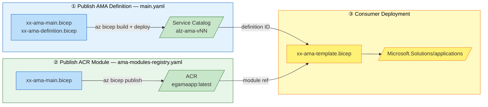
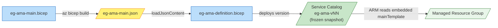
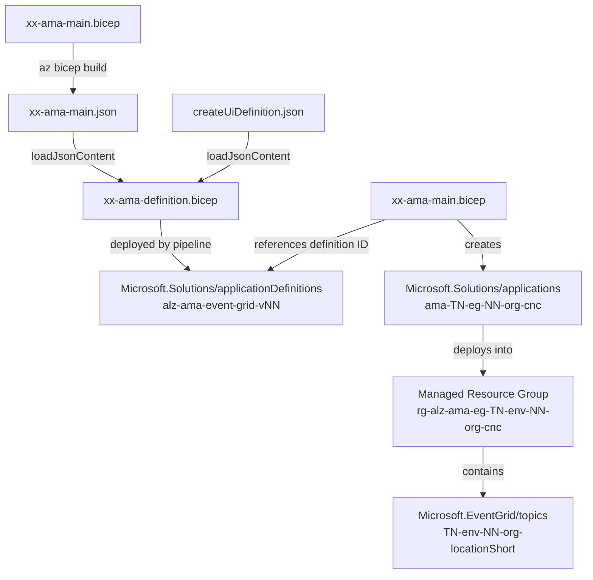
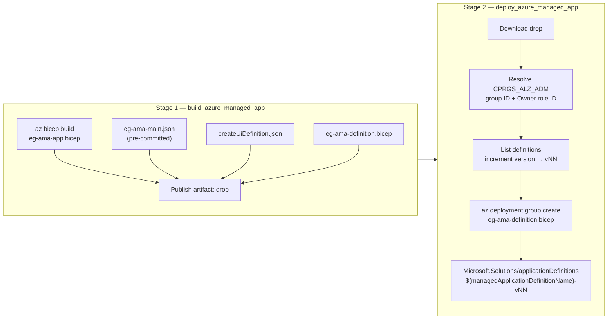
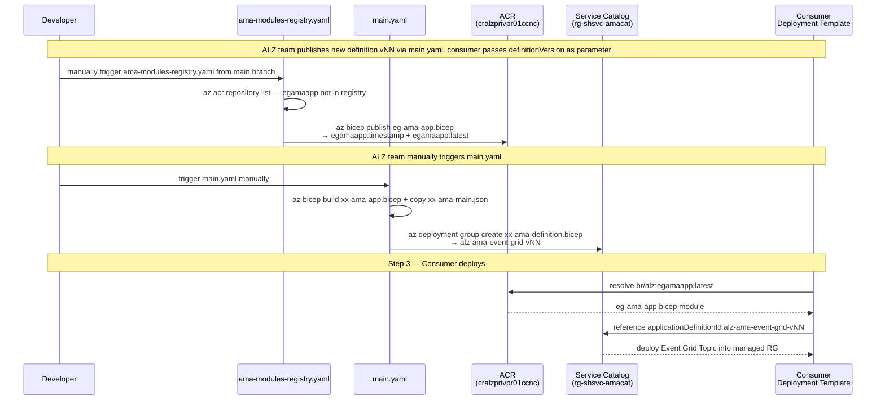
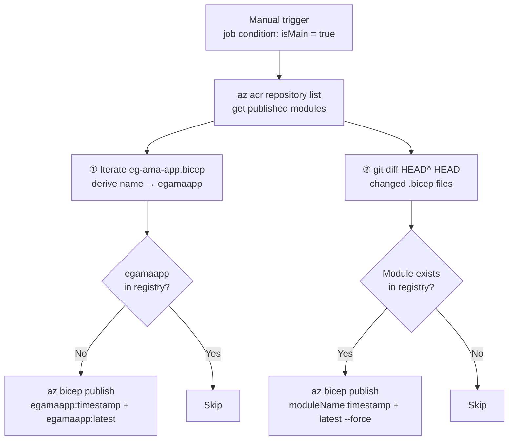
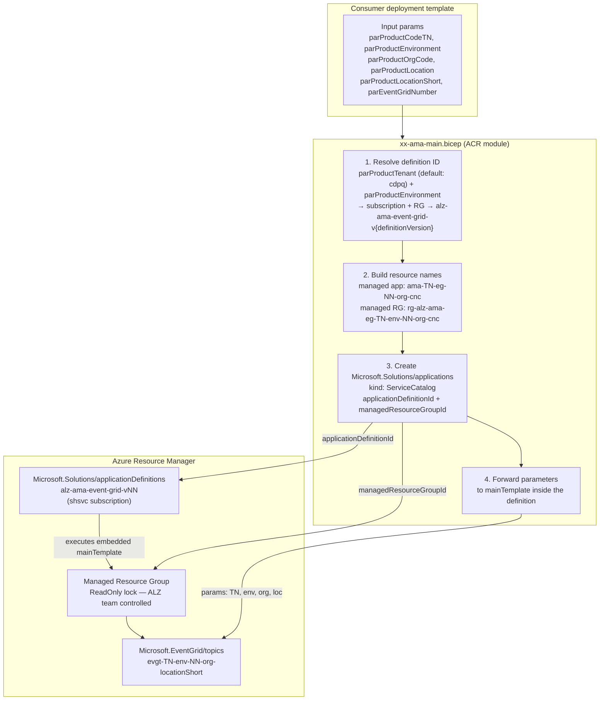
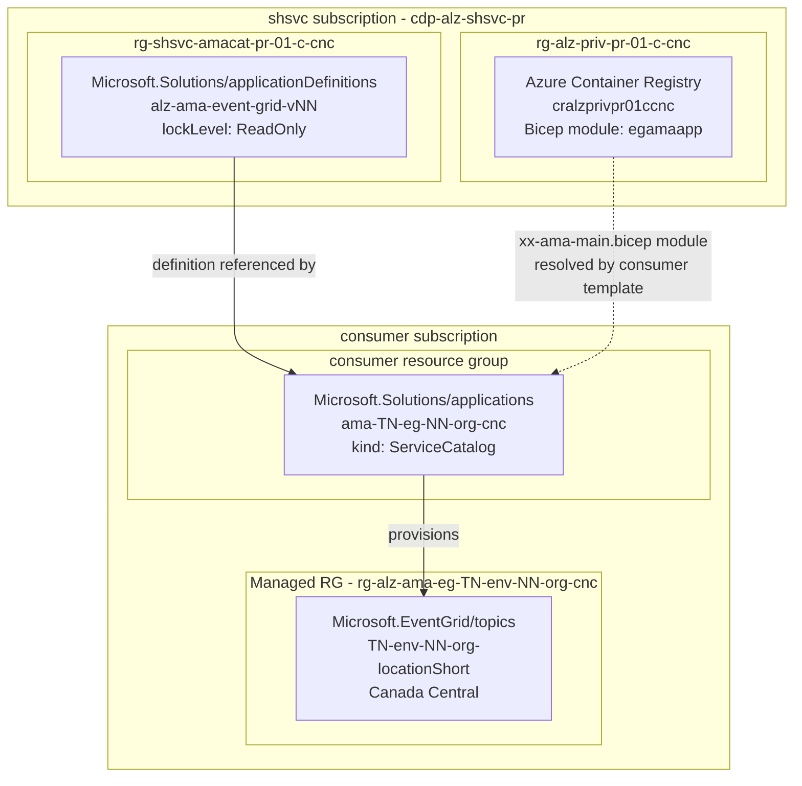

# ALZ AMA Event Grid

Azure Managed Application (AMA) that provisions an **Azure Event Grid Topic** into a consumer subscription, managed and published by the ALZ shared services team.

---

## Overview



> Both **Step ①** (`main.yaml`) and **Step ②** (`ama-modules-registry.yaml`) are triggered **manually**. Step ① must complete before Step ③.

### How the deployment is triggered

**Artifact 1 — Definition** *(governs what gets deployed in the managed resource group)*



**Artifact 2 — Module** *(how the consumer triggers the deployment)*

```mermaid
flowchart LR
    SRC["eg-ama-main.bicep"] -->|publish to ACR| ACR[/"ACR\negamamain:latest"/]
    ACR -->|br/alz:egamaapp:latest| TMPL["eg-ama-template.bicep\n(consumer)"]
    TMPL -->|creates resource with\napplicationDefinitionId| APP["Microsoft.Solutions/applications"]
    APP -->|points to| CAT[/"Service Catalog\neg-ama-vNN"/]

    style SRC fill:#BBDEFB,stroke:#1565C0
    style ACR fill:#C8E6C9,stroke:#2E7D32
    style TMPL fill:#FFF176,stroke:#F57F17
    style APP fill:#FFE0B2,stroke:#E65100
    style CAT fill:#C8E6C9,stroke:#2E7D32
```



> When `eg-ama-main.bicep` changes, both artifacts must be updated: run `az bicep build` and create a new definition version (`main.yaml`), then republish the module to ACR (`ama-modules-registry.yaml`). They are separate pipeline runs kept in sync manually.
>
> **Why both?** `eg-ama-main.bicep` is the single source of truth, but it feeds two independent copies. The definition embeds the compiled JSON as a frozen snapshot at creation time — it does not reference the file dynamically, so a new definition version must be created to pick up any change. The ACR module is a separate publish; updating the definition does not touch ACR, and updating ACR does not touch the definition. Each copy serves a different purpose and lives in a different Azure plane, so neither update cascades to the other automatically.
>
> **Why separate pipelines?** The two artifacts serve different Azure planes. The definition version is deployed into the Service Catalog (a control-plane operation requiring elevated permissions, versioned and immutable once created). The ACR module is a registry publish (a data-plane operation, always tagged `:latest`). They have different triggers, different credentials, and different rollout strategies — so they cannot share a single pipeline step.

---

## Design

### Why there are two separate Bicep files — and two separate deployments

`xx-ama-app.bicep` and `xx-ama-main.bicep` look like they could be the same file, but they serve completely different purposes at different layers:

| | `xx-ama-app.bicep` (inner template) | `xx-ama-main.bicep` (ACR module) |
|---|---|---|
| **Deploys** | `Microsoft.EventGrid/topics` | `Microsoft.Solutions/applications` |
| **Target scope** | Managed resource group (ALZ-controlled) | Consumer's resource group |
| **Target subscription** | shsvc subscription | Consumer's subscription |
| **Run by** | Azure Resource Manager (via AMA definition) | Consumer's Bicep deployment |
| **Published to** | Service Catalog (embedded as JSON) | ACR (`egamaapp:latest`) |
| **Consumer touches it?** | Never — it's hidden inside the definition | Yes — it's the public interface |

When a consumer deploys, two sequential deployments happen:

```
Consumer runs xx-ama-main.bicep (ACR module)
  └─► creates Microsoft.Solutions/applications in consumer RG
         └─► ARM reads mainTemplate (xx-ama-main.json) from Service Catalog definition
                └─► deploys Microsoft.EventGrid/topics in managed RG (ReadOnly lock)
```

They cannot be combined into one file because they target different subscriptions, different scopes, and serve different principals — the consumer controls the first; the ALZ team controls the second.

### Separation of concerns between ALZ team and consumers

The ALZ team owns and controls what gets deployed (the Event Grid topic config, naming, locks) — that's the definition. Consumers only need to say *"I want one of those"* by referencing the module. The module is the public API; the definition is the internal implementation. Consumers never touch ARM templates or Service Catalog directly.

### Independent versioning and update paths

- The **definition** (`main.yaml`) is versioned (`v01`, `v02`...) and immutable once published. Consumers can pin to a specific version. When the ALZ team changes the inner template, they publish a new version without breaking existing consumers.
- The **ACR module** (`ama-modules-registry.yaml`) is updated independently. If only the module's parameter interface changes (not the AMA itself), only that pipeline needs to run. `latest` always points to the newest module, so consumers pick it up automatically.

### Why not one pipeline?

If everything were bundled together, any change — whether to the inner template, the module interface, or the definition — would force a full republish of everything. The split means:

| Change | Pipeline to run |
|---|---|
| `xx-ama-app.bicep` (inner template) | `main.yaml` only |
| `xx-ama-main.bicep` (module interface) | `ama-modules-registry.yaml` only |
| Consumer updates | None — they always reference `latest` |

The ACR module hides all AMA plumbing (cross-subscription resource IDs, naming conventions, managed RG wiring) so consumers write ~10 lines of Bicep instead of 50.

---

## Repository structure

> **Naming note:** `xx-ama-app.bicep` and `xx-ama-main.bicep` sound related but operate at completely different layers. `xx-ama-app.bicep` is the *inner template* — it deploys the Event Grid topic inside the managed resource group and is compiled to JSON, then embedded in the AMA definition. `xx-ama-main.bicep` is the *consumer-facing ACR module* — it deploys the AMA shell (`Microsoft.Solutions/applications`) in the consumer's subscription, which triggers ARM to execute the embedded inner template. They cannot be the same file because they target different scopes, subscriptions, and resource types.

```
fichiers-bicep/event-grid/
  xx-ama-app.bicep          # INNER TEMPLATE: deploys Microsoft.EventGrid/topics inside the managed RG;
                            #   compiled to xx-ama-main.json and embedded in the AMA definition
  xx-ama-main.json          # Compiled ARM JSON of xx-ama-app.bicep; embedded in the definition via loadJsonContent
  xx-ama-definition.bicep   # Publishes the AMA definition (wraps xx-ama-main.json) to the Service Catalog
  xx-ama-main.bicep         # ACR MODULE: deploys Microsoft.Solutions/applications in the consumer subscription;
                            #   published to ACR as bicep/lzmodules/egamaapp:latest
  createUiDefinition.json   # Portal UI definition (deployment via portal disabled)
  xx-ama-template.bicep     # Consumer deployment template (references ACR module)

pipelines/
  main.yaml                 # CI/CD: build & publish AMA definition
  ama-modules-registry.yaml # Publishes Bicep modules to ACR
  variables/
    cdpq-pr.yaml            # Production deployment variables (rgname, shsvcsub, location, etc.)
```

---

## File dependencies



---

## CI/CD pipeline — `main.yaml`

This pipeline **publishes a new versioned AMA definition to the Azure Service Catalog**. It is triggered manually (`trigger: none`) and must be run whenever `eg-ama-app.bicep` or `createUiDefinition.json` changes.

**Stage 1 — `build_azure_managed_app`:**

- Runs `az bicep build --file ./eg-ama-app.bicep` — the compiled output goes to the staging directory (but this is **not** what the definition embeds; see below).
- Copies the **pre-committed** `eg-ama-main.json` to the staging directory — this is the JSON that `eg-ama-definition.bicep` embeds via `loadJsonContent('./eg-ama-main.json')`. The two files must be kept in sync manually: whenever `eg-ama-app.bicep` changes, `az bicep build` must be re-run locally and the resulting `eg-ama-main.json` committed before this pipeline runs.
- Copies `createUiDefinition.json` and `eg-ama-definition.bicep` to the staging directory.
- Publishes everything as the `drop` artifact.

**Stage 2 — `deploy_azure_managed_app`:**

- Downloads the `drop` artifact and sets the subscription to `$(shsvcsub)`.
- Resolves the AAD object ID of `CPRGS_ALZ_ADM` and the Owner role definition ID — these are passed to the definition so the ALZ admin group gets Owner on every managed resource group created from this definition.
- Lists existing definitions in `$(rgname)`, finds the one matching `$(managedApplicationDefinitionName)`, extracts the highest version suffix, and increments it (e.g. `01` → `02`). Old definitions are never overwritten — consumers can pin to a specific version.
- Runs `az deployment group create` with `eg-ama-definition.bicep`, which creates a new `Microsoft.Solutions/applicationDefinitions` named `$(managedApplicationDefinitionName)-vNN` in `$(rgname)`.



> **Important:** `eg-ama-main.json` in the repo must already reflect the current `eg-ama-app.bicep` before this pipeline runs. The `az bicep build` step in Stage 1 produces a compiled file for validation but the definition embeds the committed JSON via `loadJsonContent` at Bicep compilation time — if they are out of sync, the deployed definition will contain stale logic.

---

## How the two pipelines work together

The two pipelines are **coordinated, not independent**. When the ALZ team updates the inner template, `xx-ama-app.bicep` (and optionally `xx-ama-main.bicep` if its interface changes) are updated in the **same commit** and merged to `main`. The `definitionVersion` is **not hardcoded** in the module — it is a parameter (default `'01'`) passed by the consumer or injected by the pipeline via `bicepparam`.

- **`ama-modules-registry.yaml`** is triggered **manually**. It runs two passes: first it publishes `eg-ama-app.bicep` if `egamaapp` is not yet in the registry; then it uses `git diff` to detect any other changed `.bicep` files and republishes existing registry modules with `--force`. Note: a CI trigger on `develop` exists in the pipeline definition but is effectively a no-op — the job condition requires the source branch to be `main`, so the job is always skipped on `develop` pushes.
- **`main.yaml`** is triggered **manually** by the ALZ team. It publishes the new versioned `applicationDefinitions` entry (`alz-ama-event-grid-vNN`) to the Service Catalog.

`main.yaml` must complete before consumers deploy — the definition must exist in the Service Catalog before ARM can resolve the `applicationDefinitionId`. The ACR module just needs to be in the registry before the consumer pipeline runs.

The ACR module (`ama-modules-registry.yaml`) is how consumers **trigger** the AMA deployment; the Service Catalog definition (`main.yaml`) is what **executes** when they do.



---

## CI/CD pipeline — `ama-modules-registry.yaml`

This pipeline is **required for AMA consumers to deploy**. Consumer deployment templates reference `xx-ama-main.bicep` via the ACR alias:

```bicep
module amaApplication 'br/alz:egamaapp:latest' = { ... }
```

The `bicepconfig.json` alias `alz` resolves this to `#{arcName}#.azurecr.io/bicep/lzmodules` at pipeline runtime — the registry name is injected via the `#{arcName}#` pipeline variable. Without this pipeline having published the module first, the consumer deployment would fail to resolve the reference.

**Why the module is required:**

Without the ACR module, a consumer's Bicep deployment fails at **compilation time**, before any Azure resource is touched. When a consumer runs their deployment template, the Bicep CLI resolves `br/alz:egamaapp:latest` and pulls the module from the ACR to compile it locally. If the module does not exist in the registry, `az deployment group create` errors immediately with a module resolution failure — it never reaches Azure Resource Manager.

The ACR module is also the **interface contract** between the ALZ team and consumers:

- Consumers get a stable, versioned reference (`latest` or a specific timestamp tag) they can pin to.
- The ALZ team can update the module without consumers changing their code — they pick up the new version automatically via `latest`.
- The parameters exposed by `xx-ama-main.bicep` define exactly what the consumer must provide — the ACR module **is the public API** of this AMA.

- Triggered **manually**. A CI path trigger on `xx-ama-app.bicep` / `develop` branch exists but is a no-op — the job condition `eq(variables.isMain, 'true')` means the publish job never runs from that automatic trigger since `develop` pushes never satisfy `isMain`.
- Ensures the resource group and ACR (`cralzprivpr01ccnc`) exist before publishing.
- **New modules:** publishes `eg-ama-app.bicep` if the derived module name (`egamaapp`) does not yet exist in the registry, tagged with a timestamp version and `latest`.
- **Updated modules:** detects `.bicep` files changed in the last commit via `git diff`; if the module already exists in the registry, publishes a new versioned tag and overwrites `latest` (with `--force`). This is how updates to `eg-ama-app.bicep` are propagated to consumers.



---

## How `xx-ama-main.bicep` works as an AMA module

The module is a **convenience wrapper** that hides all AMA-specific complexity from consumers.

**1. Resolves the definition ID automatically**
The consumer only expresses intent — *"version 01, tenant cdpq, environment pr"* — by passing `parProductTenant`, `parProductEnvironment`, `parProductOrgCode`, and `definitionVersion`. The module translates those into a full cross-subscription resource ID internally: it picks the correct subscription (`d737e24c...` for `cdpq`, otherwise environment-dependent) and the correct Service Catalog resource group (`rg-shsvc-amacat-pr-01-{org}-cnc` for `cdpq`, or `rg-alz-service-catalog-apps-pr-01-c-cnc` otherwise). That resource ID is set as `applicationDefinitionId` on the ARM resource — ARM then resolves it at deploy time and executes the embedded `mainTemplate`. The consumer is completely isolated from where the definition lives.

> **How the link to the definition actually works — there is no call.**
>
> The module computes a resource ID string at compile time:
>
> ```bicep
> var appServiceCatalogId = resourceId(
>   shsvcSubscriptionId,
>   'rg-shsvc-amacat-pr-01-${parProductOrgCode}-cnc',
>   'Microsoft.Solutions/applicationDefinitions',
>   'alz-ama-event-grid-v${definitionVersion}'
> )
> ```
>
> That string is set as the `applicationDefinitionId` property on the `Microsoft.Solutions/applications` resource:
>
> ```bicep
> properties: {
>   applicationDefinitionId: appServiceCatalogId
>   managedResourceGroupId: mrgId
>   parameters: { ... }
> }
> ```
>
> The module has **zero runtime coupling** to the definition — it only produces a correctly-formatted resource ID string. When `az deployment group create` submits the resource to ARM, ARM resolves `applicationDefinitionId`, reads the embedded `mainTemplate` from the Service Catalog definition, and deploys it. If the definition does not exist at that moment, ARM fails with "resource not found".

**2. Builds naming-convention-compliant resource names**
The managed resource group (`rg-alz-ama-eg-{TN}-{env}-{NN}-{org}-cnc`) and managed app name (`ama-{TN}-eg-{NN}-{org}-cnc`) are derived from parameters. The consumer cannot accidentally use a non-compliant name.

**3. Creates the `Microsoft.Solutions/applications` resource**
This is the actual AMA instance. Azure reads the `mainTemplate` embedded inside the referenced definition and deploys it into the managed resource group. The resources inside that group are locked (`ReadOnly`) and controlled by the ALZ team — the consumer owns the application but cannot modify the resources inside it.

**4. Forwards parameters to the managed deployment**
The following are passed through to the definition's `mainTemplate`: `parProductCodeTN`, `parProductEnvironment`, `parProductOrgCode`, `parProductLocation`, `parProductTenant` (default `cdpq`). Note: `parEventGridNumber` is received by the module and used for naming the managed app and managed RG, but is **not** forwarded to the definition — the inner template (`xx-ama-app.bicep`) uses its own defaults for those. `parProductLocationShort` is **not** a parameter of this module; the location short (`cnc`) is hardcoded in the module's naming variables.

From the consumer's perspective, deploying an Event Grid AMA is simply:

```bicep
param parProductCodeTN      string = 'vso'
param parProductEnvironment string = 'dv'
param parProductOrgCode     string = 'c'
param parProductLocation    string = 'canadacentral'
param parEventGridNumber    string = '01'

module amaApplication 'br/alz:egamaapp:latest' = {
  name: 'amaApplication'
  params: {
    parProductOrgCode:     parProductOrgCode
    parProductLocation:    parProductLocation
    parProductCodeTN:      parProductCodeTN
    parEventGridNumber:    parEventGridNumber
    parProductEnvironment: parProductEnvironment
  }
}
```

> `parProductTenant` and `definitionVersion` are **optional** — the module uses its own defaults (`cdpq` and `01`) when not provided. `parProductLocationShort` is **not** a parameter of `xx-ama-main.bicep`. The consumer only provides the deployment-specific parameters.

All cross-subscription lookups, naming conventions, and AMA plumbing are encapsulated inside the module.

The matching `xx-ama-template.bicepparam` supplies pipeline-injected values at deploy time:

```bicep
using 'xx-ama-template.bicep'

param parProductCodeTN      = '#{parProductCodeTN}#'
param parProductEnvironment = '#{parProductEnvironment}#'
param parProductOrgCode     = '#{parProductOrgCode}#'
param parProductLocation    = '#{location}#'
param parEventGridNumber    = '#{parEventGridNumber}#'
```

The `#{...}#` tokens are replaced by the Azure DevOps pipeline variable substitution task before deployment.



---

## Deployed solution



---

## Naming conventions

| Token | Meaning | Example |
|---|---|---|
| `TN` | Application/affaire code | `vso`, `evgt` |
| `env` | Environment | `dv`, `pr` |
| `NN` | Event Grid instance number | `01` |
| `org` | Organisation code | `c` (CDPQ) |
| `locationShort` | Location short code | `cnc` (Canada Central) |

Topic name pattern: `{TN}-{env}-{NN}-{org}-{locationShort}`

---

## Webhook / event subscription

Event subscription configuration (webhook endpoint, authorization header) is **not managed by this AMA**. It is provisioned separately by the consuming team after the topic is deployed.
