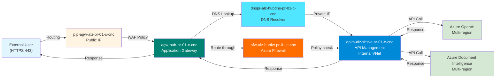

# Azure Services - Resiliency & Availability Matrix

## Overview

This document outlines the resiliency levels and availability characteristics of all Azure services deployed in the Azure Landing Zone (ALZ) infrastructure. Services are deployed across **Canada Central** (primary) and **Canada East** (secondary) regions.

---

## Services Resiliency Status

| Service | Resiliency Level | Availability SLA | Zone Redundancy | Notes |
|---------|-----------------|------------------|-----------------|-------|
| **Azure OpenAI** | High | 99.95% | Multi-region capable | Deployed behind APIM; regional failover via API Management |
| **Azure Document Intelligence** | High | 99.95% | Multi-region capable | Deployed behind APIM; regional failover via API Management |
| **Azure API Management (APIM)** | High | 99.95% (Premium) | Premium SKU supports Zone-redundant | Production: Premium SKU; Non-prod: Developer SKU |
| **Application Gateway** | High | 99.95% | Zone-redundant capable | WAF enabled; routes traffic through Azure Firewall |
| **Azure Firewall** | High | 99.95% | Zone-redundant | Network perimeter security; forced tunneling |
| **Azure Key Vault** | High | 99.99% | Zone-redundant (Premium) | Certificate & secret management; soft-delete enabled |
| **Log Analytics Workspace** | High | 99.9% | Geo-redundant | Central monitoring for all resources |
| **Azure DNS Private Resolver** | High | 99.99% | Multiple endpoints | Inbound & outbound endpoints in separate subnets |
| **Virtual Network (Hub-Spoke)** | High | 99.95% | Multi-subnet architecture | Hub-spoke topology with forced routing through firewall |
| **VPN Gateway** | High | 99.95% | Active-active capable | On-premises connectivity; local network gateway configured |
| **Managed Identity** | High | 99.99% | Built-in redundancy | System-assigned per resource; no additional config needed |

---

## Regional Configuration

### Primary Region: Canada Central (cnc)

- Hub subscription: `cdp-alz-hub-pr-01-c-cnc`
- Shared services subscription: `cdp-alz-shsvc-pr-01-c-cnc`
- **Resources**: All core infrastructure deployed here
- **Availability**: Multiple availability zones (3 zones available)

### Secondary Region: Canada East (cne)

- Used for disaster recovery and geographic redundancy
- Can be activated for workload failover
- DNS resolution via Private DNS Zones

---

## Component-Level Resiliency Details

### API Management (APIM)

- **SKU (Production)**: Premium
  - SLA: 99.95%
  - Zone redundancy: Supported via Premium SKU
  - Multiple instances across availability zones
- **SKU (Non-Production)**: Developer
  - SLA: 99.9%
  - Single-instance deployment
- **Capabilities**:
  - JWT validation with policies
  - API key injection & abstraction
  - Policy-based routing to OpenAI & Document Intelligence
  - Custom domain: `apim-alz-shsvc-pr-01-c-cnc.cdpq.cloud`

### Azure Firewall

- **Configuration**: Azure Firewall with policy (`afwp-afw-alz-hubfw-pr-01-c-cnc`)
- **Resiliency**: Zone-redundant in production
- **Capabilities**:
  - DNAT rules for traffic routing
  - Network & application filtering
  - Threat intelligence integration
  - Forced tunneling for spoke traffic

### Application Gateway

- **Configuration**: Multi-region capable
- **WAF Policy**: `waf-agw-alz-pr-01-c-cnc` (OWASP 3.2)
- **Public IP**: `pip-agw-alz-pr-01-c-cnc`
- **Managed Identity**: Separate identity for Key Vault access
- **Health Probes**: Backend pool health monitoring enabled
- **Resiliency**: Zone-redundant deployment supported

### Key Vault

- **Resiliency**: 99.99% SLA
- **Capabilities**:
  - Soft-delete enabled (90-day recovery window)
  - Purge protection available
  - Zone-redundant backup
  - RBAC for access control
- **Usage**: Stores certificates for APIM, WAF, and Application Gateway

### Azure DNS Private Resolver

- **Endpoints**: Multiple inbound/outbound endpoints
  - Inbound Endpoint 01: `snet-alz-dnspr-ie-pr-01-cnc` (10.225.2.128/28)
  - Outbound Endpoint 01: `snet-alz-dnspr-oe-pr-01-cnc` (10.225.2.144/28)
  - Inbound Endpoint 02: `snet-alz-dnspr-ie-pr-02-cnc` (10.225.2.160/28)
  - Outbound Endpoint 02: `snet-alz-dnspr-oe-pr-02-cnc` (10.225.2.176/28)
- **Private DNS Zones**:
  - `privatelink.openai.azure.com` - OpenAI private endpoints
  - `privatelink.vaultcore.azure.net` - Key Vault private endpoints
  - `privatelink.azure-api.net` - APIM private endpoints
  - `cdpq.cloud` / `cdpqdev.com` - Custom domains

### Log Analytics Workspace

- **Resiliency**: 99.9% SLA
- **Data Retention**: Configurable (default 30 days)
- **Geo-redundant**: Data replicated across paired regions
- **Capabilities**:
  - Central logging from all resources
  - Query logs with Kusto Query Language (KQL)
  - Alerts based on log patterns
  - Diagnostic settings configured

### Virtual Network (Hub-Spoke)

- **Hub VNet**: `vnet-cdp-alz-hub-pr-01` (10.225.0.0/21 for Canada Central)
- **Subnets**:
  - AzureFirewallSubnet: 10.225.2.0/26
  - GatewaySubnet: 10.225.2.64/27
  - DNS Resolver subnets: Multiple /28 subnets
  - Application Gateway subnet: 10.225.3.0/24
- **Spoke VNets**: Allocated /24 networks via IPAM
  - cdpqdev pool: /27 allocation
  - cdpq-dv pool: /25 allocation
  - cdpq-pr pool: /24 allocation

### VPN Gateway

- **Configuration**: Active-active capable
- **Type**: Route-based VPN
- **Resiliency**: Zone-redundant deployment available
- **Local Network Gateway**: `lgw-alz-riopel-pr-01-c-cnc` for on-premises connectivity

---

## Traffic Flow & Failover

---

## High Availability Patterns Implemented

### 1. **Multi-Tier Load Balancing**

- Application Gateway distributes traffic to APIM
- APIM distributes API calls to backend services

### 2. **Network Redundancy**

- Hub-spoke topology with forced tunneling through Azure Firewall
- Multiple DNS resolver endpoints for failover
- VPN Gateway for on-premises redundancy

### 3. **Data Protection**

- Key Vault with soft-delete and purge protection
- Log Analytics geo-redundant backup
- Resource-level RBAC with managed identities

### 4. **Security & Monitoring**

- WAF policies on Application Gateway
- Firewall policies with threat intelligence
- Centralized monitoring via Log Analytics
- JWT validation at APIM level

---

## Disaster Recovery Considerations

### RTO (Recovery Time Objective)

- **APIM Premium**: ~15-30 minutes (zone failover)
- **Azure Firewall**: ~10-15 minutes (zone failover)
- **Application Gateway**: ~10-15 minutes (zone failover)
- **Key Vault**: ~1-5 minutes (soft-delete recovery)

### RPO (Recovery Point Objective)

- **APIM**: Near-zero (state synchronization across zones)
- **Firewall policies**: Near-zero (policy-driven)
- **Log Analytics**: 1-5 minutes (geo-redundant replication)
- **Key Vault**: Real-time (soft-delete + backup)

---

## Recommendations for Enhanced Resiliency

| Item | Current | Recommendation |
|------|---------|-----------------|
| **Zone Redundancy** | Production Premium resources support it | Verify zone-redundant configuration in Bicep |
| **Regional Failover** | Single-region active deployment | Configure Canada East as active-passive or active-active |
| **APIM Geo-Distribution** | APIM in shared services subscription | Consider premium tier for multi-region deployment |
| **Database Replication** | N/A (stateless services) | Monitor state in Key Vault & Log Analytics |
| **Backup Strategy** | Key Vault soft-delete enabled | Document backup schedules and retention policies |
| **Health Checks** | Application Gateway health probes | Extend monitoring to backend AI services |
| **Circuit Breakers** | APIM policies (rate limiting) | Implement exponential backoff in client applications |

---

## Service Level Agreements (SLAs)

| Service | SLA | Multi-Zone Support | Premium/Standard |
|---------|-----|-------------------|------------------|
| Azure OpenAI | 99.95% | Yes (tenant-managed) | Standard |
| Azure Document Intelligence | 99.95% | Yes (tenant-managed) | Standard |
| APIM | 99.95% | Yes (Premium) | Premium SKU in prod |
| Application Gateway | 99.95% | Yes | Standard v2 / WAF v2 |
| Azure Firewall | 99.95% | Yes | Standard |
| Key Vault | 99.99% | Yes (Premium) | Premium tier |
| Log Analytics | 99.9% | Yes (geo-redundant) | Standard |
| DNS Resolver | 99.99% | Yes (multiple endpoints) | Standard |
| VPN Gateway | 99.95% | Yes (active-active) | VpnGw3+ tier |

---

## Monitoring & Alerting

### Key Metrics to Monitor

- APIM request latency and error rates
- Application Gateway backend health
- Azure Firewall rule hits and policy violations
- Key Vault access attempts and failures
- Log Analytics ingestion rate and query performance
- VPN Gateway connection status

### Alerting Strategy

- Configure alerts in Log Analytics for anomalies
- Set up budget alerts for overspend
- Monitor APIM policies for rate-limiting triggers
- Track firewall rule changes for compliance

---

## Related Documentation

- [readme_hub.md](readme_hub.md) - Infrastructure architecture & components
- [readme_ai.md](readme_ai.md) - AI services integration details
- [readme_ama.md](readme_ama.md) - Managed application deployment
- [readme_vending.md](readme_vending.md) - Subscription provisioning & multi-tenant setup
