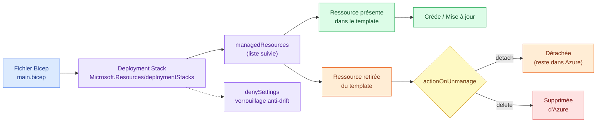
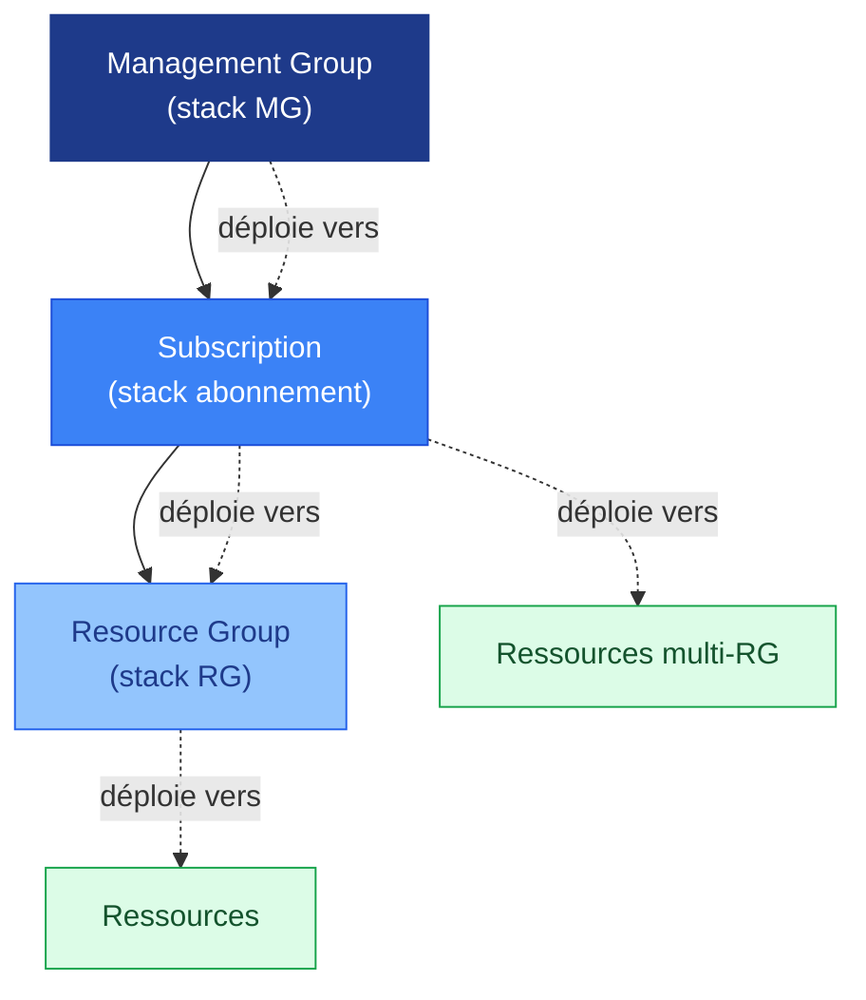
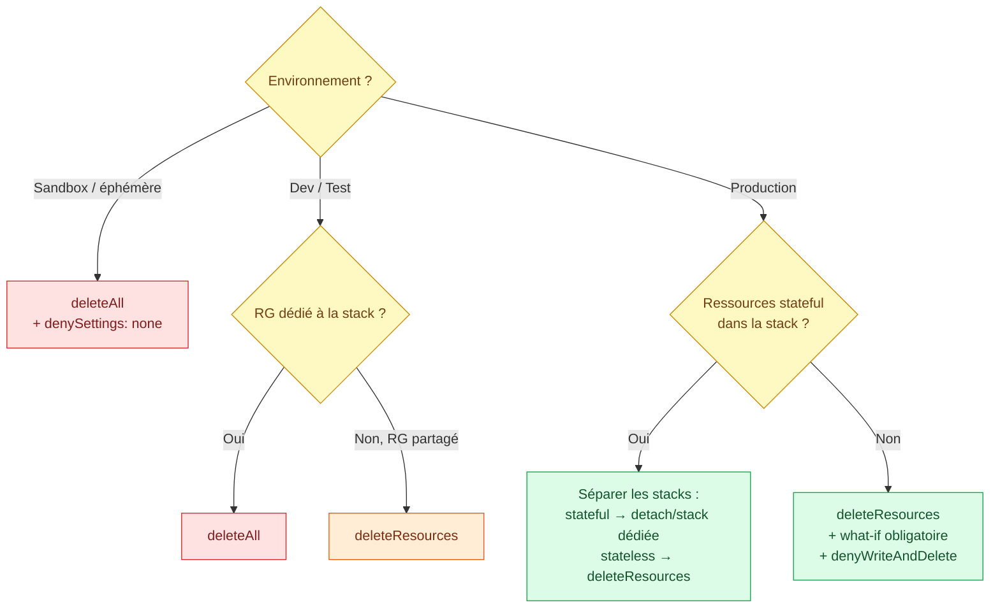
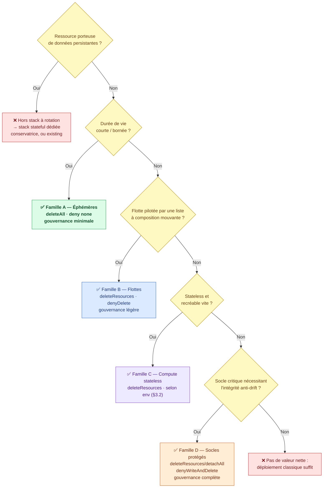
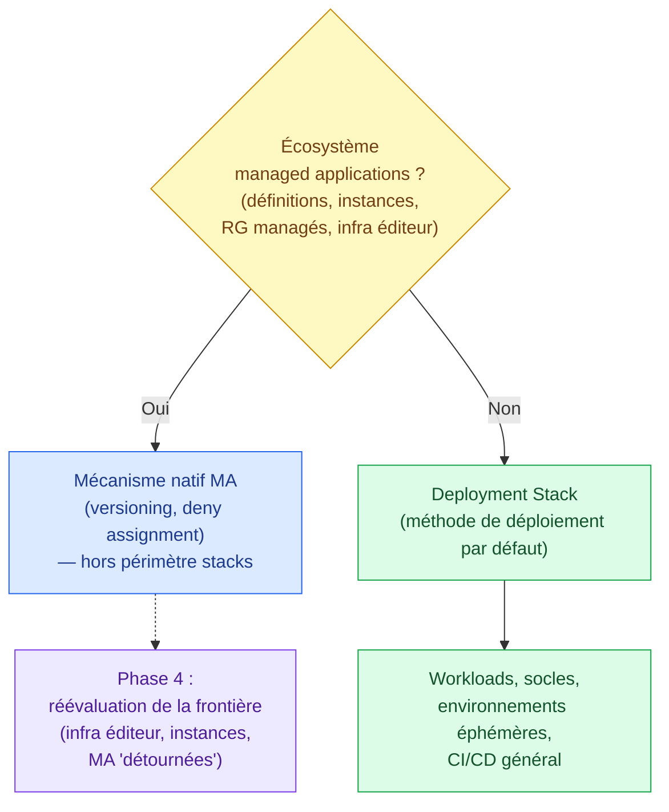
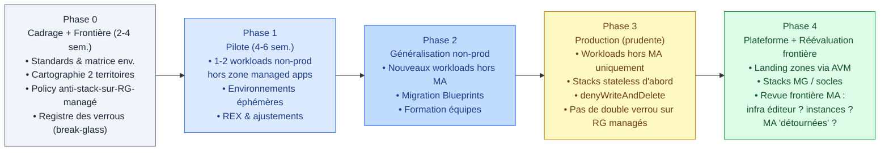
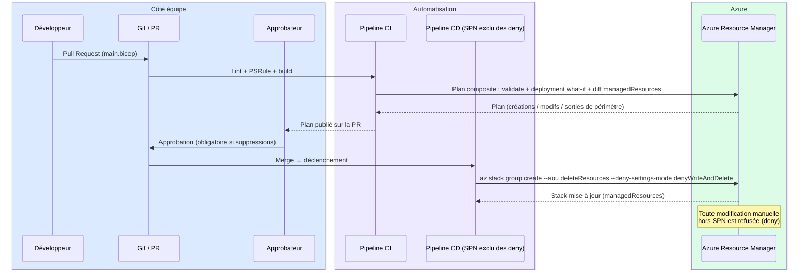
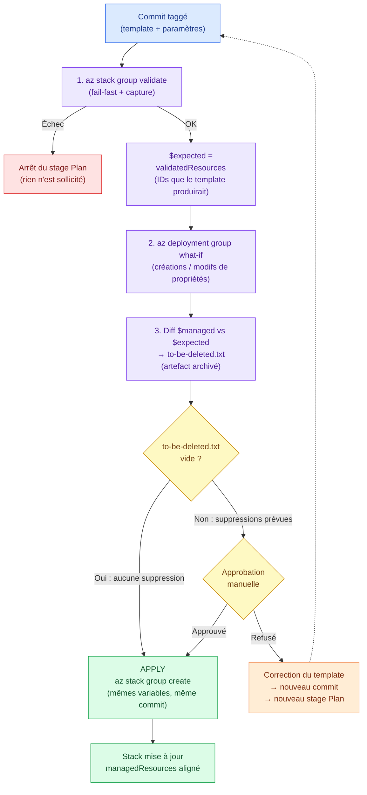
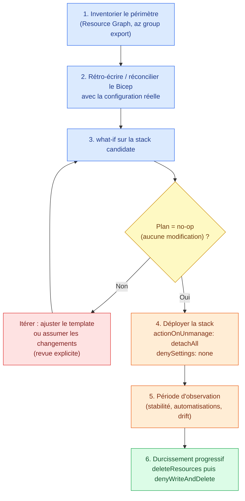

# Étude d'adoption — Azure Bicep Deployment Stacks

**Auteur :** Architecture Cloud Azure
**Date :** Juin 2026
**Statut :** Étude d'évaluation pour adoption
**Audience :** CCoE / Équipe Plateforme, Architectes, Lead DevOps, Sécurité, FinOps

---

## Table des matières

1. [Présentation du composant](#1-présentation-du-composant)
   - 1.1 [Limites des modes de déploiement historiques](#11-limites-des-modes-de-déploiement-historiques)
2. [Fonctionnement à haut niveau](#2-fonctionnement-à-haut-niveau)
   - 2.1 [Scopes de création](#21-scopes-de-création)
   - 2.2 [Paramètres structurants](#22-paramètres-structurants)
   - 2.3 [Sans état externe à opérer](#23-sans-état-externe-à-opérer)
3. [Recommandations fonctionnelles](#3-recommandations-fonctionnelles)
   - 3.1 [Choix d'actionOnUnmanage — arbre de décision](#31-choix-dactiononunmanage--arbre-de-décision)
   - 3.2 [Matrice de standards par environnement](#32-matrice-de-standards-par-environnement)
   - 3.3 [Règles fonctionnelles complémentaires](#33-règles-fonctionnelles-complémentaires)
   - 3.4 [Ressources éligibles : critères et familles de candidats](#34-ressources-éligibles--critères-et-familles-de-candidats)
4. [Gouvernance et structure](#4-gouvernance-et-structure)
   - 4.1 [Principes directeurs](#41-principes-directeurs)
   - 4.2 [Structure et découpage des stacks](#42-structure-et-découpage-des-stacks)
   - 4.3 [Convention de nommage et tags](#43-convention-de-nommage-et-tags)
   - 4.4 [Rôles et responsabilités (RACI)](#44-rôles-et-responsabilités-raci)
   - 4.5 [Contrôles de gouvernance continus](#45-contrôles-de-gouvernance-continus)
5. [Sécurité](#5-sécurité)
   - 5.1 [Deny settings : une protection au-dessus du RBAC](#51-deny-settings--une-protection-au-dessus-du-rbac)
   - 5.2 [Procédure break-glass](#52-procédure-break-glass)
   - 5.3 [Intégrité de la chaîne de déploiement](#53-intégrité-de-la-chaîne-de-déploiement)
6. [Exploitation](#6-exploitation)
   - 6.1 [Cycle de vie courant](#61-cycle-de-vie-courant)
   - 6.2 [Gestion de la dérive et des ressources détachées](#62-gestion-de-la-dérive-et-des-ressources-détachées)
   - 6.3 [Limites opérationnelles à connaître](#63-limites-opérationnelles-à-connaître)
7. [Gestion des coûts](#7-gestion-des-coûts)
8. [Modèle de facturation](#8-modèle-de-facturation)
9. [Points d'attention](#9-points-dattention)
   - 9.1 [Mauvais choix d'actionOnUnmanage](#91-mauvais-choix-dactiononunmanage)
   - 9.2 [Périmètre de stack mal découpé](#92-périmètre-de-stack-mal-découpé)
   - 9.3 [Deny settings mal calibrés](#93-deny-settings-mal-calibrés)
   - 9.4 [Confusion détaché ≠ supprimé](#94-confusion-détaché--supprimé)
   - 9.5 [Croire que la stack gère tout le scope](#95-croire-que-la-stack-gère-tout-le-scope)
   - 9.6 [Interactions avec l'existant](#96-interactions-avec-lexistant)
   - 9.7 [Secrets et ressources sensibles](#97-secrets-et-ressources-sensibles)
   - 9.8 [Limites techniques](#98-limites-techniques)
10. [Positionnement recommandé](#10-positionnement-recommandé)
    - 10.1 [Vs déploiement classique et Terraform](#101-vs-déploiement-classique-et-terraform)
    - 10.2 [Vs Azure Managed Applications](#102-vs-azure-managed-applications)
    - 10.3 [Stratégie d'adoption — ciblage : ressources hors Managed Applications](#103-stratégie-dadoption--ciblage--ressources-hors-managed-applications)
    - 10.4 [Recommandations finales](#104-recommandations-finales)
11. [Gestion des opérations](#11-gestion-des-opérations)
    - 11.1 [Déploiement](#111-déploiement) — [flux gouverné](#1111-flux-de-déploiement-gouverné) · [workflow Plan → Apply](#1112-workflow-de-référence-stage-plan--approbation--apply) · [brownfield](#1113-mise-sous-gestion-de-lexistant-brownfield) · [sans pipeline](#1114-utilisation-sans-pipeline-cli--powershell)
    - 11.2 [Surveillance](#112-surveillance)
    - 11.3 [Gestion des accès](#113-gestion-des-accès)
12. [Ressources et services connexes](#12-ressources-et-services-connexes)
13. [Conformité](#13-conformité)

---

## 1. Présentation du composant

Les **Deployment Stacks** (piles de déploiement) sont une ressource Azure native (`Microsoft.Resources/deploymentStacks`), en disponibilité générale depuis mi-2024, qui permet de gérer un **ensemble de ressources Azure comme une unité de cycle de vie unique** à partir d'un fichier Bicep ou ARM.

Elles répondent à deux lacunes historiques de l'IaC sur Azure :

1. **La gestion des suppressions** : en mode incrémental classique, une ressource retirée du template reste orpheline dans Azure. Les stacks introduisent un comportement déclaratif complet (création, mise à jour **et suppression**).
2. **La protection contre la dérive (drift)** : les *deny settings* bloquent les modifications manuelles hors pipeline, y compris pour des comptes disposant de rôles privilégiés.

Elles constituent par ailleurs le **successeur officiel d'Azure Blueprints** (déprécié en juillet 2026) et sont intégrées nativement aux Azure Verified Modules (AVM) pour les Landing Zones.

### 1.1 Limites des modes de déploiement historiques

| Mode | Comportement | Limite |
|---|---|---|
| **Incremental** (défaut) | Ajoute / met à jour, ne supprime jamais | Ressources orphelines, dérive du réel vs. code, coûts fantômes |
| **Complete** | Supprime tout ce qui n'est pas dans le template | Dangereux, limité au scope *resource group*, accidents fréquents |
| **Azure Blueprints** | Packaging de templates + RBAC + policies | Jamais passé en GA, **déprécié au 11 juillet 2026** |

**Recommandation synthétique :** adoption recommandée, de façon **progressive et gouvernée** (cf. §10), en commençant par les environnements hors production et les workloads à périmètre bien délimité, avec une convention de nommage, une stratégie `actionOnUnmanage` et une politique de *deny settings* définies en amont par le CCoE.

---

## 2. Fonctionnement à haut niveau

Une stack est une **ressource Azure à part entière** qui maintient la liste des ressources qu'elle gère (`managedResources`). À chaque déploiement, le moteur compare le template au contenu géré et applique :

- la **création/mise à jour** des ressources présentes ;
- l'action choisie (**détacher** ou **supprimer**) pour les ressources retirées du template ;
- optionnellement des **deny settings** qui verrouillent les ressources gérées contre les modifications manuelles.



### 2.1 Scopes de création

Une stack peut être créée à trois niveaux, et déployer des ressources au même niveau ou en dessous :



> Une stack créée au scope *subscription* peut gérer des ressources réparties dans plusieurs resource groups — un avantage net sur le mode *complete*.

### 2.2 Paramètres structurants

**`actionOnUnmanage`** — définit le sort des éléments qui sortent du périmètre géré :

| Valeur | Ressources | Resource Groups | Management Groups |
|---|---|---|---|
| `detachAll` | Détachées | Détachés | Détachés |
| `deleteResources` | Supprimées | Détachés | Détachés |
| `deleteAll` | Supprimées | Supprimés | Supprimés |

**`denySettingsMode`** — niveau de protection des ressources gérées :

| Valeur | Effet |
|---|---|
| `none` | Aucune protection |
| `denyDelete` | Suppression manuelle bloquée, modification autorisée |
| `denyWriteAndDelete` | Modification **et** suppression manuelles bloquées |

Options associées : `denySettingsExcludedPrincipals` (identités exemptées, ex. SPN du pipeline), `denySettingsExcludedActions` (actions exemptées), `denySettingsApplyToChildScopes` (propagation aux scopes enfants).

### 2.3 Sans état externe à opérer

Contrairement à Terraform, pas de state file à stocker, verrouiller, sauvegarder ni réconcilier : l'état (la liste `managedResources`) est porté par Azure Resource Manager lui-même.

---

## 3. Recommandations fonctionnelles

### 3.1 Choix d'`actionOnUnmanage` — arbre de décision



> 🎨 Code couleur : 🔴 agressif (réservé aux environnements jetables) · 🟠 intermédiaire · 🟢 posture production recommandée · 🟡 point de décision.

### 3.2 Matrice de standards par environnement

| Paramètre | Sandbox | Dev/Test | Pré-prod | Production |
|---|---|---|---|---|
| `actionOnUnmanage` | `deleteAll` | `deleteAll`/`deleteResources` | `deleteResources` | `deleteResources` |
| `denySettingsMode` | `none` | `none`/`denyDelete` | `denyDelete` | `denyWriteAndDelete` |
| Excl. principals | — | équipe dev (option) | pipeline uniquement | pipeline uniquement |
| `what-if` + approbation | Non | Optionnel | Oui | **Obligatoire** |
| Revue ressources détachées | — | Mensuelle | Mensuelle | Hebdomadaire |

### 3.3 Règles fonctionnelles complémentaires

- **Ségrégation stateful / stateless** : les ressources à données (SQL, Storage, Key Vault) vivent dans des stacks dédiées plus conservatrices. Le *soft delete* / *purge protection* ne dispense pas de cette ségrégation.
- **`what-if` avant tout `set`** en environnement protégé, avec approbation humaine sur les plans contenant des suppressions.
- **Dépendances partagées** (VNet hub, Log Analytics central) : référencées via le mot-clé `existing` — elles restent volontairement hors gestion de la stack.
- **Nettoyage d'environnements éphémères** : `az stack sub delete --action-on-unmanage deleteAll` supprime l'intégralité d'un environnement (sandbox, PR environment, démo) en une commande.

### 3.4 Ressources éligibles : critères et familles de candidats

Tout ne mérite pas une stack. L'éligibilité se juge sur cinq discriminants — le cycle de vie court n'est que le premier :

1. **Durée de vie courte ou bornée** (la destruction est l'objectif, pas le risque) ;
2. **Flotte à composition mouvante, pilotée par une liste dans le code** : la *ressource* peut vivre longtemps, mais la *liste* qui la pilote change en permanence (endpoints ajoutés, applications décommissionnées) — c'est le terrain où l'incrémental classique laisse des orphelins silencieux ;
3. **Stateless / recréable rapidement** (le coût d'une suppression erronée tend vers zéro) ;
4. **Périmètre auto-contenu** (RG ou scope dédié, dépendances partagées en `existing` uniquement, propriété d'une seule équipe) ;
5. **Besoin fort d'intégrité anti-drift** (la valeur vient alors des deny settings, même quand rien ne bouge — cas des socles).



#### Famille A — Éphémères (cycle de vie court)

La destruction est l'objectif : la quasi-totalité de la gouvernance lourde devient sans objet (`deleteAll`, deny `none`, pas de plan composite, pas de break-glass, pas de revue de détachées).

| Use case | Valeur | Garde-fous résiduels |
|---|---|---|
| Environnements de PR / feature branch | ⭐⭐⭐ nettoyage garanti au merge, zéro orphelin | 1 stack/PR, delete au merge |
| Tests de charge / performance | ⭐⭐⭐ gros SKUs facturés uniquement pendant le test | delete post-test dans le pipeline |
| Sandboxes / POC avec TTL | ⭐⭐⭐ fin du "cimetière de POC" | *reaper* planifié sur tag `expiresOn` + alerte si dépassement > 48 h |
| Démos / formations | ⭐⭐ N environnements montés/démontés à la demande | template unique, 1 stack/participant |
| Exercices DR / game days | ⭐⭐ environnement d'exercice jetable + preuve de reproductibilité | fenêtre datée |

Garde-fous indispensables de la famille : (a) **discipline `existing`** — une stack en `deleteAll` qui *déclarerait* une ressource partagée au lieu de la référencer la supprimerait à la destruction : c'est le seul scénario catastrophe, neutralisé par un lint/PSRule interdisant certains types de ressources dans les templates éphémères ; (b) tags `owner` + `expiresOn` obligatoires (condition d'existence du reaper).

#### Famille B — Flottes à composition mouvante (cycle long, contenu changeant) ⭐ le meilleur rapport valeur/poids

La ressource individuelle vit longtemps, mais la **liste** qui la pilote change en permanence — chaque retrait de la liste doit se traduire par une suppression réelle :

| Cas | Exemples de ressources |
|---|---|
| **Monitoring as code** (cas de référence) | Availability tests (`Microsoft.Insights/webtests`), metric alerts, scheduled query rules, action groups, workbooks, dashboards, data collection rules |
| **Gouvernance as code** | Policy assignments / exemptions, role assignments (stacks scope MG/subscription) — une exemption retirée du code disparaît réellement |
| **Configuration en listes** | Enregistrements Private DNS, règles de routage, budgets et alertes de coût |

**Pattern de référence — stack d'availability tests** :

```bicep
// La frontière critique : géré vs référencé
resource appInsights 'Microsoft.Insights/components@2020-02-02' existing = {
  name: appInsightsName   // ⬅ EXISTING : cycle long + télémétrie → jamais géré ici
}

param endpoints array     // ⬅ la liste qui pilote tout : un retrait = un nettoyage

resource webTests 'Microsoft.Insights/webtests@2022-06-15' = [for ep in endpoints: {
  name: 'at-${ep.name}'
  location: location
  tags: { 'hidden-link:${appInsights.id}': 'Resource' }
  properties: { /* standard test : url, fréquence, locations... */ }
}]

resource alerts 'Microsoft.Insights/metricAlerts@2018-03-01' = [for (ep, i) in endpoints: {
  name: 'alrt-at-${ep.name}'
  properties: { /* critère webtest ; action group également en existing */ }
}]
```

Retirer une entrée du tableau `endpoints` dans le `.bicepparam` → le test et son alerte disparaissent au déploiement suivant. Risque résiduel trivial : un test supprimé par erreur se redéploie en secondes, sans perte. La gouvernance reste légère : `deleteResources` + `denyDelete`, plan composite simplifié (le diff `to-be-deleted.txt` reste utile mais l'approbation peut être allégée).

#### Famille C — Compute et intégration stateless

Function apps (consumption), container apps sans volume, static web apps, logic apps : recréables, données portées ailleurs. Paramétrage selon la matrice par environnement (§3.2) — c'est la famille qui suit le régime standard du rapport.

#### Famille D — Socles protégés (cycle long, composition stable)

Landing zones (accélérateur AVM), socles réseau/monitoring/identité de la plateforme : ici la valeur ne vient **pas** de la suppression mais de l'**intégrité** — `denyWriteAndDelete` garantit techniquement que le socle correspond au code approuvé. Propriété : équipe plateforme exclusivement, dans des stacks dédiées ; gouvernance complète (§3.2 prod, break-glass §5.2). Un socle *partagé* n'est jamais dans la stack d'une équipe produit — il y est référencé en `existing`.

#### Anti-candidats (en miroir)

| Profil | Exemples | Raison |
|---|---|---|
| Données persistantes | SQL, Storage, Key Vault, App Insights / Log Analytics | Une sortie de template = perte potentielle ; purge protection ne suffit pas |
| Provisioning long / coûteux | VPN / ExpressRoute gateways (~45 min), APIM | La recréation n'est pas une option de récupération réaliste |
| Modifié au runtime hors code | Autoscale, rotations applicatives, ressources pilotées par un opérateur | Conflit de drift permanent avec `denyWriteAndDelete` |
| Propriété partagée floue | VNet hub dans une stack d'équipe produit | Donne à une équipe le pouvoir de supprimer une ressource des autres |
| Déjà géré par un autre contrôleur | RG managés (managed apps §10.3.1), node RG AKS | Conflit de propriété de cycle de vie |

> **Gouvernance proportionnée** : le poids du dispositif (§4, §5, §11) suit la famille, pas l'inverse — minimal pour A, léger pour B, standard pour C, complet pour D. Adopter par la famille A puis B, c'est capturer l'essentiel de la valeur (FinOps + zéro orphelin) en n'activant qu'une fraction du cadre : nommage/tags (§4.3), reaper et alertes (§11.2), discipline `existing`.

---

## 4. Gouvernance et structure

### 4.1 Principes directeurs

1. **Une stack = un périmètre de responsabilité** (un workload, un socle, une landing zone) — jamais "tout l'abonnement" par défaut.
2. **Le pipeline est le seul écrivain** : deny settings actifs en production, identité du pipeline (managed identity / OIDC) seule exclue, **aucune exclusion d'humains** en prod.
3. **`what-if` avant tout `set`** en environnement protégé, avec approbation humaine sur les plans contenant des suppressions.
4. **Ségrégation stateful / stateless** dans des stacks distinctes.
5. **Standardisation outillée** : convention de nommage des stacks, tags obligatoires, paramètres imposés via templates de pipeline réutilisables — pas de `az stack` manuel.

### 4.2 Structure et découpage des stacks

- **Stack monolithique** (toute la subscription) : rayon d'explosion énorme, déploiements lents, équipes qui se bloquent mutuellement — à proscrire.
- **Stacks trop granulaires** (une par ressource) : perte de l'intérêt du cycle de vie groupé, prolifération ingérable.
- **Chevauchement** : une ressource ne peut être gérée que par **une seule stack** ; un découpage flou crée des conflits de propriété. Le découpage se décide *avant* toute mise sous gestion.
- **Documentation du périmètre** : cartographier explicitement, par scope, ce qui est sous gestion stack et ce qui ne l'est pas (cf. §11.2), et tagger les ressources gérées.

### 4.3 Convention de nommage et tags

`stk-<workload>-<composant>-<env>` — ex. `stk-ecom-network-prod`, `stk-lz-platform-hub`.

Tags obligatoires : `owner`, `costCenter`, `criticality`, `managedBy=deploymentStack`, `repo=<url>`.

### 4.4 Rôles et responsabilités (RACI)

| Activité | CCoE / Plateforme | Équipe produit | Sécurité | FinOps |
|---|---|---|---|---|
| Standards stacks (nommage, matrices) | **R/A** | C | C | I |
| Création de stacks (via pipeline) | C | **R** | I | I |
| Gestion des deny settings & exclusions | **A** | R | C | — |
| Revue des plans `what-if` en prod | C | **R/A** | C | — |
| Audit des ressources détachées / orphelines | C | R | I | **R** |
| Procédure break-glass | **A** | C | **R** | — |

### 4.5 Contrôles de gouvernance continus

- **Azure Policy** : auditer l'existence de stacks sans deny settings en prod, tags manquants, `deleteAll` interdit hors sandbox.
- **Templates de pipeline réutilisables** imposant la matrice par environnement (§3.2) — aucune création manuelle.
- **KPI d'adoption** : % de ressources sous gestion stack, nb d'orphelins détectés/mois, nb d'usages break-glass, écarts what-if vs appliqué (détail en §11.2).

---

## 5. Sécurité

### 5.1 Deny settings : une protection au-dessus du RBAC

Les *deny settings* s'appliquent **au-dessus du RBAC** : même un Owner ne peut pas modifier/supprimer une ressource verrouillée (hors exclusions). C'est un mécanisme que ni les locks classiques ni Azure Policy ne couvrent aussi finement pour la protection anti-drift.

Points de calibrage critiques :

- **Exclure l'identité du pipeline** (`denySettingsExcludedPrincipals`) — sinon le pipeline se verrouille lui-même. Retour terrain récurrent : des deny settings trop restrictifs peuvent faire perdre à **l'identité de déploiement d'origine elle-même** la capacité de gérer la stack ; valider les exclusions (SPN et comptes d'administration de secours) *avant* le premier déploiement protégé.
- `denyWriteAndDelete` sur des ressources nécessitant des opérations runtime légitimes (scale manuel d'urgence, rotation de secrets par une app, diagnostics) → incidents d'exploitation. Utiliser `denySettingsExcludedActions` au besoin.
- `denySettingsApplyToChildScopes` : à activer quand des ressources enfants doivent aussi être protégées — mais peut bloquer des opérations légitimes (ex. data plane indirect).
- **Limite importante :** les deny settings ne sont pas appliqués pour les stacks au scope management group dans tous les cas de figure historiques — vérifier la matrice de support à jour avant de s'appuyer dessus.

### 5.2 Procédure break-glass

Les deny settings bloquent aussi les interventions d'urgence légitimes. Prévoir :

1. Un **groupe PIM** ("Stack BreakGlass") activable avec justification + approbation, détenant `Microsoft.Resources/deploymentStacks/manageDenySetting/action`.
2. Un **runbook** : relâcher temporairement le deny (`--deny-settings-mode none` via pipeline d'urgence), intervenir, **réappliquer** le verrou, puis **réaligner le code** sur la modification d'urgence.
3. Une **alerte Activity Log** sur toute modification des deny settings (cf. §11.2).

### 5.3 Intégrité de la chaîne de déploiement

- Identité de pipeline en **OIDC / managed identity** (pas de secrets longue durée).
- Approbation humaine obligatoire sur les plans contenant des suppressions (branch policies + environments protégés).
- La suppression d'une stack protégée nécessite les droits `manageDenySetting/action` — réserver ce droit au groupe break-glass et à l'identité de pipeline (détail RBAC en §11.3).

---

## 6. Exploitation

### 6.1 Cycle de vie courant

- **Mise à jour** : redéploiement de la stack (même nom, même scope) — le moteur calcule créations, mises à jour et sorties de périmètre. Aucune opération manuelle sur les ressources gérées.
- **Suppression** : `az stack ... delete` avec choix explicite de `--action-on-unmanage` ; sur les stacks protégées, l'opération exige les droits `manageDenySetting/action`.
- **Environnements éphémères** : suppression complète en une commande (`deleteAll`) — sandboxes, environnements de PR, démos.

### 6.2 Gestion de la dérive et des ressources détachées

- **Détaché ≠ supprimé** : une ressource détachée **existe toujours et continue de coûter**. Sans processus de revue des ressources détachées, on recrée silencieusement un stock d'orphelins — en croyant être protégé. Revue hebdomadaire en prod, mensuelle ailleurs (§3.2).
- **Périmètre réel vs perçu** : une stack ne gère que les ressources qu'elle a déployées, jamais l'intégralité du scope. Toute ressource créée à côté (portail, autre pipeline, automatisation) est invisible pour la stack — ni protégée, ni nettoyée. Inventaire périodique via Resource Graph (§11.2).
- **Modifications d'urgence** : toute intervention break-glass (§5.2) doit se conclure par un réalignement du code, sous peine d'écrasement au prochain déploiement.

### 6.3 Limites opérationnelles à connaître

- **Pas de choix d'action "par ressource"** : la *détection* des sorties de périmètre est bien individuelle (chaque ressource retirée du template passe en unmanaged), mais `actionOnUnmanage` est un paramètre **unique au niveau de la stack**, appliqué uniformément à tout ce qui sort lors d'une opération. Impossible de déclarer « cette base → détacher, ce compute → supprimer » (pas d'équivalent au `prevent_destroy` de Terraform). La granularité de l'action s'obtient uniquement par le **découpage en stacks** — d'où la ségrégation stateful/stateless (§3.3).
- **Pas de `what-if` natif sur les stacks** : les sous-commandes disponibles sont `create`, `delete`, `export`, `list`, `show` et `validate`. Or `validate` vérifie la *déployabilité* (syntaxe, validation ARM, droits) mais ne produit **aucun plan de changement** — et ne prédit jamais les sorties de périmètre que `deleteResources` supprimera. Le "plan préalable" exigé par ce document est donc une **procédure composite** (détail §11.1.2) : `validate` + `az deployment ... what-if` sur le même template + diff des `managedResources` vs ressources du template compilé. Suivre la roadmap Bicep : un what-if natif pour les stacks est l'évolution attendue qui simplifiera ce dispositif.
- **Pas d'atomicité plan → apply** : aucun équivalent au `terraform plan -out` → `apply`, qui garantit que ce qui est appliqué est exactement ce qui a été approuvé. Entre le plan composite et le `az stack ... create`, l'état d'Azure peut avoir évolué. Atténuations : deny settings actifs (rien ne bouge hors stack dans l'intervalle) et enchaînement plan → approbation → apply **sur le même commit** dans le pipeline.
- **Locks Azure (`CanNotDelete`/`ReadOnly`)** : peuvent entrer en conflit avec les opérations de la stack (échec de suppression de ressources unmanaged).
- **Azure Policy `deployIfNotExists`** ou automatisations tierces qui modifient des ressources gérées → conflit avec `denyWriteAndDelete` et dérive détectée.
- **Ressources créées hors stack dans un RG géré** avec `deleteAll` : seules les ressources *managées* sont supprimées, mais la suppression du RG échouera s'il n'est pas vide — échecs de pipeline difficiles à diagnostiquer.

---

## 7. Gestion des coûts

Les stacks sont un **levier FinOps** à part entière :

- **Élimination des coûts fantômes** : le mode incrémental classique laisse proliférer des ressources orphelines facturées ; `deleteResources` garantit que ce qui sort du code sort de la facture.
- **Nettoyage des environnements éphémères** : suppression complète et fiable des sandboxes / environnements de PR (`deleteAll`) — réduction directe des coûts de non-production.
- **Vigilance sur les détachées** : chaque ressource détachée reste facturée ; la revue périodique (§6.2) est une activité FinOps (RACI §4.4 : FinOps **R** sur l'audit des orphelines).
- **Imputation** : tags obligatoires `costCenter` et `owner` sur les stacks et leurs ressources (§4.3) pour le showback/chargeback.
- **KPI coûts** : montant mensuel des ressources détachées, économies sur environnements éphémères supprimés, taux de couverture stack (les ressources hors stack sont les premières suspectes de gaspillage).

---

## 8. Modèle de facturation

- La ressource `Microsoft.Resources/deploymentStacks` est **gratuite** : aucun coût pour la stack elle-même, les deny settings, le suivi `managedResources` ou les opérations de déploiement ARM.
- **Seules les ressources déployées par la stack sont facturées**, selon leur propre modèle (VM, stockage, PaaS…). Adopter les stacks n'ajoute aucune ligne de facture.
- Coûts indirects à anticiper (inchangés par rapport à l'IaC classique) : minutes de pipeline CI/CD, stockage des logs/artefacts, et licences d'outillage éventuelles.
- Pas de SKU, pas de tier, pas de quota facturé — les limites sont des limites de service ARM (taille de template, nombre de ressources par déploiement), non monétaires.

---

## 9. Points d'attention

### 9.1 Mauvais choix d'`actionOnUnmanage`
- **`deleteAll` en production sans garde-fous** : une erreur de refactoring de module (renommage, changement de chemin) peut être interprétée comme un retrait → **suppression de ressources de production**.
- À l'inverse, `detachAll` partout reproduit le problème des ressources orphelines que les stacks devaient résoudre.

> **Parade :** `what-if` systématique avant `set`, revue obligatoire des plans, `deleteResources` plutôt que `deleteAll` quand les RG sont partagés.

### 9.2 Périmètre de stack mal découpé
Stack monolithique, granularité excessive ou chevauchement de propriété : cf. règles de structure §4.2.

### 9.3 Deny settings mal calibrés
Identité de pipeline non exclue, `denyWriteAndDelete` bloquant des opérations runtime légitimes, propagation aux scopes enfants mal maîtrisée, limites au scope MG : cf. détail §5.1.

### 9.4 Confusion détaché ≠ supprimé
Une ressource détachée existe toujours et continue de coûter (§6.2, §7).

### 9.5 Croire que la stack gère tout le scope
Piège fréquemment remonté par les praticiens : **une stack ne gère que les ressources qu'elle a déployées**. Le risque est autant **organisationnel** que technique : des équipes qui se croient couvertes alors qu'une partie du RG vit hors gestion. Parade : cartographie documentée + tag `managedBy=deploymentStack` + inventaire Resource Graph (§11.2).

### 9.6 Interactions avec l'existant
Locks Azure, policies `deployIfNotExists`, automatisations tierces, RG non vides : cf. §6.3.

### 9.7 Secrets et ressources sensibles
Inclure des ressources à données persistantes dans une stack en `deleteResources` expose à des pertes de données sur simple modification de template — d'où la ségrégation stateful (§3.3).

### 9.8 Limites techniques
Action on unmanage unique par stack (détection individuelle, mais pas de choix d'action par ressource — §6.3), maturité du `what-if`, droits requis pour supprimer une stack protégée, migration Blueprints non automatique (reconception via Template Specs + Stacks) : cf. §6.3 et §10.3.

---

## 10. Positionnement recommandé

### 10.1 Vs déploiement classique et Terraform

| Critère | Déploiement Bicep classique | Deployment Stacks | Terraform |
|---|---|---|---|
| Suppression déclarative | ❌ (sauf complete, risqué) | ✅ | ✅ |
| Protection anti-drift native | ❌ (locks limités) | ✅ deny settings | ❌ (détection, pas blocage) |
| État à opérer | Aucun | Aucun (porté par ARM) | State file à gérer |
| Multi-cloud | ❌ | ❌ | ✅ |
| Multi-RG en une unité | ❌ | ✅ | ✅ |
| Plan / preview natif | ✅ what-if (modifications) | ❌ **aucun plan natif** — procédure composite à construire (§11.1.2) | ✅ `plan` complet (créations, diffs, **destructions**) |
| Atomicité plan → apply | ❌ | ❌ (pas d'équivalent `plan -out`) | ✅ `plan -out` → `apply` du plan approuvé |

> Pour une organisation **Azure-first déjà investie en Bicep**, les stacks sont l'évolution naturelle. Elles ne justifient pas, à elles seules, une migration depuis Terraform si celui-ci est maîtrisé. **Le plan d'exécution est le seul point où Terraform conserve une avance opérationnelle nette** : `terraform plan` annonce en une commande les créations, modifications et destructions, et `plan -out` → `apply` garantit que ce qui est appliqué est exactement ce qui a été approuvé. Côté stacks, ce plan doit être assemblé (§11.1.2) et l'atomicité approximée par compensation : deny settings actifs (rien ne bouge hors stack entre le plan et l'apply) + enchaînement plan → approbation → apply **sur le même commit** dans le pipeline. Le support du what-if pour les stacks est l'une des demandes les plus visibles du dépôt GitHub du produit — évolution à surveiller, qui simplifierait ce dispositif en une commande.

### 10.2 Vs Azure Managed Applications

Les deux mécanismes partagent des traits de surface (groupe de ressources géré comme une unité, protection par *deny*), mais répondent à des problèmes différents et sont **complémentaires plutôt que concurrents**.

| Critère | Managed Applications | Deployment Stacks |
|---|---|---|
| Nature | **Modèle de distribution** d'une solution packagée | **Mécanisme de déploiement** IaC interne |
| Frontière de responsabilité | Éditeur / Consommateur (RG managé) | Aucune — l'équipe gère ses propres ressources |
| Packaging | Définition + `createUiDefinition` + zip | Aucun — fichier Bicep directement |
| Protection | Deny assignment posée par l'éditeur sur le RG managé | `denySettings` paramétrables par stack |
| Suppression déclarative (`actionOnUnmanage`) | ❌ | ✅ |
| Multi-RG / multi-scope | ❌ (RG managé unique) | ✅ |
| Catalogue / Marketplace / facturation | ✅ | ❌ |
| Mise à jour | Versioning de la définition | Redéploiement de la stack (pipeline) |



Trois points d'insertion *théoriquement possibles* dans un contexte équipé en managed applications — présentés ici à titre d'analyse complète, mais **non retenus dans la stratégie ciblée** (§10.3), qui exclut l'intégralité de l'écosystème managed applications du périmètre stacks :

1. **L'infrastructure de l'éditeur** : le socle hébergeant le catalogue de services et les packages pourrait se déployer via stacks. *Non retenu : reste dans le territoire managed applications (§10.3.1).*
2. **Le cycle de vie des instances** : une instance de managed app (`Microsoft.Solutions/applications`) est une ressource ARM comme une autre — une stack pourrait la créer et la supprimer déclarativement. *Non retenu : pilotage par le mécanisme natif, à réévaluer en phase 4.*
3. **La simplification des usages détournés** : les managed apps utilisées en interne uniquement pour verrouiller des ressources pourraient être remplacées par une stack avec `denyWriteAndDelete`. *Candidat à l'étude en phase 4 uniquement.*

> ⚠️ **Anti-patterns :** ne pas déployer de stack *à l'intérieur* d'un RG managé par une application (conflit avec la deny assignment de l'éditeur ; la mise à jour passe par le versioning de la définition). En cas de protections empilées (deny assignment de l'app + deny settings d'une stack), documenter explicitement le propriétaire de chaque verrou dans la procédure break-glass (§5.2).

### 10.3 Stratégie d'adoption — ciblage : ressources hors Managed Applications

Le périmètre retenu pour l'adoption est : **les stacks pour tout déploiement hors managed applications**. C'est le scénario le plus propre — il évite toute zone de friction entre les deux mécanismes de deny (deny assignment éditeur vs deny settings de stack).

#### 10.3.1 Délimitation des deux territoires (prérequis de la phase 0)

Avant tout pilote, la frontière doit être tracée de façon opposable :

| Territoire **Managed Applications** (hors stacks) | Territoire **Deployment Stacks** |
|---|---|
| Définitions de managed apps (catalogue de services) | Workloads classiques (IaaS, PaaS, données) |
| Instances `Microsoft.Solutions/applications` | Socles partagés : réseau, monitoring, identité |
| **Resource groups managés** (deny assignment éditeur) | Environnements éphémères, sandboxes, PR environments |
| **Infrastructure de l'éditeur** : catalogue, storage des packages, pipelines de publication | Infrastructure générale de CI/CD et outillage plateforme |
| Cycle de vie via versioning des définitions | Cycle de vie via redéploiement de stack |

Matérialisation concrète :

1. **Inventaire Resource Graph** classant chaque resource group dans l'une des deux zones (un RG managé est identifiable par sa propriété `managedBy` ; les RG de l'infra éditeur sont identifiés par tag/nommage).
2. **Règle d'or outillée : aucune stack ne cible jamais un RG managé ni un RG de l'écosystème managed applications.** Une Azure Policy (audit, puis deny) sur la création de `deploymentStacks` dans ces scopes sert de garde-fou technique — pas seulement documentaire.
3. **Cartographie des verrous** : documenter qui possède quelle protection (deny assignment éditeur vs deny settings de stack) dans la procédure break-glass (§5.2).
4. **Arbitrage instances** : strictement « hors managed applications », le cycle de vie des *instances* reste piloté par le mécanisme natif (versioning de définition). Position cohérente pour démarrer, à réévaluer en phase 4.

> Choix structurant : l'écosystème managed applications est exclu **dans son intégralité**, infrastructure de l'éditeur comprise. Un seul domaine de responsabilité, un seul mécanisme de cycle de vie pour tout ce qui touche aux managed apps — aucune interférence possible entre les deux dispositifs.

#### 10.3.2 Roadmap



Spécificités du phasage ciblé :

- **Phase 2** : la généralisation ne concerne que les workloads hors écosystème managed applications — l'infra éditeur, les définitions et les instances restent intégralement sur leur mécanisme natif.
- **Phase 3** : le durcissement (`deleteResources` + `denyWriteAndDelete`) ne s'applique qu'aux workloads hors managed apps ; les RG managés conservent leur propre protection — **jamais de protections empilées**.
- **Phase 4** : point de réévaluation de la frontière, à la lumière du REX — (a) l'infra éditeur gagnerait-elle à passer sous stack ? (b) faut-il piloter les instances de managed apps par stack ? (c) les managed apps « détournées » (utilisées en interne uniquement pour le verrouillage) deviennent candidates à une simplification vers stack + `denyWriteAndDelete` (§10.2). Toute évolution de la frontière reste une décision explicite, jamais un glissement.

Bénéfices de ce ciblage : zéro risque de double verrou, un message simple aux équipes (« managed app = mécanisme managed app, tout le reste = stack »), et une frontière qui peut évoluer sans dette — la phase 4 sert précisément de point de réévaluation.

#### 10.3.3 Approche pilote et priorités

**Approche pilote recommandée (consensus des praticiens) :** réutiliser des templates ARM/Bicep **existants** et les déployer tels quels en stack via CLI ou PowerShell, sur un périmètre volontairement réduit (quelques ressources). Expérimenter ensuite, en conditions réelles, les variations de `actionOnUnmanage` et de deny settings pour observer concrètement comment Azure applique la gouvernance et le nettoyage — avant toute montée en charge. Documenter le design de chaque stack et délimiter clairement les scopes pour éviter toute confusion sur ce qui est géré ou non (§9.5).

**Priorités de migration — par famille d'éligibilité (§3.4) :**

1. **Urgent — Azure Blueprints** : dépréciation en juillet 2026 ; migrer vers Template Specs + Deployment Stacks sans attendre.
2. **Vague 1 — Famille A (éphémères)** : PR environments, tests de charge, sandboxes TTL — gain FinOps immédiat, gouvernance minimale, terrain d'entraînement sans risque pour les équipes.
3. **Vague 2 — Famille B (flottes à composition mouvante)** : monitoring as code (availability tests en cas de référence), gouvernance as code — le meilleur rapport valeur/poids, gouvernance légère.
4. **Vague 3 — Famille C (compute stateless), au fil des refontes** : régime standard de la matrice §3.2 ; existant repris via le processus brownfield §11.1.3 (`detachAll` initial + `what-if` no-op exigé, puis durcissement progressif).
5. **Vague 4 — Famille D (socles protégés)** : décision conditionnée aux KPI des vagues 1-2 (taux de couverture, incidents évités, usages du reaper) — c'est l'extension qui active la gouvernance complète, elle se justifie par les faits, pas par cette étude.

### 10.4 Recommandations finales

1. **Adopter** les Deployment Stacks comme mécanisme standard de déploiement Bicep, selon le phasage ci-dessus.
2. **Interdire** `deleteAll` hors sandbox et tout appel `az stack` manuel en prod (pipeline only).
3. **Imposer** `what-if` + approbation humaine sur tout plan comportant des suppressions en pré-prod/prod.
4. **Standardiser** via le CCoE : matrice par environnement, nommage, templates de pipeline, policies d'audit.
5. **Séparer** les ressources stateful dans des stacks dédiées conservatrices.
6. **Outiller** le break-glass (PIM + runbook + alerting) avant le premier `denyWriteAndDelete` en prod.
7. **Délimiter** les deux territoires dès la phase 0 : stacks pour tout déploiement hors managed applications, règle d'or « aucune stack sur un RG managé » outillée par policy, registre des verrous pour le break-glass, réévaluation de la frontière en phase 4 (§10.3.1).
8. **Planifier immédiatement** la sortie d'Azure Blueprints (échéance juillet 2026).
9. **Mesurer** : taux de couverture, orphelins, incidents évités — pour piloter la généralisation par les faits.

---

## 11. Gestion des opérations

### 11.1 Déploiement

#### 11.1.1 Flux de déploiement gouverné



#### 11.1.2 Workflow de référence (stage Plan → Approbation → Apply)

Workflow unifié en PowerShell : **mêmes variables du plan jusqu'à l'apply** (ce qui est validé est ce qui est déployé), et une seule commande `validate` servant deux usages — fail-fast **et** capture de la liste des ressources que le template produirait.

```powershell
# ── Variables communes : identiques pour le PLAN et l'APPLY (même commit) ──
$Stack    = "stk-app1-prod"
$Rg       = "rg-app1-prod"
$Template = "main.bicep"
$Params   = "main.prod.bicepparam"
$Aou      = "deleteResources"
$Deny     = "denyWriteAndDelete"
$SpnId    = "<objectId-SPN-pipeline>"

# ════ STAGE PLAN (procédure composite — pas de what-if natif sur les stacks) ════

# 1) Déployabilité (fail-fast) + capture des validatedResources
#    Une seule commande, deux usages : valider ET lister les IDs exacts
#    que le template produirait (modules imbriqués compris)
$validation = az stack group validate `
  --name $Stack --resource-group $Rg `
  --template-file $Template --parameters $Params `
  --action-on-unmanage $Aou --deny-settings-mode $Deny `
  -o json | ConvertFrom-Json
if ($LASTEXITCODE -ne 0) { throw "Validation échouée — arrêt du stage Plan" }

$expected = $validation.properties.validatedResources.id |
            ForEach-Object { $_.ToLower() } | Sort-Object -Unique

# 2) Prévision des créations / modifications de propriétés
#    (aveugle aux sorties de périmètre : ignore managedResources)
az deployment group what-if `
  --resource-group $Rg --template-file $Template --parameters $Params

# 3) Prévision des SUPPRESSIONS : diff managedResources vs validatedResources
#    Normalisation en minuscules indispensable : la casse des resource IDs
#    n'est pas homogène entre les APIs.
$managed = az stack group show -n $Stack -g $Rg --query "resources[].id" -o tsv |
           ForEach-Object { $_.ToLower() } | Sort-Object -Unique

$toDelete = $managed | Where-Object { $_ -notin $expected }
$toDelete | Out-File to-be-deleted.txt   # artefact de pipeline (archivable)

if ($toDelete) {
  Write-Warning "Ressources qui seront SUPPRIMÉES ($Aou) :"
  $toDelete | ForEach-Object { Write-Warning "  $_" }
  # → to-be-deleted.txt non vide ⇒ approbation manuelle obligatoire
} else {
  Write-Host "Aucune sortie de périmètre — déploiement sans suppression."
}

# ════ STAGE APPLY (après approbation — mêmes variables, même commit) ════

az stack group create `
  --name $Stack --resource-group $Rg `
  --template-file $Template --parameters $Params `
  --action-on-unmanage $Aou --deny-settings-mode $Deny `
  --deny-settings-excluded-principals $SpnId

# ── Opérations annexes ──
# Lister les ressources gérées
az stack group show -n $Stack -g $Rg --query "resources[].id"
# Supprimer la stack ET ses ressources (environnement éphémère)
az stack sub delete --name "stk-sandbox-pr123" --action-on-unmanage deleteAll --yes
```

> ⚠️ Lors du premier test, vérifier sur votre version de CLI que la réponse du `validate` expose bien `properties.validatedResources` (`$validation | ConvertTo-Json -Depth 5`) ; à défaut, le même champ est disponible via `az deployment group validate` sur le même couple template/paramètres.

Logique du workflow :



> Deux invariants à lire dans ce diagramme : (a) **le diff est la porte, pas le validate** — la branche "approbation" ne se déclenche que sur un `to-be-deleted.txt` non vide ; (b) **toute correction repart du début** — on ne modifie jamais le template entre un plan approuvé et son apply, le retour se fait par un nouveau commit et un nouveau stage Plan complet (compensation de l'absence d'atomicité plan → apply, §6.3).

> 📌 **Convention de vocabulaire** : dans tout ce document, "`what-if` obligatoire" (matrice §3.2, flux §11.1.1, brownfield §11.1.3, preuves de conformité §13) désigne cette **procédure composite en 3 temps** — `validate` seul ne constitue pas un plan et ne révèle jamais les suppressions induites par `actionOnUnmanage`. L'étape 3 (diff des sorties de périmètre) est la plus critique et doit être scriptée dans les templates de pipeline (§4.5) pour produire une sortie archivable soumise à approbation.

> 📌 **Rôle de la tâche `validate` dans le pipeline** : elle n'est pas caduque pour autant — elle reste le *fail-fast* du stage de plan (compilation, validation ARM, droits) et évite de solliciter une approbation sur un déploiement qui échouerait de toute façon. Elle est **nécessaire mais non suffisante** : c'est le diff de l'étape 3 qui constitue la porte d'approbation. Astuce de confort en RG dédié (stack gérant tout le RG) : `az deployment group what-if --mode Complete` donne une approximation *visuelle* des suppressions, mais sur-rapporte dès qu'il existe des ressources hors stack dans le RG — jamais comme source de vérité du gate.

#### 11.1.3 Mise sous gestion de l'existant (brownfield)

**Principe fondamental :** il n'existe **pas de commande d'import** (contrairement à `terraform import`). Une ressource existante est adoptée par une stack dès lors qu'elle est **décrite dans le template** (même scope, même nom, même type) et que la stack est déployée : ARM exécute un PUT idempotent, la ressource entre alors dans `managedResources`.

**Conséquence critique :** le PUT applique *l'intégralité* du template à la ressource. Toute propriété divergente entre votre Bicep et la configuration réelle (modifiée au portail depuis le déploiement initial, par exemple) sera **écrasée lors de l'adoption**. Adopter, c'est d'abord réconcilier.



**Règles de prudence :**

1. **Adopter en `detachAll` d'abord** : si l'adoption tourne mal ou que la stack est supprimée, les ressources restent intactes. Le passage à `deleteResources` n'intervient qu'une fois la fidélité template/réel démontrée sur plusieurs cycles.
2. **Exiger un `what-if` no-op avant la première adoption** : c'est le critère objectif que le template reflète fidèlement l'existant. Tout écart résiduel doit être revu et assumé explicitement.
3. **Une ressource = une seule stack** : vérifier qu'aucune ressource du périmètre n'est déjà gérée par une autre stack. Les ressources référencées via `existing` ne sont **pas** adoptées — c'est le bon outil pour les dépendances partagées.
4. **Attention aux ressources enfants et extensions** (diagnostic settings, locks, role assignments posés hors IaC) : non décrites dans le template, elles ne seront pas gérées et peuvent créer de la confusion sur le périmètre réel (§9.5).
5. **Adopter par vagues fonctionnelles** (un workload à la fois), jamais un RG hétéroclite d'un bloc — le découpage de stacks (§4.2) se décide *avant* l'adoption.

> 💡 Outils d'aide à la rétro-écriture : `az group export` / export ARM du portail (à nettoyer), décompilation `az bicep decompile`, et l'option *insert resource* de l'extension Bicep VS Code. Le résultat brut n'est jamais directement exploitable : prévoir un vrai travail de refactoring (paramétrage, modules, suppression des propriétés en lecture seule).

#### 11.1.4 Utilisation sans pipeline (CLI / PowerShell)

Les stacks fonctionnent à l'identique en exécution manuelle — c'est d'ailleurs l'approche pilote recommandée (§10.3.3) et le canal naturel du break-glass. Mais hors de ces cas, le mode manuel fait perdre trois garde-fous du flux gouverné (§11.1.1) :

| Garde-fou perdu | Risque | Contrôle compensatoire |
|---|---|---|
| `what-if` imposé par le pipeline | Suppression non anticipée (`deleteResources`) | Runbook : `what-if` obligatoire, **sortie archivée**, pair présent (4 yeux "manuels") |
| Approbation tracée sur PR | Changement non revu | Déploiement uniquement depuis un **commit taggé** du repo (jamais un fichier local modifié) ; SHA enregistré en tag de stack |
| Source de vérité = repo | Divergence poste local / déployé ("ça marchait sur mon poste") | Git obligatoire même sans CI ; interdiction d'éditer hors commit ; réconciliation périodique `what-if` no-op |

Compléments de cadrage :

- **Restriction des opérateurs** : droits `Microsoft.Resources/deploymentStacks/write` limités à un petit groupe ; en pré-prod/prod, élévation via **PIM** (justification + approbation) plutôt que droits permanents.
- **Deny settings toujours pertinents** : ils protègent contre les modifications *hors stack* quel que soit le canal de déploiement — le verrou anti-drift ne dépend pas du pipeline. Vigilance accrue sur les `excludedPrincipals` (pas de SPN de pipeline à exclure ; risque d'auto-verrouillage §5.1 plus élevé) : tester sur un périmètre jetable d'abord.
- **Traçabilité préservée** : l'Activity Log journalise tous les déploiements manuels (qui, quand, quoi) — les alertes de §11.2 restent opérantes et détectent notamment les déploiements manuels en prod.
- **Positionnement par environnement** : manuel **légitime** en sandbox / lab / pilote / break-glass ; **toléré avec la gouvernance minimale ci-dessus** en dev/test ; **à proscrire** en pré-prod/prod où la règle "pipeline seul écrivain" (§4.1) reste la cible — le mode manuel y est l'exception PIM-élevée, pas le régime nominal.

### 11.2 Surveillance

- **Activity Log** : toutes les opérations sur les stacks (create/set/delete, modifications de deny settings) y sont tracées. Alertes obligatoires sur : modification des deny settings, suppression de stack en prod, échec de déploiement de stack.
- **Inventaire Azure Resource Graph** : requêtes périodiques pour détecter (a) les ressources hors de toute stack ("non gérées") dans les scopes censés être couverts, (b) les ressources détachées en attente de décision, (c) les stacks sans tags obligatoires.
- **Tableau de bord KPI** : % de ressources sous gestion stack, nombre d'orphelins détectés/mois, nombre d'usages break-glass, écarts what-if vs appliqué, montant mensuel des ressources détachées (lien FinOps §7).
- **Détection de dérive** : les tentatives bloquées par les deny settings apparaissent comme des échecs d'autorisation dans l'Activity Log — signal précieux d'usages non conformes à canaliser vers le pipeline.

### 11.3 Gestion des accès

| Persona | Droits | Mécanisme |
|---|---|---|
| Pipeline CD (SPN / MI) | Contributor sur le scope + `deploymentStacks/*` ; exclu des deny settings | OIDC / managed identity, pas de secret longue durée |
| Développeurs | Lecture sur les stacks et ressources ; **aucune** exclusion des deny en prod | RBAC Reader + PR/pipeline pour tout changement |
| Break-glass | `Microsoft.Resources/deploymentStacks/manageDenySetting/action` + Contributor | Groupe **PIM** activable (justification + approbation), alerté |
| CCoE / Plateforme | Administration des templates de pipeline, policies, standards | RBAC sur les repos et management groups |

Règles :

- **Aucune exclusion d'humains** des deny settings en production (§4.1) ; les exclusions ne concernent que les identités d'automatisation.
- Le droit `manageDenySetting/action` est le **droit le plus sensible** du dispositif : il permet de désarmer la protection. Il est limité au pipeline et au groupe PIM break-glass, et toute utilisation déclenche une alerte (§11.2).
- Les approbations de plans avec suppressions s'appuient sur les *environments* protégés / branch policies de votre plateforme CI/CD.

---

## 12. Ressources et services connexes

| Service / outil | Rôle dans le dispositif |
|---|---|
| **Template Specs** | Publication versionnée de templates ; combiné aux stacks, remplace Azure Blueprints |
| **Azure Verified Modules (AVM)** | Modules Bicep standardisés ; l'accélérateur Landing Zones s'appuie nativement sur les stacks |
| **Azure Policy** | Garde-fous complémentaires : audit des stacks non conformes, restrictions `deleteAll`, tags |
| **Azure Resource Graph** | Inventaire des ressources gérées / non gérées / détachées (§11.2) |
| **Microsoft Entra PIM** | Élévation temporaire pour le break-glass (§5.2) |
| **What-If (ARM)** | Prévisualisation des plans ; garde-fou central du flux gouverné |
| **Bicep tooling** (CLI, extension VS Code, `bicep decompile`, PSRule) | Authoring, lint, rétro-écriture brownfield |
| **Azure DevOps / GitHub Actions** | Pipelines, environments protégés, approbations, OIDC |
| **Azure Managed Applications** | Complémentaire pour la distribution éditeur/consommateur (§10.2) |
| **Azure Blueprints** | ⚠️ Déprécié juillet 2026 — migration obligatoire vers Template Specs + Stacks |
| **Veille roadmap produit** | Pas de roadmap formelle publiée. Suivi via : section *Known limitations* de la doc officielle (le what-if y est noté "pas encore disponible") — [learn.microsoft.com/azure/azure-resource-manager/bicep/deployment-stacks](https://learn.microsoft.com/azure/azure-resource-manager/bicep/deployment-stacks) ; issues GitHub labellisées *feature request / needs upvote* — [github.com/Azure/deployment-stacks/issues](https://github.com/Azure/deployment-stacks/issues) — la priorisation suit les votes : **upvoter** le what-if et la [#216](https://github.com/Azure/deployment-stacks/issues/216) (action on unmanage granulaire, nos deux limites majeures) ; Bicep Community Calls mensuels — [github.com/Azure/bicep](https://github.com/Azure/bicep) — et Azure Updates pour les annonces de preview |

---

## 13. Conformité

Les Deployment Stacks renforcent directement plusieurs exigences classiques des référentiels (ISO 27001, SOC 2, CIS, exigences internes de change management) :

- **Gestion des changements** : tout changement passe par le code, une PR, un plan `what-if` et une approbation tracée — la chaîne de preuve (qui a changé quoi, quand, avec quelle validation) est native.
- **Intégrité de la configuration** : les deny settings garantissent techniquement (et pas seulement procéduralement) que l'état déployé correspond au code approuvé — argument fort en audit.
- **Traçabilité / auditabilité** : la stack est visible dans le portail (liste des ressources gérées, paramètres, historique), interrogeable via CLI/PowerShell/API, et toutes les opérations sont journalisées dans l'Activity Log, exportable vers Log Analytics pour la rétention exigée par vos politiques.
- **Séparation des tâches (SoD)** : développeurs sans droits d'écriture directs en prod, pipeline seul écrivain, break-glass nominatif via PIM avec justification — le modèle d'accès (§11.3) matérialise la SoD.
- **Réversibilité contrôlée** : `detachAll` permet de retirer la gestion sans détruire — utile pour les exigences de continuité lors d'audits ou de transferts de responsabilité.
- **Points de vigilance conformité** : documenter la procédure break-glass et ses usages (les auditeurs la demanderont), conserver les plans `what-if` approuvés comme preuves de change management, et inclure les ressources *détachées* dans le périmètre d'inventaire (elles restent des actifs à protéger même hors gestion stack).

Les stacks ne stockent aucune donnée métier : la ressource `deploymentStacks` ne contient que des métadonnées de déploiement (références de ressources, paramètres — attention toutefois aux **paramètres sensibles**, à passer via Key Vault ou paramètres sécurisés plutôt qu'en clair dans le template).