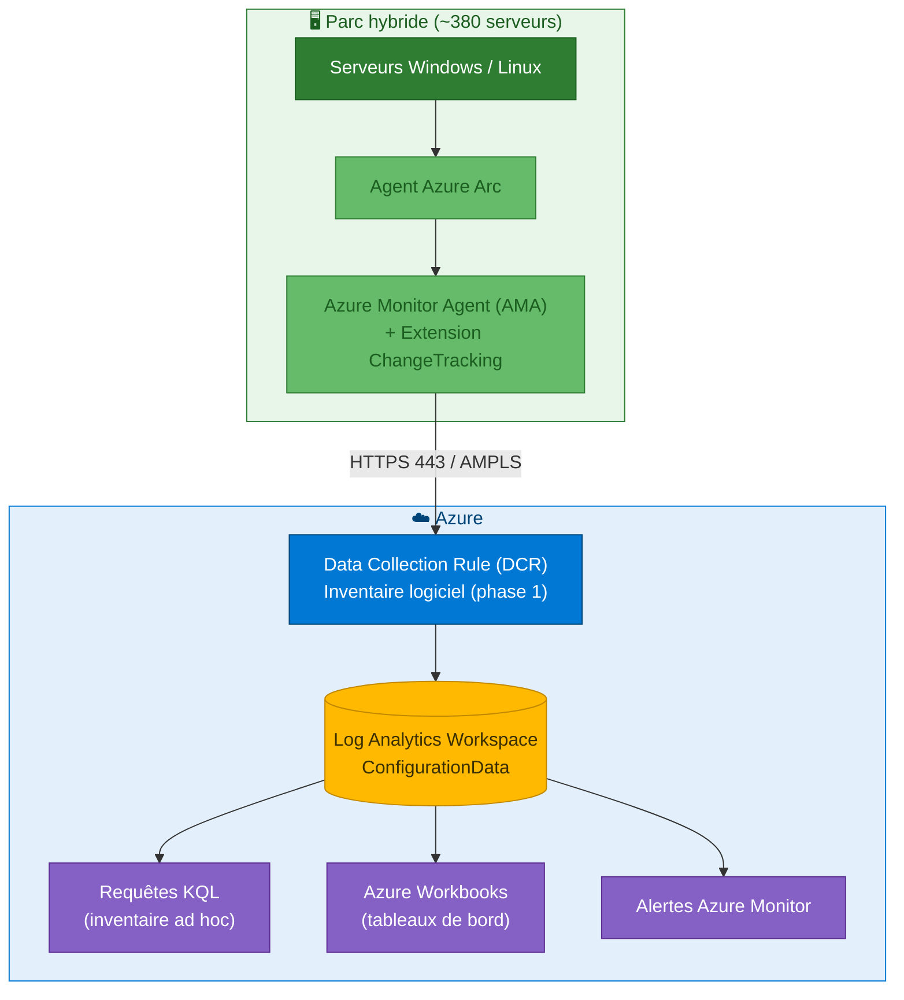
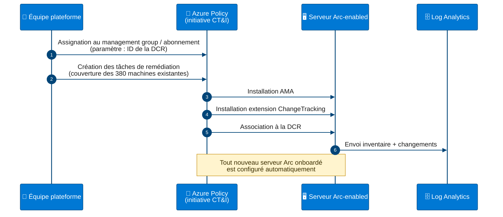
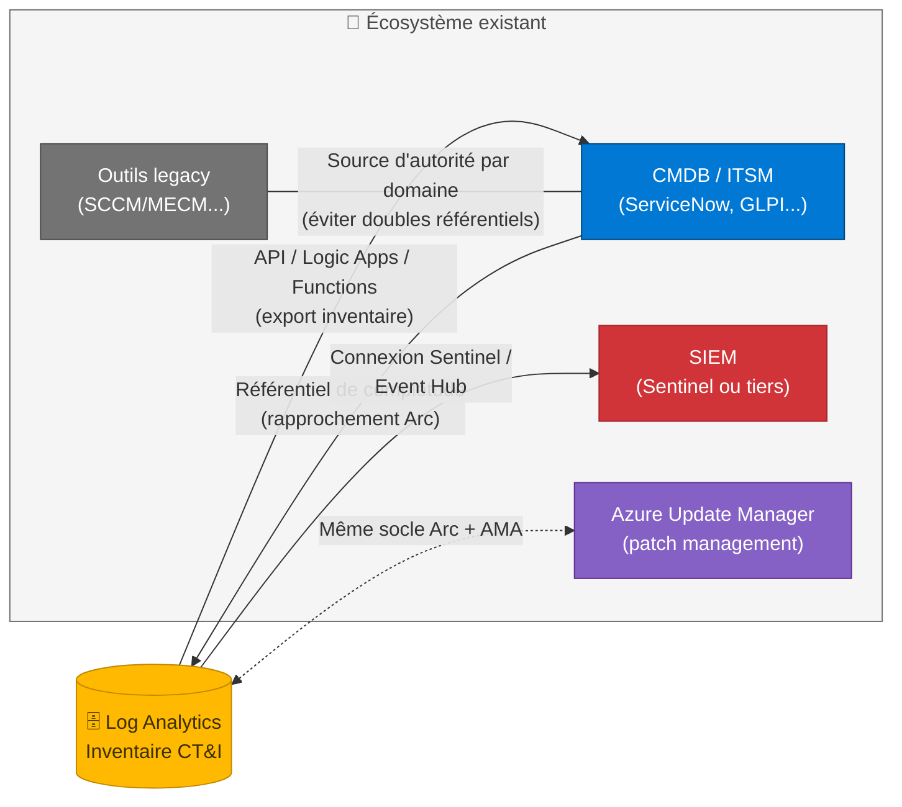

# Étude composant — Azure Change Tracking and Inventory

**Périmètre :** Inventaire logiciel d'un parc de ~380 serveurs Azure Arc-enabled.
**Phasage :** Phase 1 — fonction **Inventory** uniquement. La fonction Change Tracking (suivi des changements fichiers/registre/services) est différée en phase 2.
**Date :** Juin 2026

---

## 1. Présentation du composant

Azure Change Tracking and Inventory (CT&I) est le service Azure permettant d'inventorier en continu les logiciels installés, fichiers, services Windows, démons Linux et clés de registre sur les machines virtuelles Azure et les serveurs Arc-enabled (on-premises ou multi-cloud).

Le service répond à deux besoins distincts et complémentaires :

- **Inventory** : photographie à jour de ce qui est installé sur chaque machine du parc (applications, versions, éditeurs) — **périmètre de la phase 1** ;
- **Change Tracking** : journal des changements détectés dans le temps (installation, désinstallation, montée de version, modification de fichier ou de service) — **différé en phase 2**.

**Point structurant :** Inventory et Change Tracking constituent une **solution unique** côté agent (même extension, même DCR, mêmes tables). On ne déploie pas « l'inventaire seul » techniquement : on déploie la solution et on **limite la configuration au strict nécessaire** — l'inventaire logiciel est collecté par défaut, tandis que le suivi de fichiers, de registre et les usages orientés détection de changements ne sont simplement pas configurés ni exploités. La bascule en phase 2 se fera par simple ajustement de la DCR, sans redéploiement d'agents.

La version actuelle du service repose sur l'**Azure Monitor Agent (AMA)**, l'ancien agent Log Analytics (MMA) ayant été retiré en août 2024. CT&I est désormais découplé d'Azure Automation : il s'appuie uniquement sur Azure Monitor, les Data Collection Rules et Log Analytics.

### Données collectées en phase 1

| Type | Windows | Linux | Phase |
| --- | --- | --- | --- |
| Logiciels installés | Programmes & fonctionnalités, MSI | Paquets (rpm, deb) | **Phase 1** |
| Services / démons | Services Windows | Démons Linux | Phase 1 (collecté par défaut, exploitation optionnelle) |
| Fichiers | Oui | Oui | Phase 2 — non configuré |
| Registre | Oui | N/A | Phase 2 — non configuré |

---

## 2. Fonctionnement à haut niveau



1. L'**agent Arc** projette le serveur dans Azure comme une ressource gérable (resource ID, extensions, RBAC, Policy).
2. L'**Azure Monitor Agent** et l'**extension ChangeTracking** (Windows/Linux) sont déployés sur la machine.
3. Une **Data Collection Rule (DCR)** de type Change Tracking définit les éléments collectés et le workspace de destination.
4. Les données alimentent les tables **ConfigurationData** (inventaire courant) et **ConfigurationChange** (historique des changements) dans **Log Analytics**.
5. L'exploitation se fait par requêtes **KQL**, tableaux de bord, Workbooks ou alertes Azure Monitor.

La collecte n'est pas temps réel : l'inventaire logiciel Windows est rafraîchi environ toutes les 30 minutes, avec une collecte complète quotidienne.

---

## 3. Recommandations fonctionnelles

- **Cas d'usage cible (phase 1)** : vérifier la présence (ou l'absence) d'une application sur l'ensemble du parc, détecter les dérives de versions, alimenter les rapports d'audit et la CMDB.
- **Configuration minimale** : conserver la collecte par défaut (inventaire logiciel, services/démons) ; **ne pas configurer** le suivi de fichiers ni de registre en phase 1 — cela limite l'ingestion et simplifie l'exploitation.
- **Compléter par Machine Configuration** (Azure Policy, ex-Guest Configuration) lorsque le besoin est normatif : « l'application X doit être présente partout ». L'inventaire répond à *qu'est-ce qui est installé ?* ; Machine Configuration répond à *le parc est-il conforme à la norme ?* avec une vue X/380 conformes sans écrire de KQL.
- **Run Command Arc** ou runbook sur Hybrid Worker uniquement pour les vérifications ponctuelles hors cycle de collecte.
- **Phase 2 (différée)** : suivi des changements (ConfigurationChange), suivi ciblé de fichiers de configuration critiques et de clés de registre sensibles, alertes sur changements — activable par simple évolution de la DCR.

### Requêtes KQL de référence

Serveurs disposant de l'application :

```kusto
ConfigurationData
| where ConfigDataType == "Software"
| where SoftwareName contains "NomDeLApplication"
| summarize arg_max(TimeGenerated, *) by Computer
| project Computer, SoftwareName, CurrentVersion, Publisher
```

Serveurs où l'application est absente :

```kusto
let avecApp = ConfigurationData
    | where ConfigDataType == "Software" and SoftwareName contains "NomDeLApplication"
    | distinct Computer;
Heartbeat
| where TimeGenerated > ago(1d)
| distinct Computer
| where Computer !in (avecApp)
```

Dérive de versions :

```kusto
ConfigurationData
| where ConfigDataType == "Software"
| where SoftwareName contains "NomDeLApplication"
| summarize arg_max(TimeGenerated, *) by Computer
| summarize Serveurs = count() by SoftwareName, CurrentVersion
| order by Serveurs desc
```

Changements logiciels des 7 derniers jours *(phase 2 — donnée disponible mais non exploitée en phase 1)* :

```kusto
ConfigurationChange
| where ConfigChangeType == "Software"
| where TimeGenerated > ago(7d)
| project TimeGenerated, Computer, SoftwareName, ChangeCategory, Previous, Current
| order by TimeGenerated desc
```

---

## 4. Gouvernance et structure

### Chaîne de déploiement à l'échelle



- **Déploiement exclusivement par Azure Policy** : assigner l'initiative intégrée *Enable Change Tracking and Inventory for Arc-enabled virtual machines* au niveau **management group ou abonnement**. Elle installe l'AMA, l'extension ChangeTracking et associe la DCR. Aucune configuration machine par machine.
- **Remédiation** : créer des tâches de remédiation pour couvrir les 380 machines existantes (Policy ne s'applique automatiquement qu'aux ressources nouvelles ou modifiées). Les nouveaux serveurs Arc onboardés sont ensuite configurés sans intervention.
- **Workspace Log Analytics unique** (ou un par région si la résidence des données l'exige) : la fragmentation de l'inventaire sur plusieurs workspaces complique fortement les requêtes transversales.
- **Infrastructure as Code** : DCR, assignations Policy et workspace déclarés en ARM/Bicep/Terraform pour garantir reproductibilité et traçabilité.
- **Convention de nommage et tags** sur la DCR et le workspace, alignées sur la stratégie de la landing zone (environnement, propriétaire, centre de coûts).
- **Exclusions** : gérer les exceptions (serveurs hors périmètre) via des exemptions Policy documentées plutôt que par des périmètres d'assignation morcelés.

---

## 5. Sécurité

- **RBAC** : lecture de l'inventaire via *Log Analytics Reader* sur le workspace ; administration de la collecte (DCR, Policy) réservée à l'équipe plateforme via *Monitoring Contributor* / rôles Policy. Appliquer le moindre privilège.
- **Identité** : l'agent Arc et l'AMA s'authentifient par **identité managée** ; aucune clé ou secret à gérer sur les serveurs.
- **Flux réseau** : sortie HTTPS (443) vers les endpoints Azure Arc et Azure Monitor. Si la politique de sécurité l'exige, utiliser **Azure Monitor Private Link Scope (AMPLS)** et Private Link pour Arc afin d'éviter toute exposition Internet.
- **Sensibilité des données** : l'inventaire logiciel révèle la surface applicative du SI (versions vulnérables incluses) — traiter le workspace comme une donnée sensible : accès restreint, journalisation des requêtes, pas d'export non maîtrisé.
- **Intégrité de la chaîne** : la configuration de collecte étant pilotée par Policy/DCR, toute modification est tracée dans l'Activity Log ; mettre des alertes sur la suppression ou modification de la DCR et des assignations.
- **Valeur défensive** : le suivi des changements (logiciels, services, fichiers) constitue un signal utile pour la détection d'installations non autorisées ; possibilité de connecter le workspace à Microsoft Sentinel.

---

## 6. Exploitation

- **Tableaux de bord** : Workbook Azure dédié (présence applicative, dérive de versions, complétude de la collecte) partagé avec les équipes d'exploitation.
- **Alertes (phase 2)** : règles d'alerte Log Analytics sur ConfigurationChange (désinstallation d'un agent de sécurité, installation non planifiée) — différées avec la fonction Change Tracking.
- **Santé de la collecte** : superviser le Heartbeat des machines — un serveur sans Heartbeat depuis 24 h est un angle mort d'inventaire. Requête de contrôle :

```kusto
Heartbeat
| summarize Dernier = max(TimeGenerated) by Computer
| where Dernier < ago(24h)
```

- **Santé des agents Arc** (Azure Resource Graph) :

```kusto
resources
| where type == "microsoft.hybridcompute/machines"
| project name, agentVersion = properties.agentVersion, status = properties.status
| order by name asc
```

- **Cycle de vie** : suivre les versions de l'agent Arc et de l'AMA ; activer la mise à jour automatique des extensions.
- **Reporting** : export CSV des requêtes KQL ou intégration Power BI pour les rapports périodiques (audit, CAB).

---

## 7. Gestion des coûts

- **Modèle de facturation** : CT&I est facturé via l'**ingestion et la rétention Log Analytics** (pas de licence dédiée). À noter : les serveurs Arc-enabled peuvent impliquer une tarification spécifique selon les services activés — à valider sur la grille tarifaire en vigueur.
- **Volumétrie** : en se limitant à l'inventaire logiciel (phase 1), le volume ingéré par machine est **faible** — c'est la configuration la plus économique du service. Le suivi de fichiers et de registre (phase 2) est le principal facteur d'augmentation de l'ingestion ; son report constitue donc aussi une maîtrise des coûts.
- **Rétention** : 30 jours inclus par défaut (selon le plan de la table) ; au-delà, la rétention est facturée. Aligner la durée sur les exigences d'audit, et utiliser l'archivage longue durée si un historique pluriannuel est requis.
- **Suivi** : requête Usage par table pour suivre la consommation, budget et alertes de coût Azure Cost Management sur le workspace :

```kusto
Usage
| where TimeGenerated > ago(30d)
| where DataType in ("ConfigurationData", "ConfigurationChange")
| summarize GB = sum(Quantity) / 1024 by DataType
```

- **Optimisation** : éviter la duplication de collecte (plusieurs DCR ciblant les mêmes données), mutualiser le workspace, exclure les machines hors périmètre.

---

## 8. Points d'attention

| Point | Détail |
| --- | --- |
| Solution unique Inventory + Change Tracking | Les deux fonctions partagent la même extension et la même DCR ; « inventaire seul » signifie en pratique **ne pas configurer ni exploiter** le suivi de fichiers/registre/changements. La table ConfigurationChange peut recevoir des données par défaut : convenir de ne pas l'exploiter en phase 1 |
| Migration MMA → AMA | Tout déploiement basé sur l'ancien agent Log Analytics est obsolète (retrait août 2024) ; vérifier qu'aucun legacy ne subsiste |
| Latence de collecte | Inventaire non temps réel (~30 min logiciel Windows, collecte complète quotidienne) ; ne pas l'utiliser pour de la détection immédiate |
| Échecs de remédiation | Sur 380 machines, quelques-unes échoueront au premier passage (proxy, pare-feu, agent obsolète) : ce sont précisément les angles morts à traiter en priorité |
| Couverture applicative | L'inventaire s'appuie sur les mécanismes natifs (MSI/Programmes & fonctionnalités, paquets Linux) ; les applications déployées par simple copie (xcopy, binaires portables) ne sont pas détectées — compléter par le suivi de fichiers si nécessaire |
| Workspace fragmenté | Plusieurs workspaces = requêtes transversales complexes ; centraliser |
| Dépendance réseau | Sans connectivité vers Azure, l'agent bufferise puis perd des données au-delà de la capacité locale |
| Évolutions produit | Le service évolue (DCR, tables, tarification) ; revalider la documentation Microsoft avant déploiement |

---

## 9. Positionnement recommandé

| Besoin | Solution recommandée | Phase |
| --- | --- | --- |
| Savoir si une application est installée sur le parc | **Inventory** + requête KQL | **1** |
| Identifier les serveurs où elle manque | **Inventory** (anti-jointure sur Heartbeat) | **1** |
| Déploiement sur 380 serveurs + futurs serveurs | **Initiative Azure Policy** + remédiation | **1** |
| Vérification ponctuelle immédiate | **Run Command Arc** / runbook Hybrid Worker | 1 (au besoin) |
| Rapport de conformité permanent, sans KQL | **Machine Configuration** (Azure Policy) | 1 ou 2 |
| Tracer installations/désinstallations, fichiers, registre | **Change Tracking** (évolution de la DCR) | **2** |
| Détection sécurité avancée / EDR | Hors périmètre — Defender for Servers / Sentinel | — |

En phase 1, la fonction **Inventory** est positionnée comme la **source d'inventaire logiciel de référence** du parc hybride : déployée par Policy, centralisée dans un workspace unique, exploitée en KQL et Workbooks. Le socle déployé (Arc, AMA, extension, DCR, workspace) est **intégralement réutilisé en phase 2** pour activer le suivi des changements : aucun redéploiement, uniquement une évolution de configuration. L'inventaire ne remplace ni un outil de conformité normative (Machine Configuration), ni un EDR, ni un outil de déploiement applicatif — il les alimente et les complète.

---

## 10. Gestion des opérations (dont intégration avec l'existant)

### Processus opérationnels

- **Onboarding** : tout nouveau serveur passe par l'enrôlement Arc (script ou provisioning automatisé) ; Azure Policy applique ensuite CT&I sans action manuelle. Intégrer l'enrôlement Arc au processus standard de mise en production.
- **Décommissionnement** : suppression de la ressource Arc lors de la sortie du parc afin d'éviter les machines fantômes dans l'inventaire et les rapports de conformité.
- **Revue périodique** : contrôle mensuel des machines sans Heartbeat, des échecs de remédiation Policy et des versions d'agents.
- **Gestion des changements** : les modifications de DCR et d'assignations Policy suivent le processus de change (IaC + revue), avec traçabilité via l'Activity Log.

### Intégration avec l'existant



- **CMDB / ITSM** : l'inventaire Log Analytics peut alimenter la CMDB (export programmé via API Log Analytics, Logic Apps ou Azure Functions) ; à l'inverse, la CMDB sert de référentiel pour vérifier la complétude de l'enrôlement Arc (rapprochement liste CMDB ↔ ressources Arc).
- **Outillage de supervision existant** : les alertes Azure Monitor peuvent être routées vers l'ITSM (ServiceNow, etc.) via Action Groups / webhooks.
- **Patch management** : CT&I est complémentaire d'**Azure Update Manager** (même socle Arc/AMA) — l'un inventorie, l'autre corrige ; les deux s'activent par les mêmes mécanismes Policy.
- **SIEM** : connexion du workspace à Microsoft Sentinel ou export vers un SIEM tiers (Event Hub) pour corréler les changements avec les événements de sécurité.
- **Outils d'inventaire historiques** (SCCM/MECM, GLPI, etc.) : définir la source d'autorité par domaine pour éviter les doubles référentiels ; à terme, CT&I peut devenir la source d'inventaire logiciel du périmètre hybride pendant que l'outil legacy conserve le déploiement applicatif.
- **Active Directory / réseau** : prévoir les ouvertures de flux sortants (443) ou la mise en place d'AMPLS/Private Link en cohérence avec l'architecture réseau existante (proxy, inspection TLS à exclure pour les endpoints Arc/Monitor).

### RACI synthétique

| Activité | Plateforme Azure | Exploitation serveurs | Sécurité |
| --- | --- | --- | --- |
| DCR, Policy, workspace (IaC) | R/A | C | C |
| Enrôlement Arc des serveurs | C | R/A | I |
| Requêtes, Workbooks, rapports | C | R/A | C |
| Alertes sécurité sur changements | C | C | R/A |
| Revue des coûts | R/A | I | I |