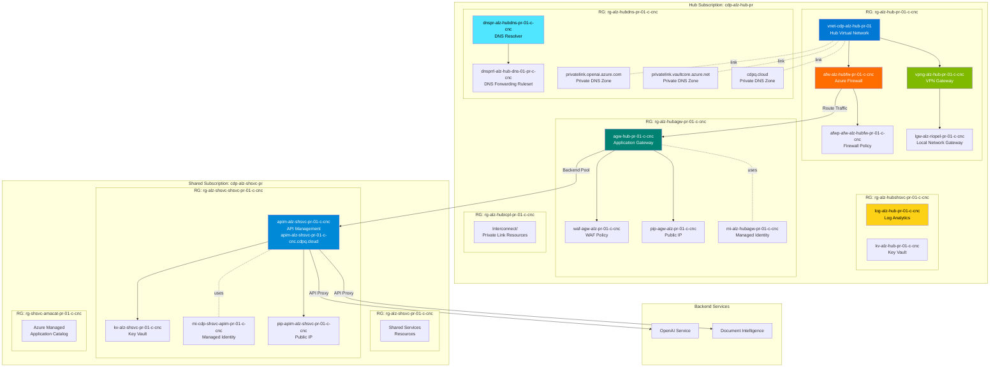
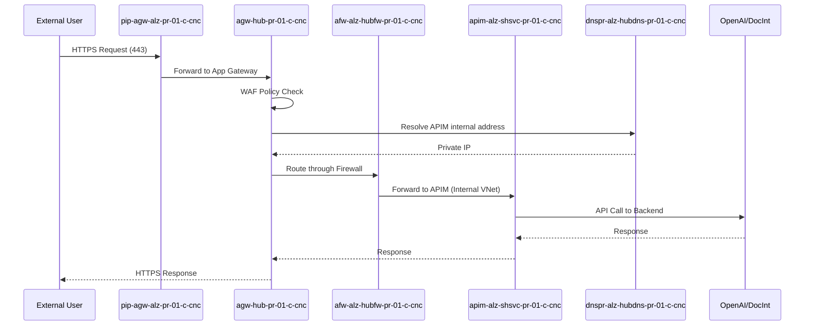
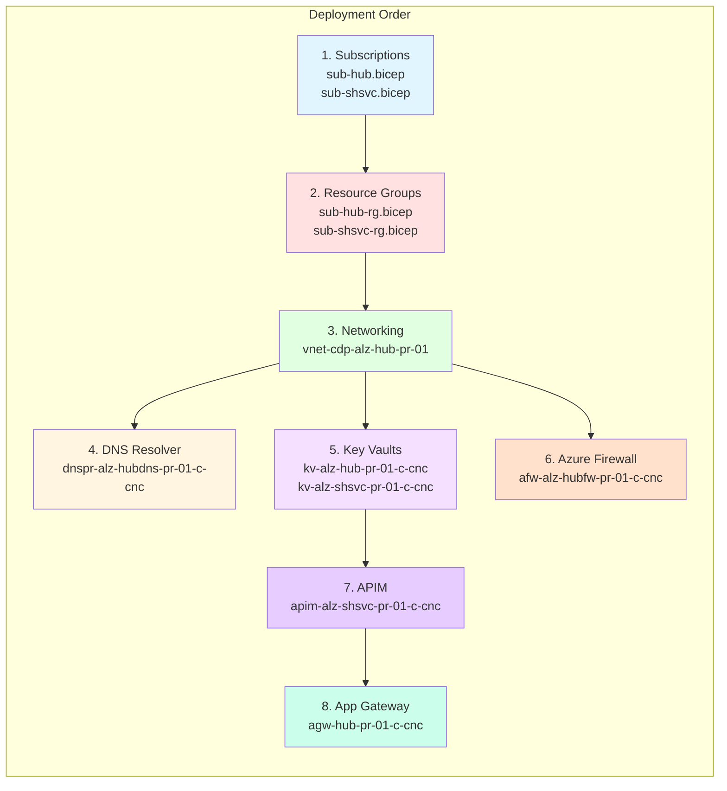
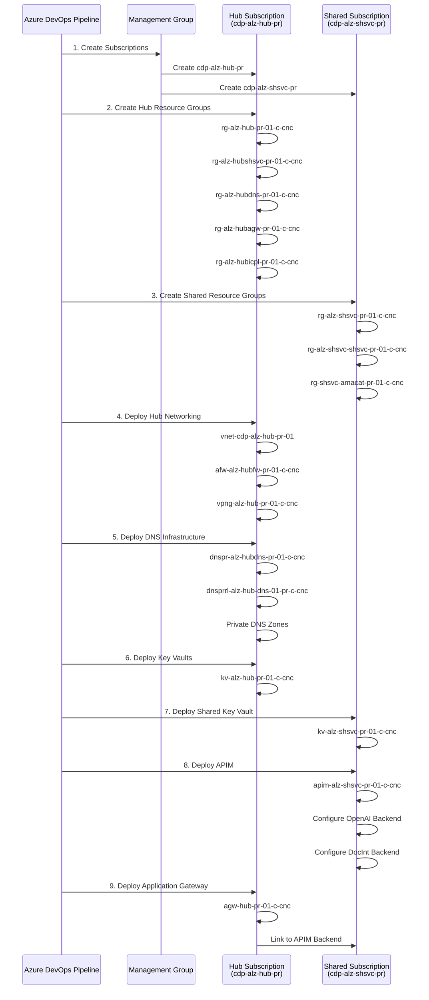
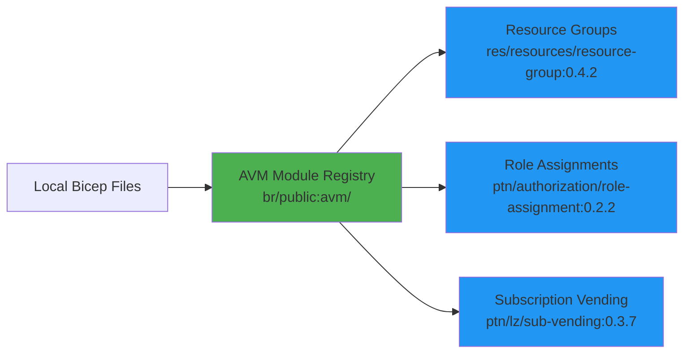

# Azure Landing Zone Infrastructure

This repository contains the infrastructure-as-code (IaC) for deploying an Azure Landing Zone using Bicep templates. The project implements a hub-spoke network topology with shared services, API Management, and Application Gateway infrastructure.

## Table of Contents
- [Architecture Overview](#architecture-overview)
- [Project Structure](#project-structure)
- [Created Resources](#created-resources)
- [Deployment Flow](#deployment-flow)
- [Getting Started](#getting-started)
- [Module Usage](#module-usage)

## Architecture Overview

This solution implements an Azure Landing Zone with the following components (shown for production environment in Canada Central):



### Key Components by Subscription

#### Hub Subscription (`cdp-alz-hub-pr`)

**Networking (rg-alz-hub-pr-01-c-cnc)**
- `vnet-cdp-alz-hub-pr-01` - Hub Virtual Network
- `afw-alz-hubfw-pr-01-c-cnc` - Azure Firewall with policy `afwp-afw-alz-hubfw-pr-01-c-cnc`
- `vpng-alz-hub-pr-01-c-cnc` - VPN Gateway for on-premises connectivity
- `lgw-alz-riopel-pr-01-c-cnc` - Local Network Gateway
- Route Tables: `rt-hubfwsubnet-pr-01`, `rt-hubdsubnet-pr-01`, `rt-hubgwsubnet-pr-01`

**Subnets**
- `AzureFirewallSubnet` - Azure Firewall subnet (10.225.2.0/26 for CDPQ)
- `GatewaySubnet` - VPN Gateway subnet (10.225.2.64/27 for CDPQ)
- `snet-alz-dnspr-ie-pr-01-cnc` - DNS Resolver Inbound Endpoint 01 (10.225.2.128/28)
- `snet-alz-dnspr-oe-pr-01-cnc` - DNS Resolver Outbound Endpoint 01 (10.225.2.144/28)
- `snet-alz-dnspr-ie-pr-02-cnc` - DNS Resolver Inbound Endpoint 02 (10.225.2.160/28)
- `snet-alz-dnspr-oe-pr-02-cnc` - DNS Resolver Outbound Endpoint 02 (10.225.2.176/28)
- `snet-alz-agw-oe-pr-01-cnc` - Application Gateway subnet (10.225.3.0/24)

**Monitoring & Security (rg-alz-hubshsvc-pr-01-c-cnc)**
- `log-alz-hub-pr-01-c-cnc` - Log Analytics Workspace
- `kv-alz-hub-pr-01-c-cnc` - Key Vault for certificates and secrets

**DNS Services (rg-alz-hubdns-pr-01-c-cnc)**
- `dnspr-alz-hubdns-pr-01-c-cnc` - Azure DNS Private Resolver
- `dnsprrl-alz-hub-dns-01-pr-c-cnc` - DNS Forwarding Ruleset
- Private DNS Zones:
  - `privatelink.openai.azure.com`
  - `privatelink.cognitiveservices.azure.com`
  - `privatelink.vaultcore.azure.net`
  - `privatelink.azure-api.net`
  - `cdpq.cloud` / `cdpqdev.com` (based on tenant)

**Application Gateway (rg-alz-hubagw-pr-01-c-cnc)**
- `agw-hub-pr-01-c-cnc` - Application Gateway (routes to APIM)
- `waf-agw-alz-pr-01-c-cnc` - Web Application Firewall Policy
- `pip-agw-alz-pr-01-c-cnc` - Public IP Address
- `mi-alz-hubagw-pr-01-c-cnc` - Managed Identity (for Key Vault access)
- `nsg-agw-pr-01` - Network Security Group

**Interconnect (rg-alz-hubicpl-pr-01-c-cnc)**
- Private Link and interconnect resources

#### Shared Services Subscription (`cdp-alz-shsvc-pr`)

**Main Services (rg-alz-shsvc-pr-01-c-cnc)**
- Shared infrastructure resources

**APIM Services (rg-alz-shsvc-shsvc-pr-01-c-cnc)**
- `apim-alz-shsvc-pr-01-c-cnc` - API Management instance
  - Custom domain: `apim-alz-shsvc-pr-01-c-cnc.cdpq.cloud`
  - SKU: Premium (production) / Developer (non-prod)
  - VNet Mode: Internal
- `kv-alz-shsvc-pr-01-c-cnc` - Key Vault for APIM certificates
- `mi-cdp-shsvc-apim-pr-01-c-cnc` - Managed Identity for APIM
- `pip-apim-alz-shsvc-pr-01-c-cnc` - Public IP Address

**API Backends**
- OpenAI Service endpoints
- Document Intelligence endpoints

**Managed App Catalog (rg-shsvc-amacat-pr-01-c-cnc)**
- Azure Managed Application catalog resources

### Network Flow



### Resource Dependencies



## Project Structure

```
alz-landingzone/
├── bicepconfig.json                 # Bicep configuration
├── README.md                        # This file
├── fichiers-bicep/                  # Bicep templates
│   ├── apim-infra/                 # API Management infrastructure
│   │   ├── apim.bicep
│   │   └── apim.azcli
│   ├── app-gateway-infra/          # Application Gateway infrastructure
│   │   ├── app-gateway-infra.bicep
│   │   └── app-gateway-infra.bicepparam
│   ├── landing-hub-infra/          # Hub infrastructure
│   │   ├── sub-hub.bicep           # Hub subscription creation
│   │   ├── sub-hub-rg.bicep        # Hub resource groups
│   │   ├── rg-hub-main-components.bicep
│   │   ├── rg-hub-dns-components.bicep
│   │   ├── rg-hub-gateway-components.bicep
│   │   ├── rg-hub-shsvc-components.bicep
│   │   ├── rg-hub-icpl-components.bicep
│   │   ├── add-forwarding-rule.bicep
│   │   ├── dep-hub-gateway-subnet.bicep
│   │   ├── dep-hub-icpl-arecords.bicep
│   │   ├── dep-hub-shsvc-keyvault.bicep
│   │   ├── dep-hub-sqlmi-icpl-arecords.bicep
│   │   └── prerequis/              # Prerequisites (resource provider registration)
│   └── landing-shared-infra/       # Shared services infrastructure
│       ├── sub-shsvc.bicep         # Shared subscription creation
│       ├── sub-shsvc-rg.bicep      # Shared resource groups
│       ├── rg-shsvc-components.bicep
│       ├── rg-shsvc-shsvc-components.bicep
│       ├── dep-shsvc-shsvc-devCenter.bicep
│       └── dep-shsvc-shsvc-keyvault.bicep
└── pipelines/                       # Azure DevOps pipelines
    ├── main.yaml
    ├── deploy-env-job.yaml
    ├── get-secure-file.yaml
    └── variables/
```

## Created Resources

### Resource Naming Convention

Resources follow the naming pattern: `{prefix}-{workload}-{component}-{env}-{instance}-{org}-{location}`

- **{prefix}**: Resource type (rg, vnet, kv, agw, apim, etc.)
- **{workload}**: Workload identifier (alz, shsvc, hub, etc.)
- **{component}**: Component name (hub, dns, gateway, etc.)
- **{env}**: Environment (pr=production, dev=development)
- **{instance}**: Instance number (01, 02, etc.)
- **{org}**: Organization code (c=CDPQ, d=dev)
- **{location}**: Location short code (cnc=Canada Central, cne=Canada East)

**Examples:**
- `rg-alz-hub-pr-01-c-cnc` - Hub resource group for production in Canada Central
- `vnet-cdp-alz-hub-pr-01` - Hub virtual network for production
- `agw-hub-pr-01-c-cnc` - Application Gateway for production
- `apim-alz-shsvc-pr-01-c-cnc` - API Management for shared services in production

### Resource Summary by Type

#### Subscriptions
- **Hub**: `cdp-alz-hub-{env}` - Contains networking, security, and gateway resources
- **Shared Services**: `cdp-alz-shsvc-{env}` - Contains shared application services

#### Resource Groups (Total: 8)

**Hub Subscription (5 groups):**
1. `rg-alz-hub-{env}-01-{org}-{location}` - Core hub networking (VNet, Firewall, VPN)
2. `rg-alz-hubshsvc-{env}-01-{org}-{location}` - Hub monitoring & security (Log Analytics, Key Vault)
3. `rg-alz-hubdns-{env}-01-{org}-{location}` - DNS services (DNS Resolver, Private DNS Zones)
4. `rg-alz-hubagw-{env}-01-{org}-{location}` - Application Gateway & WAF
5. `rg-alz-hubicpl-{env}-01-{org}-{location}` - Interconnect & Private Link

**Shared Services Subscription (3 groups):**
1. `rg-alz-shsvc-{env}-01-{org}-{location}` - Main shared services
2. `rg-alz-shsvc-shsvc-{env}-01-{org}-{location}` - APIM & API services
3. `rg-shsvc-amacat-{env}-01-{org}-{location}` - Azure Managed Application catalog

For detailed component lists, see [Key Components by Subscription](#key-components-by-subscription) section above.

## Deployment Flow

The deployment follows this orchestrated sequence:



## Getting Started

### Prerequisites

1. **Azure CLI** - [Install Azure CLI](https://docs.microsoft.com/cli/azure/install-azure-cli)
2. **Bicep CLI** - Installed with Azure CLI
3. **Azure Subscription** - With appropriate permissions
4. **Azure DevOps** - For pipeline execution

### Installation

1. Clone the repository:
   ```bash
   git clone <repository-url>
   cd alz-landingzone
   ```

2. Configure Bicep (if needed):
   ```bash
   az bicep install
   az bicep upgrade
   ```

3. Login to Azure:
   ```bash
   az login
   az account set --subscription <subscription-id>
   ```

### Manual Deployment

To deploy individual components manually:

#### Deploy Hub Infrastructure
```bash
cd fichiers-bicep/landing-hub-infra
az deployment mg create \
  --management-group-id <mg-id> \
  --location canadacentral \
  --template-file sub-hub.bicep \
  --parameters sub-hub.bicepparam
```

#### Deploy Shared Infrastructure
```bash
cd fichiers-bicep/landing-shared-infra
az deployment mg create \
  --management-group-id <mg-id> \
  --location canadacentral \
  --template-file sub-shsvc.bicep \
  --parameters sub-shsvc.bicepparam
```

#### Deploy Application Gateway
```bash
cd fichiers-bicep/app-gateway-infra
az deployment sub create \
  --location canadacentral \
  --template-file app-gateway-infra.bicep \
  --parameters app-gateway-infra.bicepparam
```

### Pipeline Deployment

The repository includes Azure DevOps pipelines for automated deployment:

1. Configure pipeline variables in `pipelines/variables/`
2. Run the main pipeline: `pipelines/main.yaml`
3. Monitor deployment progress in Azure DevOps

## Module Usage

This project leverages **Azure Verified Modules (AVM)** from the public Bicep registry for standardized, best-practice resource deployments:



### Key AVM Modules Used

- `br/public:avm/res/resources/resource-group:0.4.2` - Resource group creation
- `br/public:avm/ptn/authorization/role-assignment:0.2.2` - RBAC assignments
- `br/public:avm/ptn/lz/sub-vending:0.3.7` - Subscription creation and management

## Configuration

### Parameter Files

Parameter files (`.bicepparam`) contain environment-specific configuration:

- `sub-hub.bicepparam` - Hub subscription parameters
- `sub-shsvc.bicepparam` - Shared services parameters
- `app-gateway-infra.bicepparam` - Application Gateway parameters

### Bicep Configuration

The `bicepconfig.json` file configures:
- Module aliases
- Linter rules
- Formatting preferences

## Key Features

- ✅ Hub-spoke network topology
- ✅ Centralized DNS management
- ✅ API Management with OpenAI and Document Intelligence backends
- ✅ Application Gateway with WAF
- ✅ Infrastructure as Code using Bicep
- ✅ Azure Verified Modules for standardization
- ✅ CI/CD pipeline automation
- ✅ Multi-environment support (dev, prod)

## Troubleshooting

### Common Issues

1. **Module not found**: Ensure Bicep CLI is up to date
   ```bash
   az bicep upgrade
   ```

2. **Insufficient permissions**: Verify RBAC assignments at management group level

3. **Resource provider not registered**: Run prerequisite scripts in `landing-hub-infra/prerequis/`

## Contributing

1. Create a feature branch
2. Make changes following the existing naming conventions
3. Test deployments in a non-production environment
4. Submit a pull request with detailed description

## License

[Specify license information]

## Support

For issues or questions, contact the infrastructure team.