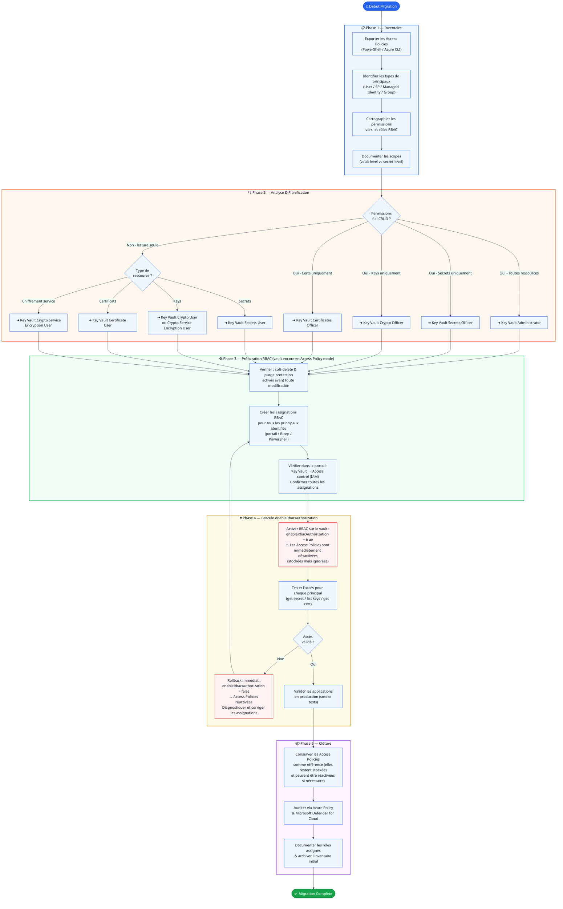

# Migration Azure Key Vault — Access Policies vers RBAC

## Contexte

Azure Key Vault supporte deux modèles d'autorisation pour le plan de données :

| Modèle | Description | Statut |
|---|---|---|
| **Access Policies** | Modèle historique, permissions granulaires par principal sur un vault | Déprécié (legacy) |
| **Azure RBAC** | Modèle basé sur les rôles Azure, géré via Azure Resource Manager | **Recommandé** |

> **Recommandation Microsoft** : Migrer vers RBAC pour bénéficier de la gestion centralisée des accès, de l'audit via Azure Policy, et du principe de moindre privilège via des rôles prédéfinis.

---

## Correspondance des permissions → Rôles RBAC

### Secrets

| Permissions Access Policy | Rôle RBAC équivalent | Scope recommandé |
|---|---|---|
| `get, list` | **Key Vault Secrets User** | `/secrets/<nom>` ou vault |
| `get, list, set, delete, backup, restore, recover, purge` | **Key Vault Secrets Officer** | vault |
| Toutes permissions + keys + certs | **Key Vault Administrator** | vault |

### Clés (Keys)

| Permissions Access Policy | Rôle RBAC équivalent |
|---|---|
| `get, list` | **Key Vault Crypto User** |
| `get, list, wrapKey, unwrapKey` | **Key Vault Crypto Service Encryption User** |
| `get, list, create, delete, update, import, backup, restore, recover, purge` | **Key Vault Crypto Officer** |

### Certificats (Certificates)

| Permissions Access Policy | Rôle RBAC équivalent |
|---|---|
| `get, list` | **Key Vault Certificate User** |
| `get, list, create, delete, update, import, backup, restore, recover, purge` | **Key Vault Certificates Officer** |

---

## Matrice d'accès RBAC — Souscriptions ALZ

Ce tableau est le référentiel cible pour toutes les assignations RBAC sur les Key Vaults de plateforme. Il remplace les Access Policies actuelles.

### Principaux de base (toutes souscriptions)

| ObjectId | Principal | Type | Secrets | Keys | Certs | Rôle(s) RBAC cible |
|---|---|---|---|---|---|---|
| `f85601f7-5851-4bb2-b0eb-a095e53a5b63` | Appliance Resource Provider | Service Principal | full CRUD | — | — | **Key Vault Secrets Officer** |
| `1a1189f4-298c-4ec4-96c8-7c0ad5dfa94b` | `cdpq-CDP.AZURE-0bdbe027` (Service Connection) | Service Principal | full CRUD | full CRUD | full CRUD | **Key Vault Secrets Officer** + **Key Vault Certificates Officer** + **Key Vault Crypto Officer** |
| `b61edcea-2352-48cb-9759-305be05f9f22` | `cprgs_alz_adm` (Groupe Entra) | Groupe | full CRUD | — | full CRUD | **Key Vault Secrets Officer** + **Key Vault Certificates Officer** |

### Principaux conditionnels — Vocation OpenAI

| ObjectId | Principal | Type | Secrets | Keys | Certs | Rôle(s) RBAC cible | Condition |
|---|---|---|---|---|---|---|---|
| `86c66f5d-7498-459b-b6e6-556fa4ca5539` | `mi-apim-*` (Managed Identity APIM) | Managed Identity | get, list | — | — | **Key Vault Secrets User** | Uniquement si sub vocation OpenAI |

### Principaux conditionnels — Vocation Automation Account

| ObjectId | Principal | Type | Secrets | Keys | Certs | Rôle(s) RBAC cible | Condition |
|---|---|---|---|---|---|---|---|
| `cb72d4ee-b08b-4f6d-8187-bac278c7595b` | `aa-ogpos-pr-01-c-cnc` (System Identity AA) | System-Assigned MI | get, list | — | get, list | **Key Vault Secrets User** + **Key Vault Certificate User** | Uniquement si sub vocation Automation |
| `4aad9f2a-5b12-4c47-a219-0950ef175fde` | `mi-ogpos-aa-pr-01-c-cnc` (User-Assigned MI) | User-Assigned MI | get, list | — | get, list | **Key Vault Secrets User** + **Key Vault Certificate User** | Uniquement si sub vocation Automation |

---

## Processus de Migration



---

## Commandes de référence

### 1. Exporter les Access Policies existantes

```powershell
# Exporter toutes les access policies d'un vault
$vault = Get-AzKeyVault -VaultName "kvogposaapr01ccnc"
$vault.AccessPolicies | Select-Object ObjectId, PermissionsToSecrets, PermissionsToKeys, PermissionsToCertificates |
    Export-Csv -Path "access-policies-kvogposaapr01ccnc.csv" -NoTypeInformation
```

### 2. Auditer les accès actuels avant toute modification

```powershell
# Lister tous les principaux et leurs permissions sur le vault
$vault = Get-AzKeyVault -VaultName "kvogposaapr01ccnc" -ResourceGroupName "rg-posaa-pr-01-c-cnc"
$vault.AccessPolicies | ForEach-Object {
    [PSCustomObject]@{
        ObjectId    = $_.ObjectId
        Secrets     = $_.PermissionsToSecrets -join ","
        Keys        = $_.PermissionsToKeys -join ","
        Certs       = $_.PermissionsToCertificates -join ","
    }
} | Format-Table -AutoSize
```

### 3. Créer les assignations RBAC (vault encore en mode Access Policy)

```powershell
$vaultId = (Get-AzKeyVault -VaultName "kvogposaapr01ccnc" -ResourceGroupName "rg-posaa-pr-01-c-cnc").ResourceId

# ── BASE : toutes souscriptions ──────────────────────────────────────────────

# Appliance Resource Provider → Key Vault Secrets Officer
New-AzRoleAssignment -ObjectId "f85601f7-5851-4bb2-b0eb-a095e53a5b63" `
    -RoleDefinitionName "Key Vault Secrets Officer" -Scope $vaultId

# Service Connection cdpq-CDP.AZURE → Secrets Officer + Certs Officer + Crypto Officer
New-AzRoleAssignment -ObjectId "1a1189f4-298c-4ec4-96c8-7c0ad5dfa94b" `
    -RoleDefinitionName "Key Vault Secrets Officer" -Scope $vaultId
New-AzRoleAssignment -ObjectId "1a1189f4-298c-4ec4-96c8-7c0ad5dfa94b" `
    -RoleDefinitionName "Key Vault Certificates Officer" -Scope $vaultId
New-AzRoleAssignment -ObjectId "1a1189f4-298c-4ec4-96c8-7c0ad5dfa94b" `
    -RoleDefinitionName "Key Vault Crypto Officer" -Scope $vaultId

# Groupe cprgs_alz_adm → Secrets Officer + Certs Officer
New-AzRoleAssignment -ObjectId "b61edcea-2352-48cb-9759-305be05f9f22" `
    -RoleDefinitionName "Key Vault Secrets Officer" -Scope $vaultId
New-AzRoleAssignment -ObjectId "b61edcea-2352-48cb-9759-305be05f9f22" `
    -RoleDefinitionName "Key Vault Certificates Officer" -Scope $vaultId

# ── CONDITIONNEL : Vocation OpenAI ───────────────────────────────────────────

# mi-apim → Key Vault Secrets User
New-AzRoleAssignment -ObjectId "86c66f5d-7498-459b-b6e6-556fa4ca5539" `
    -RoleDefinitionName "Key Vault Secrets User" -Scope $vaultId

# ── CONDITIONNEL : Vocation Automation Account ───────────────────────────────

# aa-ogpos-pr-01-c-cnc (System Identity) → Secrets User + Certificate User
New-AzRoleAssignment -ObjectId "cb72d4ee-b08b-4f6d-8187-bac278c7595b" `
    -RoleDefinitionName "Key Vault Secrets User" -Scope $vaultId
New-AzRoleAssignment -ObjectId "cb72d4ee-b08b-4f6d-8187-bac278c7595b" `
    -RoleDefinitionName "Key Vault Certificate User" -Scope $vaultId

# mi-ogpos-aa-pr-01-c-cnc (User-Assigned MI) → Secrets User + Certificate User
New-AzRoleAssignment -ObjectId "4aad9f2a-5b12-4c47-a219-0950ef175fde" `
    -RoleDefinitionName "Key Vault Secrets User" -Scope $vaultId
New-AzRoleAssignment -ObjectId "4aad9f2a-5b12-4c47-a219-0950ef175fde" `
    -RoleDefinitionName "Key Vault Certificate User" -Scope $vaultId
```

### 4. Vérifier les assignations dans le portail, puis basculer

```powershell
# Vérifier toutes les assignations AVANT de basculer
Get-AzRoleAssignment -Scope $vaultId |
    Select-Object DisplayName, RoleDefinitionName, ObjectId, ObjectType |
    Format-Table -AutoSize

# Une fois les assignations confirmées — basculer en mode RBAC
# ⚠️ Les Access Policies sont immédiatement ignorées après cette commande
# ✅ Réversible : repasser à $false réactive les Access Policies stockées
Update-AzKeyVault -VaultName "kvogposaapr01ccnc" `
                  -ResourceGroupName "rg-posaa-pr-01-c-cnc" `
                  -EnableRbacAuthorization $true
```

### 5. Rollback si les tests échouent

```powershell
# Les Access Policies sont toujours stockées sur le vault — les réactiver suffit
Update-AzKeyVault -VaultName "kvogposaapr01ccnc" `
                  -ResourceGroupName "rg-posaa-pr-01-c-cnc" `
                  -EnableRbacAuthorization $false
```

### 6. Assigner un rôle sur un secret individuel (moindre privilège)

```powershell
# Scope sur un secret spécifique plutôt que le vault entier
New-AzRoleAssignment `
    -ObjectId "86c66f5d-7498-459b-b6e6-556fa4ca5539" `
    -RoleDefinitionName "Key Vault Secrets User" `
    -Scope "$vaultId/secrets/nom-du-secret"
```

---

## Considérations importantes

| Aspect | Détail |
|---|---|
| **Comportement du toggle** | `enableRbacAuthorization = true` → Access Policies **immédiatement ignorées** (non supprimées). Repasser à `false` les réactive instantanément. |
| **Ordre impératif** | Créer **toutes** les assignations RBAC et les vérifier dans le portail **avant** de basculer le flag |
| **Scope granulaire** | RBAC permet l'assignation au niveau d'un secret individuel (`/secrets/<nom>`) pour le moindre privilège |
| **Propagation** | Les assignations RBAC peuvent prendre jusqu'à **10 minutes** pour se propager |
| **Audit** | Toutes les opérations sont journalisées dans Azure Monitor / Log Analytics |
| **Azure Policy** | Appliquer la policy `[Preview]: Azure Key Vault should use RBAC permission model` pour gouvernance |
| **Soft-delete** | Vérifier que soft-delete est activé avant la migration pour éviter toute perte de données |

---

## Rôles RBAC intégrés — Référence rapide

| Rôle | Plan de données | Cas d'usage |
|---|---|---|
| `Key Vault Administrator` | Toutes opérations | Administrateurs du vault |
| `Key Vault Secrets Officer` | CRUD secrets | Applications d'écriture de secrets |
| `Key Vault Secrets User` | Lecture secrets | Applications de lecture |
| `Key Vault Crypto Officer` | CRUD clés | Gestion des clés de chiffrement |
| `Key Vault Crypto User` | Opérations crypto | Services utilisant des clés |
| `Key Vault Crypto Service Encryption User` | wrapKey / unwrapKey | Chiffrement côté service (Storage, SQL) |
| `Key Vault Certificates Officer` | CRUD certificats | Gestion des certificats |
| `Key Vault Certificate User` | Lecture certificats | Services consommant des certificats |
| `Key Vault Reader` | Métadonnées uniquement | Lecture des propriétés du vault (pas les données) |

> **Principe de moindre privilège** : Assigner le rôle le plus restrictif répondant au besoin, et préférer un scope sur le secret/clé/certificat individuel plutôt que sur le vault entier lorsque c'est possible.

---

## Bicep — Assignations RBAC cibles

### Publication du module

Le fichier `fichiers-bicep/event-grid/eg-ama-app.bicep` est publié dans le registre ACR privé via le pipeline `pipelines/ama-modules-registry.yaml`. Le nom du module dans l'ACR est dérivé automatiquement par le pipeline (suppression des tirets + extraction du dernier segment du chemin) :

| Fichier source | Nom dérivé | Référence ACR |
|---|---|---|
| `fichiers-bicep/event-grid/eg-ama-app.bicep` | `egamaapp` | `br:cralzprivpr01ccnc.azurecr.io/bicep/lzmodules/egamaapp:latest` |

> **Note** : le pipeline ne publie le module que si la branche est `main` **et** si le fichier est nouveau ou modifié dans le commit (`git diff --diff-filter=ad`).

Pour consommer le module depuis une sub-vending (`sub-vending/` ou `sub-vending-infra/`) :

```bicep
module kvRbacAssignments 'br:cralzprivpr01ccnc.azurecr.io/bicep/lzmodules/egamaapp:latest' = {
  name: 'kv-rbac-assignments'
  params: {
    keyVaultId:                    keyVault.id
    applianceResourceProviderId:   varApplianceResourceProviderId
    serviceConnectionPrincipalId:  serviceConnectionPrincipalId
    adminGroupObjectId:            adminGroupObjectId
    vocation:                      vocation
    // Optionnels selon vocation
    apimManagedIdentityId:         apimManagedIdentityId
    automationAccountSystemId:     automationAccountSystemIdentityId
    automationAccountUserMIId:     automationAccountUserMIId
  }
}
```

### Contenu du module (`eg-ama-app.bicep`)

```bicep
// ──────────────────────────────────────────────────────────────
// Assignations RBAC Key Vault — BASE (toutes souscriptions)
// ──────────────────────────────────────────────────────────────

// Appliance Resource Provider — Key Vault Secrets Officer
resource rbacApplianceRP 'Microsoft.Authorization/roleAssignments@2022-04-01' = {
  name: guid(keyVault.id, varApplianceResourceProviderId, 'b86a8fe4-44ce-4948-aee5-eccb2c155cd7')
  scope: keyVault
  properties: {
    roleDefinitionId: subscriptionResourceId('Microsoft.Authorization/roleDefinitions', 'b86a8fe4-44ce-4948-aee5-eccb2c155cd7') // Key Vault Secrets Officer
    principalId: varApplianceResourceProviderId
    principalType: 'ServicePrincipal'
  }
}

// Service Connection cdpq-CDP.AZURE — Secrets Officer + Certs Officer + Crypto Officer
var roleSecretsOfficer     = 'b86a8fe4-44ce-4948-aee5-eccb2c155cd7'
var roleCertsOfficer       = 'a4417e6f-fecd-4de8-b567-7b0420556985'
var roleCryptoOfficer      = '14b46e9e-c2b7-41b4-b07b-48a6ebf60603'

resource rbacSvcConnSecrets 'Microsoft.Authorization/roleAssignments@2022-04-01' = {
  name: guid(keyVault.id, serviceConnectionPrincipalId, roleSecretsOfficer)
  scope: keyVault
  properties: {
    roleDefinitionId: subscriptionResourceId('Microsoft.Authorization/roleDefinitions', roleSecretsOfficer)
    principalId: serviceConnectionPrincipalId
    principalType: 'ServicePrincipal'
  }
}

resource rbacSvcConnCerts 'Microsoft.Authorization/roleAssignments@2022-04-01' = {
  name: guid(keyVault.id, serviceConnectionPrincipalId, roleCertsOfficer)
  scope: keyVault
  properties: {
    roleDefinitionId: subscriptionResourceId('Microsoft.Authorization/roleDefinitions', roleCertsOfficer)
    principalId: serviceConnectionPrincipalId
    principalType: 'ServicePrincipal'
  }
}

resource rbacSvcConnCrypto 'Microsoft.Authorization/roleAssignments@2022-04-01' = {
  name: guid(keyVault.id, serviceConnectionPrincipalId, roleCryptoOfficer)
  scope: keyVault
  properties: {
    roleDefinitionId: subscriptionResourceId('Microsoft.Authorization/roleDefinitions', roleCryptoOfficer)
    principalId: serviceConnectionPrincipalId
    principalType: 'ServicePrincipal'
  }
}

// Groupe cprgs_alz_adm — Secrets Officer + Certs Officer
resource rbacAdminGrpSecrets 'Microsoft.Authorization/roleAssignments@2022-04-01' = {
  name: guid(keyVault.id, adminGroupObjectId, roleSecretsOfficer)
  scope: keyVault
  properties: {
    roleDefinitionId: subscriptionResourceId('Microsoft.Authorization/roleDefinitions', roleSecretsOfficer)
    principalId: adminGroupObjectId
    principalType: 'Group'
  }
}

resource rbacAdminGrpCerts 'Microsoft.Authorization/roleAssignments@2022-04-01' = {
  name: guid(keyVault.id, adminGroupObjectId, roleCertsOfficer)
  scope: keyVault
  properties: {
    roleDefinitionId: subscriptionResourceId('Microsoft.Authorization/roleDefinitions', roleCertsOfficer)
    principalId: adminGroupObjectId
    principalType: 'Group'
  }
}

// ──────────────────────────────────────────────────────────────
// Assignations conditionnelles — Vocation OpenAI
// ──────────────────────────────────────────────────────────────
resource rbacApimMI 'Microsoft.Authorization/roleAssignments@2022-04-01' = if (vocation == 'openai') {
  name: guid(keyVault.id, apimManagedIdentityId, 'Key Vault Secrets User')
  scope: keyVault
  properties: {
    roleDefinitionId: subscriptionResourceId('Microsoft.Authorization/roleDefinitions', '4633458b-17de-408a-b874-0445c86b69e6') // Key Vault Secrets User
    principalId: apimManagedIdentityId
    principalType: 'ServicePrincipal'
  }
}

// ──────────────────────────────────────────────────────────────
// Assignations conditionnelles — Vocation Automation Account
// ──────────────────────────────────────────────────────────────
var roleSecretsUser  = '4633458b-17de-408a-b874-0445c86b69e6'
var roleCertUser     = 'db79e9a7-68ee-4b58-9aeb-b90e7c24fcba'

resource rbacAASystemSecrets 'Microsoft.Authorization/roleAssignments@2022-04-01' = if (vocation == 'automation') {
  name: guid(keyVault.id, automationAccountSystemIdentityId, roleSecretsUser)
  scope: keyVault
  properties: {
    roleDefinitionId: subscriptionResourceId('Microsoft.Authorization/roleDefinitions', roleSecretsUser)
    principalId: automationAccountSystemIdentityId
    principalType: 'ServicePrincipal'
  }
}

resource rbacAASystemCerts 'Microsoft.Authorization/roleAssignments@2022-04-01' = if (vocation == 'automation') {
  name: guid(keyVault.id, automationAccountSystemIdentityId, roleCertUser)
  scope: keyVault
  properties: {
    roleDefinitionId: subscriptionResourceId('Microsoft.Authorization/roleDefinitions', roleCertUser)
    principalId: automationAccountSystemIdentityId
    principalType: 'ServicePrincipal'
  }
}

resource rbacAAUserMISecrets 'Microsoft.Authorization/roleAssignments@2022-04-01' = if (vocation == 'automation') {
  name: guid(keyVault.id, automationAccountUserMIId, roleSecretsUser)
  scope: keyVault
  properties: {
    roleDefinitionId: subscriptionResourceId('Microsoft.Authorization/roleDefinitions', roleSecretsUser)
    principalId: automationAccountUserMIId
    principalType: 'ServicePrincipal'
  }
}

resource rbacAAUserMICerts 'Microsoft.Authorization/roleAssignments@2022-04-01' = if (vocation == 'automation') {
  name: guid(keyVault.id, automationAccountUserMIId, roleCertUser)
  scope: keyVault
  properties: {
    roleDefinitionId: subscriptionResourceId('Microsoft.Authorization/roleDefinitions', roleCertUser)
    principalId: automationAccountUserMIId
    principalType: 'ServicePrincipal'
  }
}
```

### Role Definition IDs — Référence

| Rôle | GUID |
|---|---|
| Key Vault Secrets Officer | `b86a8fe4-44ce-4948-aee5-eccb2c155cd7` |
| Key Vault Secrets User | `4633458b-17de-408a-b874-0445c86b69e6` |
| Key Vault Certificates Officer | `a4417e6f-fecd-4de8-b567-7b0420556985` |
| Key Vault Certificate User | `db79e9a7-68ee-4b58-9aeb-b90e7c24fcba` |
| Key Vault Crypto Officer | `14b46e9e-c2b7-41b4-b07b-48a6ebf60603` |
| Key Vault Crypto User | `12338af0-0e69-4776-bea7-57ae8d297424` |
| Key Vault Administrator | `00482a5a-887f-4fb3-b363-3b7fe8e74483` |
