# Supervision Azure — Séparation des périmètres Observabilité / Sécurité

## Contexte

L'architecture de plateforme doit clarifier la séparation des périmètres entre la supervision d'infrastructure et la supervision de sécurité dans le contexte du parc Azure actuel.

Deux services de plateforme distincts coexistent :

| Service | Rôle | Responsabilité |
|---|---|---|
| **Datadog** | Surveillance et observabilité (infrastructure, applicatif, performance) | Plateforme Exploitation |
| **Microsoft Sentinel** | Journalisation de sécurité (SIEM) | Escouade SEC |

> **Principe clé (MVA Surveillance)** : Datadog n'est pas un SIEM et ne doit pas collecter de logs de sécurité.

**Parc Azure concerné** : 35 VM sur 6 souscriptions (Canada Central / Canada East) — VM applicatives, VM d'infrastructure (ALZ Hub/Spoke), VM de relais Syslog EISEC — plus les ressources PaaS des zones d'atterrissage Azure.

---

## Périmètres de chaque service

| Datadog (observabilité) | SIEM / Sentinel (sécurité) |
|---|---|
| Métriques d'infrastructure | Logs de sécurité |
| Logs techniques et applicatifs | Logs d'audit |
| Traces applicatives (APM) | Événements IAM |
| Événements opérationnels | Journaux réglementaires |

---

## Constats sur le parc Azure

- **VM applicatives et d'infrastructure** : couvertes par les deux services, chacun dans son périmètre respectif.
- **VM de relais Syslog (EISEC)** : leur santé en tant qu'infrastructure relève de Datadog ; le contenu qu'elles transportent relève exclusivement du SIEM.
- **Ressources PaaS Azure** : les Diagnostic Settings permettent de séparer métriques et journaux d'audit à la source.
- **VM arrêtées (ALZ Hub/Spoke)** : devront se conformer aux mêmes règles si remises en service.

---

## Architecture de collecte

```mermaid
%%{init: {
  "theme": "base",
  "flowchart": { "curve": "basis", "nodeSpacing": 55, "rankSpacing": 70 },
  "themeVariables": {
    "fontFamily": "Segoe UI, Arial",
    "lineColor": "#374151",
    "primaryTextColor": "#111827"
  }
}}%%

flowchart LR

  subgraph AZ["Microsoft Azure — La Caisse (Canada EAST)"]
    direction LR

    subgraph SUB1["DFO / DFOINFRA / QUARK-PROD"]
      direction TB
      S1["28 VMs Windows\n(avec Datadog Agent)"]:::vm
    end

    subgraph SUB2["EISEC (Sécurité)"]
      direction TB
      ALB["Application Load Balancer"]:::net
      FWD["2 vm-forwarders-syslog\n(avec Datadog Agent)"]:::vm
      S2["VMs (sécurité)\n(avec Datadog Agent)"]:::vm
      ALB --> FWD
    end

    AMA["Azure Monitor Agent (AMA)"]:::agentAma
    DCR["DCR (Data Collection Rule)"]:::cfg
    LAWSEC["Log Analytics Workspace\nLogs de Sécurité"]:::lawSec

    DDAG["Datadog Agent"]:::agentDd
    LAWDD["Log Analytics Workspace\n⚠️ recommandé — non déployé"]:::lawFuture

    S1 --> AMA
    S2 --> AMA
    FWD --> AMA
    AMA --> DCR --> LAWSEC

    S1 --> DDAG
    S2 --> DDAG
    FWD --> DDAG
    DDAG -. "recommandé" .-> LAWDD
  end

  DR["Produit Détection réponse (DR)\nJournalisation & évènements de sécurité"]:::secSink
  SENT["Azure Sentinel"]:::sentinel
  DD["Datadog\nPlateforme Exploitation"]:::datadog

  LAWSEC -- "HTTPS / TLS 443" --> DR --> SENT
  DDAG -- "HTTPS / intake.datadoghq.com" --> DD

  classDef vm fill:#EEF2FF,stroke:#4338CA,stroke-width:1.5px,color:#111827;
  classDef net fill:#FFF7ED,stroke:#C2410C,stroke-width:1.5px,color:#111827;
  classDef agentAma fill:#E0F2FE,stroke:#0284C7,stroke-width:2px,color:#0F172A;
  classDef lawSec fill:#DBEAFE,stroke:#1D4ED8,stroke-width:2px,color:#111827;
  classDef agentDd fill:#ECFDF5,stroke:#059669,stroke-width:2px,color:#0F172A;
  classDef lawObs fill:#DCFCE7,stroke:#16A34A,stroke-width:1.5px,color:#0F172A,stroke-dasharray:4 4;
  classDef lawFuture fill:#FEF9C3,stroke:#CA8A04,stroke-width:1.5px,color:#78350F,stroke-dasharray:4 4;
  classDef cfg fill:#FFFBEB,stroke:#D97706,stroke-width:1.5px,color:#111827;
  classDef secSink fill:#FFE4E6,stroke:#E11D48,stroke-width:2px,color:#111827;
  classDef sentinel fill:#FFEDD5,stroke:#F97316,stroke-width:2px,color:#111827;
  classDef datadog fill:#F5F3FF,stroke:#6D28D9,stroke-width:2px,color:#111827;

  %% 0: ALB→FWD, 1-5: security pipeline (S1/S2/FWD→AMA→DCR→LAWSEC)
  linkStyle 0,1,2,3,4,5 stroke:#0284C7,stroke-width:2px;
  %% 6-8: DDAG feeds, 9: optional LAW retention (dashed)
  linkStyle 6,7,8 stroke:#16A34A,stroke-width:2px;
  linkStyle 9 stroke:#16A34A,stroke-width:1.5px,stroke-dasharray:5 5;
  %% 10-11: security outputs (LAWSEC→DR→SENT)
  linkStyle 10,11 stroke:#F97316,stroke-width:2px;
  %% 12: direct Datadog push (DDAG→DD)
  linkStyle 12 stroke:#6D28D9,stroke-width:2.5px;
```



---

## Recommandation — Position d'architecture

La plateforme adopte une **séparation stricte des flux de données**, conformément aux MVAs.

### Règles d'architecture

| Règle | Description |
|---|---|
| Pas de logs de sécurité dans Datadog | Aucun log de sécurité ne doit transiter vers Datadog |
| Séparation à la source | Les flux doivent être séparés dès la source ou via routage explicite |
| Datadog = observabilité uniquement | Utilisé exclusivement pour la supervision, la performance et l'exploitation |
| Pas d'interconnexion | Aucune interconnexion entre Datadog et Sentinel |

### Exception (court terme)

Les VM Azure existantes sont tolérées temporairement. Elles doivent :

- être supervisées via Datadog pour l'**infrastructure uniquement**
- respecter la séparation des flux

### Cible long terme

- Convergence vers le **pipeline AIS**
- Remplacement des collecteurs actuels par un modèle gouverné

---

## Conclusion

L'architecture de plateforme confirme la séparation entre **observabilité (Datadog)** et **sécurité (SIEM / AIS)**.

Cette distinction est essentielle pour :

- Assurer la **conformité**
- Clarifier les **responsabilités**
- Éviter les **dérives d'usage** des outils

Une exception est accordée pour les VM existantes, mais une convergence vers les patrons cibles est requise. L'architecture de plateforme garantit cette frontière sans se substituer à l'architecture de sécurité.

---

## Plan d'implémentation

### Actifs existants (à réutiliser)

| Nom | Région | Créé par | Sources collectées | Destination | VMs couvertes |
|---|---|---|---|---|---|
| `microsoft-security-canadacentral-dcr` | Canada Central | Microsoft Defender for Cloud (auto) | Windows Event Logs, AzureSecurityWindowsAgent, AzureSecurityLinuxAgent, AdvancedThreatProtection, VulnerabilityAssessment | `WP-CDPQ-SENTINEL-PR...` (LAW Sentinel) ✅ | **9 / 28 VMs** |

> **Observations** :
>
> - Ce DCR est **géré par MDfC** (Microsoft Defender for Cloud) — ne pas modifier ses data sources manuellement.
> - La destination est confirmée vers le LAW Sentinel : la séparation sécurité est **respectée pour ces 9 VMs**.
> - **19 VMs restantes** de DFO/DFOINFRA ne sont pas couvertes — action requise (voir tableau ci-dessous).
> - Le DCR est en région **Canada Central** ; vérifier si des VMs Canada East nécessitent un DCR distinct.

---

### Actions par périmètre

#### Pipeline Sécurité (AMA → DCR → LAW Sécurité → Sentinel)

| Souscription | Action | Priorité |
|---|---|---|
| DFO / DFOINFRA — 9 VMs | ✅ `microsoft-security-canadacentral-dcr` en place, LAW Sentinel confirmé — **aucune action** | — |
| DFO / DFOINFRA — 19 VMs restantes | Identifier les VMs non associées au DCR MDfC, les y rattacher | **Haute** |
| EISEC | Déployer AMA sur les VM de relais Syslog + associer au DCR sécurité | Haute |
| QUARK-PROD | Créer DCR sécurité (Windows Security Events) + déployer AMA | Haute |
| ALZ Hub/Spoke (VM arrêtées) | Prévoir association au DCR sécurité lors de la remise en service | À planifier |

#### Pipeline Observabilité (Datadog Agent → Datadog direct)

| Souscription | Action | Priorité |
|---|---|---|
| DFO / DFOINFRA | Confirmer que le Datadog Agent est configuré pour **métriques/logs techniques uniquement** (pas de Security Events) | Vérification |
| EISEC | Confirmer que le Datadog Agent des VM EISEC ne collecte que la santé infrastructure | Vérification |
| QUARK-PROD | Même vérification de périmètre Datadog | Vérification |
| Ressources PaaS | Configurer les Diagnostic Settings pour séparer métriques (→ Datadog via Event Hub) et logs d'audit (→ LAW Sécurité) | Moyenne |

#### Pipeline Rétention Observabilité dans Azure — LAW Datadog ⚠️ recommandé, non déployé

> La LAW Datadog ne peut pas recevoir de données directement du Datadog Agent. Le mécanisme officiel est :
> **AMA → DCR-OBS → LAW Datadog** (rétention Azure) et séparément **LAW Datadog → Data Export Rule → Storage Account (`ddlogstorage*`) → Datadog Log Forwarder (Container App) → Datadog**
>
> Ref : [docs.datadoghq.com/logs/guide/azure-automated-log-forwarding/#log-analytics-workspaces](https://docs.datadoghq.com/logs/guide/azure-automated-log-forwarding/#log-analytics-workspaces)

| Composant | Action | Contraintes | Priorité |
|---|---|---|---|
| DCR-OBS | Créer un DCR dédié rétention (performance counters, app logs) → LAW Datadog | Distinct du DCR-SEC | Basse |
| LAW Datadog | Créer le Log Analytics Workspace pour rétention observabilité | Même région que les VMs | Basse |
| Datadog Log Forwarder | Déployer via ARM template Datadog (Azure Portal ou CLI) | Max 10 Data Export Rules / LAW | Basse |
| Data Export Rule | Configurer sur LAW Datadog → Storage Account `ddlogstorage*` | Même région que le forwarder | Basse |

---

### Séquence recommandée

```
── Court terme (obligatoire) ──────────────────────────────────────────
1. ✅ DCR MDfC (microsoft-security-canadacentral-dcr) confirmé → 9 VMs DFO/DFOINFRA, LAW Sentinel OK
2. Identifier les 19 VMs DFO/DFOINFRA restantes → les associer au DCR MDfC existant
3. Auditer la config Datadog Agent sur toutes les VM → retirer tout log de sécurité
4. Déployer AMA + associer au DCR sécurité sur EISEC et QUARK-PROD
5. Configurer Diagnostic Settings PaaS (logs d'audit → LAW Sentinel / métriques → Datadog via Event Hub)
6. Valider la séparation end-to-end avec l'Escouade SEC

── Long terme (rétention observabilité recommandée) ───────────────────
7. Créer LAW Datadog + DCR-OBS (AMA → DCR-OBS → LAW Datadog)
8. Déployer Datadog Log Forwarder via ARM template
   → https://docs.datadoghq.com/logs/guide/azure-automated-log-forwarding/
9. Configurer Data Export Rule : LAW Datadog → Storage ddlogstorage* → Forwarder → Datadog
```
