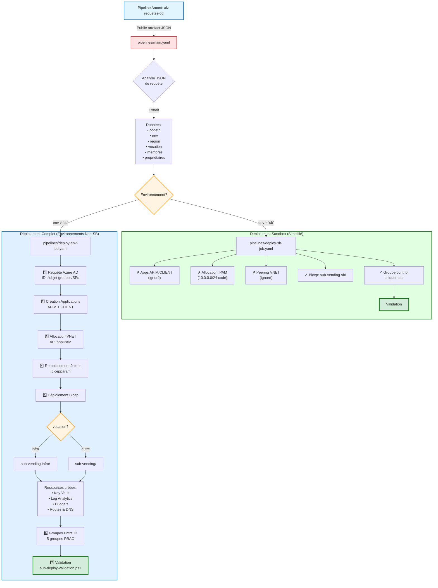

# Machine de Distribution d'Abonnements Azure Landing Zone

Provisionnement et configuration automatisés d'abonnements Azure utilisant des modèles Bicep et des pipelines Azure DevOps. Ce projet implémente un modèle de "machine de distribution d'abonnements" pour les zones d'atterrissage Azure (ALZ) à travers plusieurs environnements et locataires.

## Vue d'Ensemble de l'Architecture

Trois modèles de déploiement d'abonnements existent dans `fichiers-bicep/`:

- **sub-vending/**: Abonnements standards avec intégration APIM (charges de travail AI/ML)
- **sub-vending-infra/**: Abonnements d'infrastructure avec composants ARC
- **sub-vending-sb/**: Abonnements sandbox (sans APIM, sans peering, réseau simplifié)

Tous les modèles utilisent le module Azure Verified Module `br/public:avm/ptn/lz/sub-vending:0.2.5` au niveau du groupe de gestion.

## Architecture du Flux de Pipeline



## Conventions Principales

### Modèles de Nommage

Les noms de ressources suivent des conventions strictes: `<type>-<codetn>-<env>-<vocation>-<regionshort>-<seq>`

- Exemple d'abonnement: `cdp-alz-frodo-dv-ai-cnc` (code=frodo, env=dv, vocation=ai, region=canadacentral→cnc)
- Groupes de ressources: `rg-<codetn>-<purpose>-<env>-<seq>-<orgcode>-<regionshort>`
- Key vaults: `kv-<codetn>-<env>-<seq>-<orgcode>-<regionshort>` (limite de 15 caractères impacte les noms)
- Groupes Entra ID: `${prefix}_alz_${codetn}_${vocation}_${region}_${role}` où le préfixe est basé sur l'environnement (cprgs/cdvgs/csbgs/ctags)

**Convention de Code d'Organisation**: `c` pour le locataire cdpq, `d` pour le locataire cdpqdev

### Architecture Multi-Locataire

Deux contextes de locataires: `cdpq` (production) et `cdpqdev` (développement)

- Les ID d'abonnement, les VNets hub et les groupes administrateurs diffèrent par locataire
- La logique conditionnelle dans Bicep utilise des opérateurs ternaires `parTenant == 'cdpq'` de manière extensive
- Voir les fichiers de variables dans `pipelines/variables/` pour la configuration spécifique au locataire

### Mappage des Environnements

Environnements: `sb` (sandbox), `ct` (contrôle), `dv` (développement), `pr` (production), `ta` (test)

- Chacun a une étape de pipeline dédiée et un fichier de variables
- Sandbox utilise `deploy-sb-job.yaml` (simplifié: pas d'applications APIM, pas de peering VNET, pas de création de groupes Azure AD)
- Les autres utilisent `deploy-env-job.yaml` (déploiement complet avec groupes AD, applications APIM, intégration IPAM)
- Les abonnements d'infrastructure (`vocation=infra`) utilisent les modèles `sub-vending-infra/` avec composants ARC

## Flux de Déploiement

### Pipeline de Déploiement Complet (deploy-env-job.yaml)

1. **Requête Azure AD**
   - Récupère les ID d'objet pour les groupes/SPs administrateurs
   - Utilise les variables de `pipelines/variables/<tenant>-<env>.yaml`

2. **Création d'Enregistrements d'Applications**
   - Appelle `scripts/create-azure-app.ps1`
   - Lit `scripts/app-roles.json` pour les rôles d'application APIM
   - Crée l'enregistrement d'application `<SUBSCRIPTION>-APIM`
   - Crée l'enregistrement d'application `<SUBSCRIPTION>-CLIENT`
   - Assigne les propriétaires (application Voute + principal + secondaire)
   - Accorde les permissions de l'application CLIENT à l'application APIM

3. **Allocation VNET IPAM**
   - Appelle `scripts/get-ipam-vnet-range.ps1`
   - S'authentifie avec le secret Key Vault 'ipam'
   - Interroge l'API phpIPAM: `https://ipam.sharedservices-prod.altocdpq.com/`
   - Alloue une plage /24 depuis le pool spécifique à l'environnement
   - ID de pools:
     - cdpqdev: 1710 (masque /27)
     - cdpq-dv: 1716 (masque /25)
     - cdpq-pr: 1723 (masque /24)

4. **Remplacement de Jetons**
   - Utilise la tâche replacetokens@6
   - Remplace `#{variable}#` dans les fichiers .bicepparam
   - Source les variables depuis `pipelines/variables/<tenant>-<env>.yaml`

5. **Déploiement Bicep**
   - Lit `bicepconfig.json` pour les alias de registre
   - Sélectionne le modèle basé sur le paramètre vocation
   - Déploie au niveau du groupe de gestion
   - Crée:
     - Key Vault (limite de 15 caractères)
     - Espace de travail Log Analytics
     - Budgets
     - Tables de routage avec routes de pare-feu hub
     - Liens de zones DNS privées
     - Groupe de ressources d'application gérée Azure

6. **Création de Groupes Entra ID**
   - Appelle `scripts/create-azure-group-role.ps1`
   - Crée 5 groupes par abonnement:
     - `${prefix}_alz_${codetn}_${vocation}_${region}_reader`
     - `${prefix}_alz_${codetn}_${vocation}_${region}_security`
     - `${prefix}_alz_${codetn}_${vocation}_${region}_network`
     - `${prefix}_alz_${codetn}_${vocation}_${region}_owner`
     - `${prefix}_alz_${codetn}_${vocation}_${region}_contrib`
   - Assigne les attributions de rôles Azure par groupe
   - Ajoute les membres selon l'environnement:
     - Sandbox: Membres → groupe contrib
     - Non-sandbox: Membres → groupe reader

7. **Validation**
   - Appelle `scripts/sub-deploy-validation.ps1`

### Différences de Déploiement Sandbox

- **IGNORE**: Création d'enregistrements d'applications (pas d'applications APIM/CLIENT)
- **IGNORE**: Appel API IPAM (utilise 10.0.0.0/24 codé en dur)
- **IGNORE**: Peering VNET vers le hub
- Utilise les modèles `fichiers-bicep/sub-vending-sb/`
- Crée uniquement le groupe contrib avec tous les membres

## Architecture Réseau

Topologie hub-spoke avec tunneling forcé:

- Les VNets hub diffèrent par locataire/environnement
- `sub-vending-add-route.bicep` ajoute des routes vers le pare-feu hub
- Zones DNS privées liées à l'abonnement hub
- IPAM assigne des VNETs /24, les sous-réseaux sont /27

## Interactions avec les Systèmes Externes

### Azure AD / Entra ID
- Appels API Graph pour la création d'enregistrements d'applications, création de groupes, recherche d'utilisateurs par email, attribution de rôles
- Consentement administrateur requis dans le locataire cdpqdev

### API phpIPAM
- Point de terminaison: `https://ipam.sharedservices-prod.altocdpq.com/phpipam/api/ALZProd/`
- Authentification: Secret Key Vault 'ipam'
- Opérations: check_if_subnet_exists, get_first_available_subnet

### Azure Resource Manager
- Déploiements au niveau du groupe de gestion
- Création/placement d'abonnements
- Provisionnement de ressources

### Azure Container Registry
- Registre: `cralzprivdv01ccnc.azurecr.io/bicep/lzmodules`
- Registre de modules Bicep privé

## Fichiers Clés

- **bicepconfig.json**: Définit l'alias de registre `br:alz`
- **sub-vending.bicepparam**: Modèle de jetons avec des espaces réservés `#{variable}#`
- **sub-vending-sub-resources.bicep**: Crée Key Vault, Log Analytics, budgets, tables de routage, liens DNS privés
- **ama-rg.bicep**: Crée le groupe de ressources d'application gérée Azure

## Flux de Développement

### Tests Locaux

```powershell
# Valider le déploiement
az deployment mg create --location 'canadacentral' \
  --management-group-id 'mg-cdpq-platforms-infrastructure' \
  --template-file ./sub-vending.bicep \
  --parameters ./sub-vending.bicepparam
```

### Ajout de Nouveaux Environnements

1. Créer un fichier de variables dans `pipelines/variables/<tenant>-<env>.yaml`
2. Ajouter une étape à `main.yaml` avec une condition correspondant à la clé d'environnement
3. S'assurer que l'ID du groupe de gestion et le scope de facturation sont corrects pour le locataire

## Dépendances et Outils

- Azure CLI avec extension Bicep
- Pools Azure DevOps: Pool géré `CDPQ-VSO-DV-AZURE-1-DV`
- API IPAM: `https://ipam.sharedservices-prod.altocdpq.com/phpipam/api/ALZProd/`
- Connexions de service: `Azure-ALZ-Ct-Root`, `Azure-ALZ-Dv-Root` (par locataire)