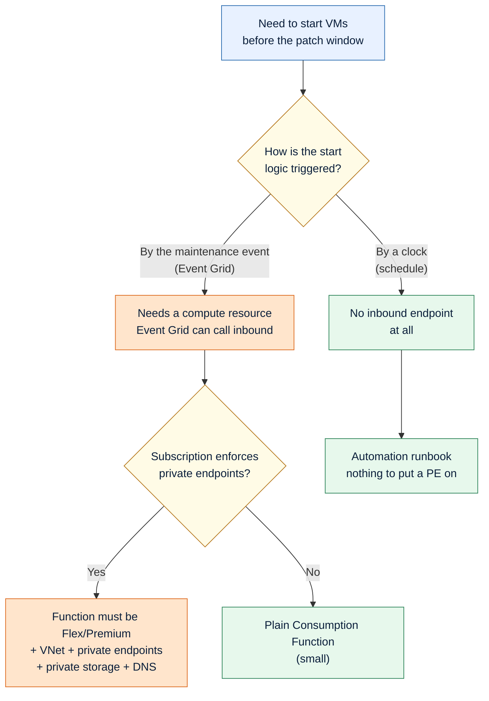
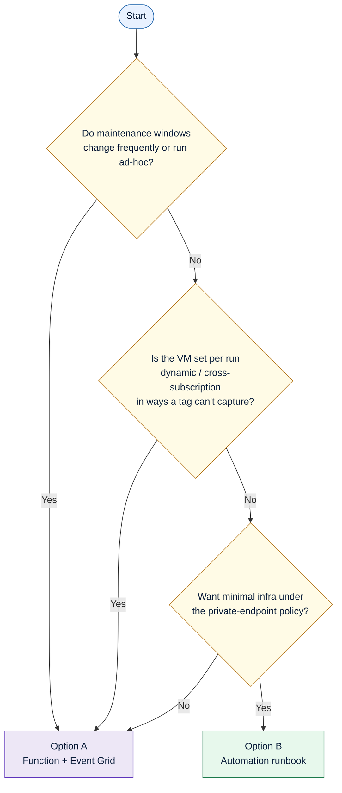
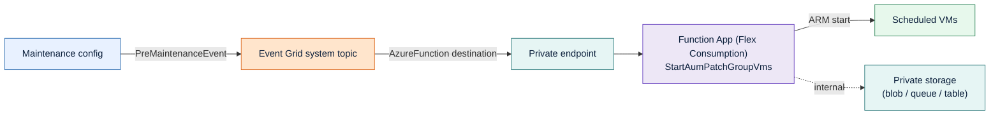
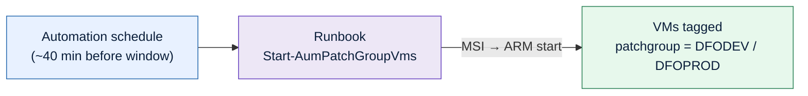

# Auto-Start VMs Before Azure Update Manager Maintenance

Two supported ways to wake up deallocated VMs *before* their scheduled patch window in Azure Update Manager (AUM), so cost-saving "stopped overnight" VMs don't get skipped by the patch run. This document explains the problem, the one constraint that forces the design decision, and both implementation options end-to-end so you can pick the right one.

> **TL;DR** — If your subscription enforces private endpoints, an event-driven Function is a real piece of private-networking infrastructure. A schedule-driven Automation runbook achieves the same outcome with almost none of it, at the cost of keeping a schedule in sync by hand. For a small, fixed set of VMs on a stable cadence, **Option B (Automation runbook) is the recommended default**. Use **Option A (Function + Event Grid)** only when you genuinely need the start to be driven by the actual maintenance run rather than a clock.

---

## 1. The problem

AUM patches the machines that are in scope when the maintenance window opens. A machine that is **deallocated** at that moment is simply skipped — AUM does not power it on. Teams that deallocate DEV VMs overnight to save money therefore miss their patch cycle.

The maintenance configuration resource (`Microsoft.Maintenance/maintenanceConfigurations`) has **no inline pre-task hook** to run "start the VMs first." The supported extensibility point is an **event**: the configuration emits a pre-maintenance event ahead of the window.

| Event | Fires | Purpose |
|---|---|---|
| `Microsoft.Maintenance.PreMaintenanceEvent` | ~40 min before the window opens | Trigger start logic |
| `Microsoft.Maintenance.PostMaintenanceEvent` | after the window | Trigger stop / cleanup logic (out of scope here) |

That ~40-minute lead time is the budget you have to bring machines online before patching begins.

---

## 2. The constraint that decides everything

**Does your subscription enforce private endpoints / deny public network access on PaaS?**

This single question determines how much infrastructure you sign up for, because the two approaches differ in *one structural way*: whether they require an **inbound endpoint**.



The crux: **an event-driven trigger requires something inbound for Event Grid to deliver to** (a Function, webhook, or Logic App). Under a deny-public policy that resource has to be wrapped in private networking. A **schedule-driven trigger has nothing inbound** — the runbook wakes itself on a timer and only makes *outbound* calls to Azure Resource Manager — so the private-endpoint mandate has almost nothing to bite.

---

## 3. Choose an approach

| If you need… | Pick |
|---|---|
| The start to track the *actual* maintenance run (windows move often, ad-hoc runs, exact correlation of which VMs are in the run) | **Option A — Function + Event Grid** |
| The simplest thing that works on a stable, known cadence, with the least infrastructure under a private-endpoint policy | **Option B — Automation runbook** |
| To start the exact VM set AUM computed for *this* run (cross-subscription, dynamic scoping) with zero schedule maintenance | **Option A** |
| To start everything carrying a patch-group tag, accepting a clock you maintain | **Option B** |



---

## 4. Option A — Event-driven (Function App + Event Grid)

The start is triggered by the maintenance configuration's pre-event. The Function queries Azure Resource Graph by the run's correlation ID to get **exactly** the VMs AUM scheduled, then starts the stopped ones. This is the [official Microsoft pattern](https://learn.microsoft.com/azure/update-manager/tutorial-using-functions).

### 4.1 Architecture



### 4.2 What a private-endpoint policy forces, and why

These are not optional choices — they are consequences of "deny public network access":

- **Plan must be Flex Consumption (or Elastic Premium / Dedicated).** The classic Consumption (Y1) plan **cannot** host an inbound private endpoint or VNet integration, so it's disqualified the moment a private endpoint is required. Flex Consumption is the cost-effective private-capable plan; Elastic Premium works too but carries an always-on charge.
- **The Function App needs its own inbound private endpoint** (`sites` sub-resource), with `publicNetworkAccess = Disabled`.
- **Storage must be private.** The Functions host uses **blob, queue, and table** internally — not just blob. So with storage locked to `defaultAction: Deny`, you need private endpoints for **blob + queue + table**. You do **not** need `file` — Flex Consumption deploys from a blob container, not an Azure Files content share.
- **DNS is handled centrally.** In a landing zone the `privatelink.*` zones live in the hub/connectivity subscription. Either a DeployIfNotExists policy auto-registers the A records (in which case you create the private endpoint and add **no** DNS in your IaC), or you reference the hub zone explicitly with a `privateDnsZoneGroup` — which requires the deploying identity to hold **Private DNS Zone Contributor** on that hub zone.

#### Private endpoint count

| Sub-resource | Needed? | Notes |
|---|---|---|
| Function app `sites` | ✅ | Inbound access to the app |
| Storage `blob` | ✅ | Deployment package + host metadata |
| Storage `queue` | ✅ (PE-only policy) | Host internal use |
| Storage `table` | ✅ (PE-only policy) | Host internal use |
| Storage `file` | ❌ | Not used by Flex Consumption |

You can drop to **two** private endpoints (function `sites` + storage `blob`) **only if** your policy permits securing queue/table via a storage VNet rule (`Microsoft.Storage` service endpoint on the integration subnet) plus the `AzureServices` bypass and an identity-based storage connection. Strict "private-endpoints-only, no bypass" policies do not allow this; there your floor is **four** (function + blob + queue + table).

### 4.3 The PowerShell-on-Flex gotcha

**Flex Consumption does not support PowerShell managed dependencies.** Your `requirements.psd1` (`Az`, `Az.ResourceGraph`, …) will **not** auto-restore. You must bundle the modules into the deployment package, and the `Az` module is large — that bloats the package and cold start. If that is unacceptable, Elastic Premium keeps managed dependencies (at always-on cost). Decide this before building.

### 4.4 Resources

| Layer | Resource | Purpose |
|---|---|---|
| Compute | `Microsoft.Web/serverfarms` (Flex `FC1`) | Hosting plan |
| Compute | `Microsoft.Web/sites` (`functionapp,linux`, PowerShell 7.4, system-assigned MSI, `publicNetworkAccess=Disabled`, VNet integrated) | The Function App |
| Compute | `Microsoft.Storage/storageAccounts` (`defaultAction=Deny`) | Host + deployment store |
| Compute | `Microsoft.Insights/components` | Logs / traces |
| Networking | Private endpoint(s) — function `sites`, storage `blob` (+ `queue`/`table`) | Inbound private access |
| Networking | `privateDnsZoneGroup` on each PE → hub zone (or DINE policy) | Name resolution |
| Events | `Microsoft.EventGrid/systemTopics` + event subscription, per maintenance config | Native, auto-validated wiring |
| RBAC | **Virtual Machine Contributor** + **Reader** on the VM scope | Start VMs; read run list via Resource Graph |
| Code | `StartAumPatchGroupVms` + `host.json` + `requirements.psd1` (bundled) | Event Grid trigger, ARG-driven discovery |

> The existing VNet, subnets (one delegated to `Microsoft.App/environments` for outbound integration, one for the private endpoint), and the hub private DNS zones are **consumed**, not created — they belong to the platform team.

### 4.5 Deployment outline

1. Deploy the infra (Flex plan, Function App, private storage, private endpoints).
2. Publish the function code **with the `Az` modules bundled** (`func azure functionapp publish …` from a host with line-of-sight to the private endpoint, or a pipeline runner inside the VNet).
3. Deploy the Event Grid system topic + subscription per maintenance config (after the function exists, so the `AzureFunction` destination validates).
4. Grant the MSI **Virtual Machine Contributor** + **Reader** on the VM scope.

### 4.6 Event payload and function behavior

The pre-event carries the run's `CorrelationId` and `ResourceSubscriptionIds`. The function:

1. `Connect-AzAccount -Identity`.
2. Queries Resource Graph (`maintenanceresources`, type `microsoft.maintenance/applyupdates`) filtered by that correlation ID → the exact VM list for this run.
3. For each VM in a stopped/deallocated state, `Start-AzVM` inside a `Start-ThreadJob` for parallelism.
4. `Wait-Job` and surface per-VM errors.

Because the VM list comes from the correlation ID, the function is **patch-group-agnostic** — one function serves every group, with one Event Grid subscription per maintenance config, and adding a group is zero-touch for the code.

### 4.7 Gotchas

- System-topic creation against a maintenance-config source occasionally throws a transient *"Unable to verify access to resource… try again"* — re-run.
- The `AzureFunction` destination only validates once the function exists; wire Event Grid **after** publishing code.
- Confirm the ~40-min lead time is enough for your largest VMs to boot.
- Arc machines can't be started from Azure — scope is `Microsoft.Compute/virtualMachines`.

---

## 5. Option B — Schedule-driven (Automation runbook) — recommended default

An Azure Automation runbook starts the tagged VMs on a schedule set ~40 minutes before each window. **There is no inbound endpoint**, so there is nothing for the private-endpoint policy to wrap. The runbook authenticates with the Automation account's managed identity and only calls ARM (`management.azure.com`) — the public control plane — to start VMs, which works regardless of how locked-down data-plane resources are.

### 5.1 Architecture



No VNet. No storage account. No private endpoint. No DNS. No Event Grid.

### 5.2 Resources

| Resource | Purpose |
|---|---|
| `Microsoft.Automation/automationAccounts` (system-assigned MSI, `publicNetworkAccess` off) | Hosts the runbook + identity |
| `Microsoft.Automation/automationAccounts/runbooks` (PowerShell 7.2) | The start logic |
| `Microsoft.Automation/automationAccounts/schedules` — one per patch group | Monthly, on the right weekday occurrence, ~40 min early |
| `Microsoft.Automation/automationAccounts/jobSchedules` — one per patch group | Binds runbook + schedule + tag parameters |
| RBAC | **Virtual Machine Contributor** on the VM scope |

### 5.3 The runbook

`Start-AumPatchGroupVms` takes a tag key + value, finds matching VMs, and starts the stopped ones:

1. `Connect-AzAccount -Identity`.
2. `Get-AzResource` for `Microsoft.Compute/virtualMachines` filtered by the patch-group tag.
3. For each VM in `deallocated`/`stopped`, `Start-AzVM -NoWait`.

Starting a tagged-but-already-running VM is a no-op, and starting a tagged VM that happens not to be in a given run is harmless — if it carries the patch-group tag, it is meant to be patched.

### 5.4 Deployment

1. Host `Start-AumPatchGroupVms.ps1` somewhere ARM can fetch (e.g. the raw file in this repo) and deploy the Bicep, passing that URL.
2. Ensure the runbook's PowerShell 7.2 runtime has `Az` available (the default runtime bundles it; otherwise import `Az.Compute` once from the modules gallery).
3. Grant the MSI **Virtual Machine Contributor** on the VM scope.

```powershell
az deployment group create -g rg-update-manager `
  -f Wake_PatchGroup_Vms.bicep -p runbookContentUri='<raw URL of the .ps1>'

$mi = az deployment group show -g rg-update-manager -n Wake_PatchGroup_Vms `
  --query properties.outputs.automationPrincipalId.value -o tsv
az role assignment create --assignee-object-id $mi --assignee-principal-type ServicePrincipal `
  --role "Virtual Machine Contributor" --scope /subscriptions/<sub>   # or the VM RG(s)
```

### 5.5 The private-endpoint policy and Automation

- First check whether the policy even targets `Microsoft.Automation/automationAccounts`. Many "enforce private endpoint" baselines cover Storage, App Service, Key Vault, SQL and ACR but **not** Automation — in which case there is nothing to do.
- If it does target Automation, set `publicNetworkAccess` off (the template does). The scheduled **cloud job still runs**, because starting a VM is an ARM control-plane call, not a hit against a private-endpoint-secured data resource.
- Only if the policy demands an actual private endpoint on the account do you add **one** PE against the hub `privatelink.azure-automation.net` zone. Note Automation's private-link model is oriented toward Hybrid Runbook Workers; for a pure ARM cloud job you generally don't need it. Confirm the requirement with the platform team before adding it.

### 5.6 The one trade-off

The schedule is **independent of the maintenance window**. It is set to fire ~40 minutes before each window, so if someone moves a maintenance window, move the matching schedule's `startTime` / `occurrence` too. On a fixed monthly cadence this is a rare edit — which is exactly why this approach fits a small, stable VM set.

---

## 6. Side-by-side

| | Option A — Function + Event Grid | Option B — Automation runbook |
|---|---|---|
| Trigger | Maintenance pre-event (Event Grid) | Clock (Automation schedule) |
| Tracks the actual run automatically | ✅ | ❌ (you maintain the schedule) |
| VM selection | Exact run list via correlation ID (ARG) | Everything with the patch-group tag |
| Inbound endpoint | Yes → must be privatized | **None** |
| Private-endpoint burden | High: Flex plan, 2–4 PEs, private storage, VNet integration, DNS | ~None (optionally one PE on the account) |
| Approx. resource count | ~9–12 | ~4 |
| PowerShell modules | Bundled into the package (no managed deps on Flex) | Runtime-provided `Az` |
| Code deployment | `func publish` into a private network | Host one `.ps1`, reference its URL |
| Cross-subscription runs | Native (array in the event) | Works if RBAC spans the subs |
| Operational overhead | Higher (private networking lifecycle) | Lower (one schedule edit if a window moves) |
| Cost | Pay-per-exec (Flex) + PE hours | Pay-per-job-minute (effectively free at this volume) |
| Best for | Frequently changing or ad-hoc windows; dynamic/cross-sub VM sets | Stable cadence; a known, tagged VM set |

**Recommendation:** for ~15 VMs on a fixed monthly schedule under a private-endpoint policy, **Option B**. The infrastructure you avoid is the infrastructure you don't have to secure, patch, and explain at audit. Reach for **Option A** only when a clock genuinely can't represent your windows.

---

## 7. Shared prerequisites (both options)

- VMs carry the patch-group tag used for scoping (e.g. `cdp-alz-aum-patchgroup = DFODEV | DFOPROD`).
- VMs are onboarded to AUM with `patchMode = AutomaticByPlatform` (Customer Managed Schedules).
- The start identity (Function MSI or Automation MSI) holds at least the start/read permissions on the VM scope — **Virtual Machine Contributor** covers it; a custom role limited to `Microsoft.Compute/virtualMachines/start/action` + read is tighter.
- The maintenance configurations already exist (created by the patching baseline).
- `~40 minutes` of lead time is enough for your VMs to boot before patching begins.

---

## 8. File layout

```text
schedule/
├── README.md                          ← patching baseline (existing)
├── Wake-VMs-Pre-Patch.md              ← this document
├── option-b-runbook/
│   ├── Wake_PatchGroup_Vms.bicep      ← Automation account + runbook + schedules
│   └── Start-AumPatchGroupVms.ps1     ← the runbook
└── option-a-function/                 ← only if you choose the event-driven path
    ├── Maintenance_PreStart_Function.bicep
    ├── privateEndpointWithHubDns.bicep
    └── function/                       ← StartAumPatchGroupVms + bundled Az modules
```